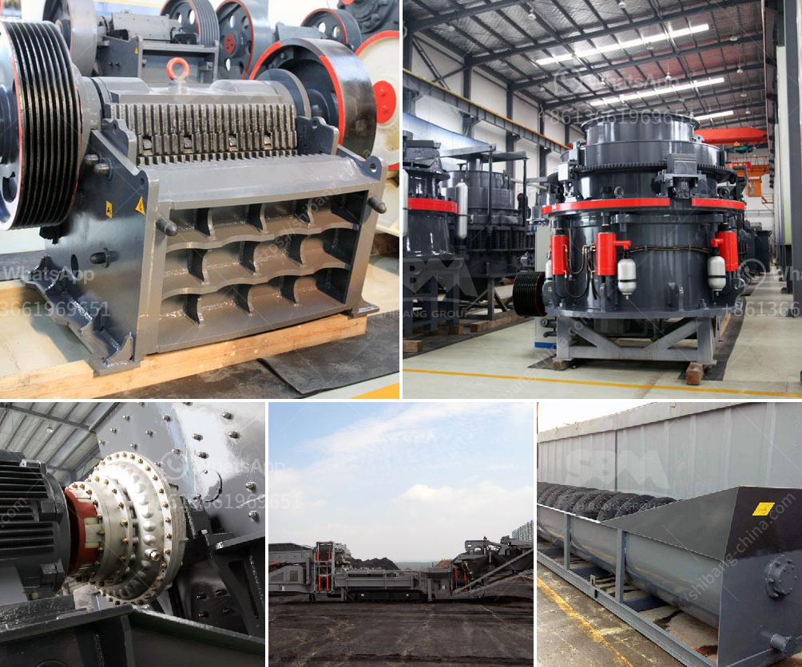

<h3>milling equipment for talcum powder</h3>
Talcum powder is a common household product that has been used for many years for various purposes. However, producing this powder has become more sophisticated, with the advent of advanced milling equipment. This article will delve into the details of milling equipment used for talcum powder production, providing a comprehensive overview.

Talcum powder, also known as talc, is a natural mineral made up of hydrated magnesium silicate. It is widely used in various industries, including cosmetics, pharmaceuticals, and food, due to its excellent moisture-absorbent and anti-friction properties.

In the production of talcum powder, the initial step involves mining and crushing talc rock. Then, it is blended with various additives and heated to remove any impurities. The resulting material is finally milled to a fine powder for commercial use. Milling plays a crucial role in achieving the desired particle size and distribution, contributing to the quality of the final product.

There are several types of milling equipment used in the production of talcum powder. Each type offers unique features and benefits, which influence the efficiency and output of the process. Some of the commonly used milling equipment includes:

1. Raymond Mill: This mill employs a combination of forces, including compression, shear, and impact, to grind talc into powders of various fineness. Its performance is reliable and the maintenance cost is low. Additionally, it has a high passing rate for the finished products.

2. Ball Mill: This equipment is ideal for producing fine and ultrafine powders. It uses grinding media such as ceramic balls, flint pebbles, or stainless steel balls to achieve particle size reduction. Ball mills are highly efficient and require low maintenance.

3. Jet Mill: A jet mill utilizes high-pressure air or steam to cause particle-on-particle collision and attrition, resulting in fine grinding. This method produces consistent and uniform particle sizes, making it suitable for high-quality talcum powder production.

4. Hammer Mill: This equipment uses rotating hammers to grind talc into a powder. It is commonly used in the pharmaceutical industry due to its ability to control the particle size distribution. However, it may generate more heat during the milling process, requiring adequate cooling mechanisms.

5. Vibratory Mill: This type of mill utilizes vibrating chambers to induce tumbling and grinding motions, resulting in a fine powder. Vibratory mills are advantageous for producing a narrow particle size distribution.

The choice of milling equipment depends on various factors such as the desired particle size, output capacity, and cost-effectiveness. Manufacturers often consider the specific requirements of their products to select the most suitable milling equipment.

In conclusion, milling equipment is a critical component in the production of talcum powder. The advanced milling techniques and equipment ensure consistent quality, precise particle size, and distribution of talcum powder. Manufacturers must consider numerous factors while selecting the milling equipment to produce high-quality talcum powder for a range of applications. With ongoing technological advancements, the milling process is likely to continue evolving, further improving the quality and efficiency of talcum powder production.
<h3>Contact us</h3><ul><li><strong>Whatsapp:&nbsp;<a href="https://wa.me/8613661969651">+8613661969651</a></strong></li><li><a href="https://swt.shibang-china.com/?git&amp;zhl&amp;milling equipment for talcum powder"><strong>Online Service(chat now)</strong></a></li></ul><h3>Related</h3><ul><li><a href='limestone grinding mill.md'>limestone grinding mill</a></li><li><a href='second hand equipment for sale in south africa.md'>second hand equipment for sale in south africa</a></li><li><a href='bentonite clay processing plant.md'>bentonite clay processing plant</a></li><li><a href='silica sand manufacturing plant.md'>silica sand manufacturing plant</a></li><li><a href='project report for quartz stone plant and quarry.md'>project report for quartz stone plant and quarry</a></li></ul>