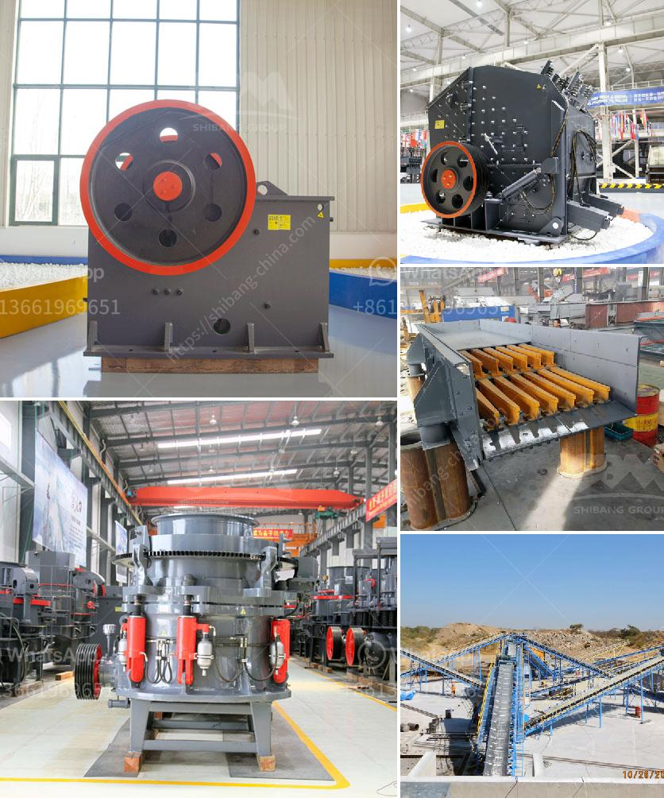

<h3>mineral crushing plant</h3>
Mineral crushing plants are used to process a variety of rocks, ores, and minerals into smaller sizes. These plants are commonly used in the construction, mining, and aggregate industry for crushing materials such as limestone, quartz, gravel, iron ore, copper ore, and other minerals. This article will provide an overview of a mineral crushing plant.

A mineral crushing plant typically consists of various components including crushers, screens, conveyors, feeders, and control systems. It is used to break down large rocks into smaller, more manageable sizes. The crushing process reduces the size of the rocks by using compressive force and impact.

The first step in the crushing process is the primary crushing stage. This is usually done by a jaw crusher, a powerful and robust machine that is designed to handle large rocks. The jaw crusher breaks down the rocks into smaller sizes by exerting pressure on the rock and forcing it against the stationary plate.

After the primary crushing stage, the material is then sent to the secondary crushing stage. This is where cone crushers or impact crushers come into play. Cone crushers are ideal for hard and abrasive materials, while impact crushers are suitable for softer materials. Both types of crushers use the principle of compression to break down the rocks further.

Once the material has been crushed to the desired size, it is then screened to separate the different sizes of rocks. This is usually done using vibrating screens, which are designed to separate the material into different grades or sizes. The screens ensure that oversized rocks are removed from the desired product and only the correct-sized material is sent to the next stage of the process.

The final stage in the crushing process is the feeding of the crushed material to a conveyor system. This is usually done using feeders, which control the flow of material onto the conveyor. The conveyor system then transports the material to the desired location, such as a storage pile or the next stage of the processing plant.

Overall, a mineral crushing plant plays a crucial role in the processing of rocks, ores, and minerals. It breaks down large rocks into smaller sizes, allowing for easier handling and transportation. The plant consists of various machinery and equipment that work together to achieve the desired final product.

In conclusion, a mineral crushing plant is essential for breaking down rocks, ores, and minerals into smaller sizes. It is used in various industries like construction, mining, and aggregates. The plant consists of crushers, screens, conveyors, feeders, and control systems to achieve the desired final product. By utilizing the crushing plant, companies can efficiently process and utilize these valuable minerals.
<h3>Contact us</h3><ul><li><strong>Whatsapp:&nbsp;<a href="https://wa.me/8613661969651">+8613661969651</a></strong></li><li><a href="https://swt.shibang-china.com/?git&amp;zhl&amp;mineral crushing plant"><strong>Online Service(chat now)</strong></a></li></ul><h3>Related</h3><ul><li><a href='pebble crushing equipment.md'>pebble crushing equipment</a></li><li><a href='rubble recycle concrete crusher hire.md'>rubble recycle concrete crusher hire</a></li><li><a href='black stone crushing nigeria.md'>black stone crushing nigeria</a></li><li><a href='stone crushing machines in uk.md'>stone crushing machines in uk</a></li><li><a href='jaw crusher comparison advantages.md'>jaw crusher comparison advantages</a></li></ul>