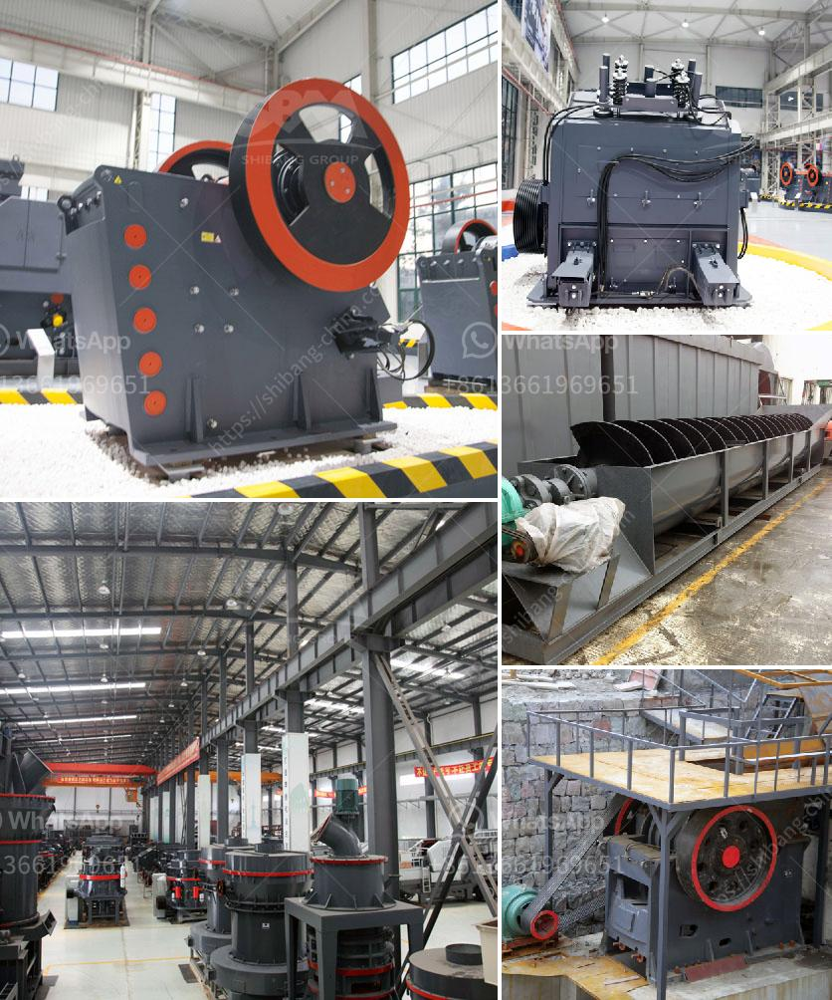

<h3>mineral grinder navi mumbai</h3>
The industrial sector is one of the key contributors to a nation's economic growth. With the rapid expansion of industries in India and the ongoing infrastructural developments, the demand for minerals and raw materials has increased significantly. In Navi Mumbai, a city known for its thriving industrial sector, the use of mineral grinders has become essential for many businesses.

A mineral grinder, also known as a pulverizer or a crusher, is a machine used to crush and grind various minerals into smaller particles. These machines are widely used in industries such as mining, construction, and chemical manufacturing, where minerals are processed into industrial materials. In Navi Mumbai, the availability of mineral grinders has proven to be a boon for the industrial sector, providing a cost-effective and efficient solution for mineral processing.

One of the key advantages of using a mineral grinder in Navi Mumbai is its ability to process a wide range of minerals, including limestone, gypsum, dolomite, quartz, and more. These machines can handle both soft and hard minerals, ensuring a versatile solution for various industries. Moreover, mineral grinders are capable of producing different particle sizes, allowing businesses to customize the output as per their requirements.

The use of mineral grinders in Navi Mumbai has also led to enhanced productivity and efficiency in the industrial sector. These machines are designed to crush minerals into smaller particles, which can then be utilized for various purposes. For example, powdered limestone can be used for cement production, while crushed quartz can be utilized in the glass manufacturing industry. With the use of mineral grinders, industries can maximize the utilization of raw materials and minimize waste, thereby optimizing their production processes.

Furthermore, the introduction of mineral grinders in Navi Mumbai has also contributed to environmental sustainability. By processing minerals efficiently, businesses can reduce the need for excessive mining activities, preserving natural resources in the long run. Moreover, the smaller particle sizes generated by these machines enable easy transportation and storage, minimizing the impact on the environment.

In Navi Mumbai, several companies offer mineral grinder services, allowing industries to benefit from this advanced technology. These companies provide professional assistance in the selection and operation of mineral grinders, ensuring a seamless integration into the existing production processes. Through their expertise, businesses can optimize the use of these machines, maximizing productivity and cost-effectiveness.

In conclusion, the availability of mineral grinders in Navi Mumbai has greatly benefitted the industrial sector in multiple ways. The ability to process a wide range of minerals, customize output sizes, and enhance productivity has made these machines an indispensable tool for businesses. Additionally, the environmental sustainability achieved through efficient mineral processing contributes to the overall development of the city. As Navi Mumbai continues to witness industrial growth, the demand for mineral grinders will likely increase, further driving the economic prosperity of the region.
<h3>Contact us</h3><ul><li><strong>Whatsapp:&nbsp;<a href="https://wa.me/8613661969651">+8613661969651</a></strong></li><li><a href="https://swt.shibang-china.com/?git&amp;zhl&amp;mineral grinder navi mumbai"><strong>Online Service(chat now)</strong></a></li></ul><h3>Related</h3><ul><li><a href='komatsu crawler crusher.md'>komatsu crawler crusher</a></li><li><a href='portable crusher manufacturer.md'>portable crusher manufacturer</a></li><li><a href='drums of conveyor belts malaysia.md'>drums of conveyor belts malaysia</a></li><li><a href='sample business plan for stone crusher pdf.md'>sample business plan for stone crusher pdf</a></li><li><a href='ball mill lining made in china.md'>ball mill lining made in china</a></li></ul>