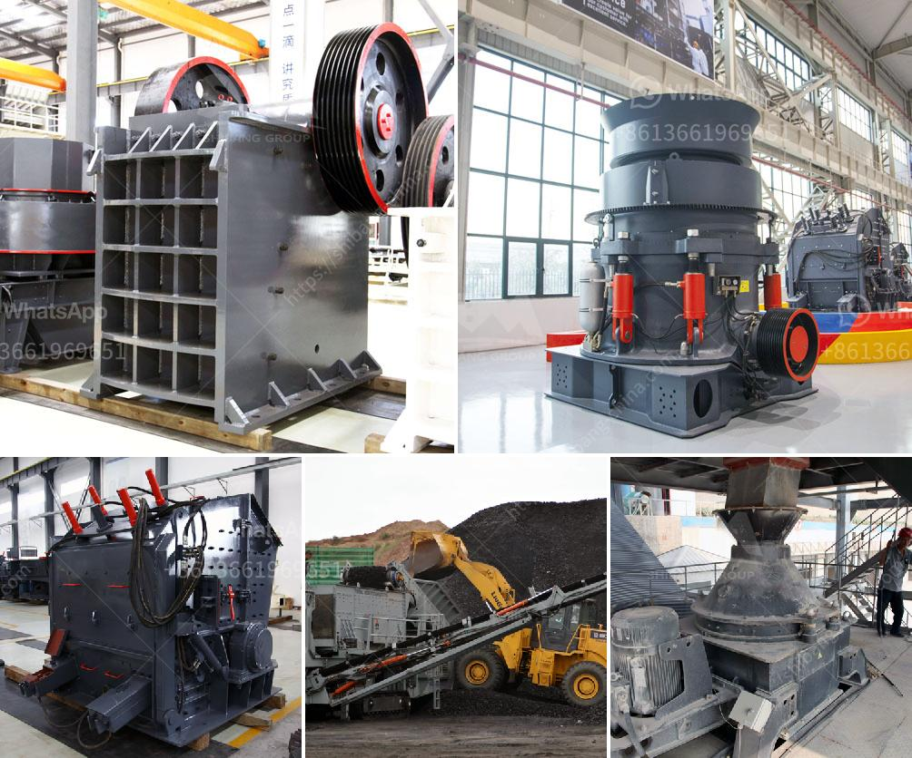

<h3>mineral industrial crushers</h3>
In the realm of mining and resource extraction, crushers play a vital role. These rugged machines are designed to reduce large rocks into smaller, more manageable sizes. Whether it's ore, coal, or industrial minerals, crushers are capable of breaking down these raw materials into a form that can be processed further. Let us delve into the world of mineral industrial crushers and understand their importance in resource extraction.

One of the primary reasons for using crushers in the mining industry is their ability to break down large rocks into smaller particles. This is especially crucial when dealing with ores, as they often contain valuable minerals encased within hard rock. By reducing the size of these rocks, crushers make it easier to liberate the minerals from the surrounding material, making extraction more efficient.

Crushers come in various types, each designed for specific applications. Jaw crushers are commonly used in the mining industry and are capable of handling large rock sizes. Their main function is to crush the material between two plates, known as jaws, to produce particles of a desired size. These crushers are best suited for primary crushing, where the rock is directly fed into the crusher and reduced in size.

Another type of crusher commonly used in the mining industry is the cone crusher. These crushers operate by squeezing the rock between an eccentrically rotating mantle and a concave bowl. The crushed material falls onto a vibrating screen, where different sizes of particles are separated. Cone crushers are suitable for secondary and tertiary crushing, as they can produce a fine and homogenous product.

Impactors and hammer mills are also employed in the mining industry to crush rocks. These crushers use impact force to break down the material. The rock is fed into the crusher and struck by a series of hammers or blow bars, which rotate at high speed. This impact causes the material to break into smaller particles, and it is then passed through a screen to sort them according to size.

The next step after crushing is often grinding, which further reduces the size of the particles and prepares them for processing. Crushers are often used in tandem with grinding mills for this purpose. The crushed material is fed into the mill, where it undergoes further comminution by grinding media, such as steel balls or rods.

The use of crushers in resource extraction is not limited to rocks. They are also essential in coal mining operations, where large chunks of coal need to be reduced in size before further processing. Additionally, crushers are employed in the extraction of industrial minerals, such as limestone, gypsum, and salt. These minerals are often found in large deposits and require crushing to facilitate their use in various industries.

In conclusion, mineral industrial crushers play a crucial role in resource extraction. They break down large rocks into smaller, more manageable sizes, allowing for the liberation of valuable minerals. Crushers come in various types, each designed for specific applications and are often used in conjunction with grinding mills. With these crushers, the path to resource extraction becomes smoother, efficient, and economical, ensuring the sustainable supply of essential raw materials for numerous industries.
<h3>Contact us</h3><ul><li><strong>Whatsapp:&nbsp;<a href="https://wa.me/8613661969651">+8613661969651</a></strong></li><li><a href="https://swt.shibang-china.com/?git&amp;zhl&amp;mineral industrial crushers"><strong>Online Service(chat now)</strong></a></li></ul><h3>Related</h3><ul><li><a href='impact crusher 70 130tph.md'>impact crusher 70 130tph</a></li><li><a href='quartz stone machine price.md'>quartz stone machine price</a></li><li><a href='granite crusher cost.md'>granite crusher cost</a></li><li><a href='calcite grinding machine manufacturer in udaipur.md'>calcite grinding machine manufacturer in udaipur</a></li><li><a href='quartz stone powder mill.md'>quartz stone powder mill</a></li></ul>