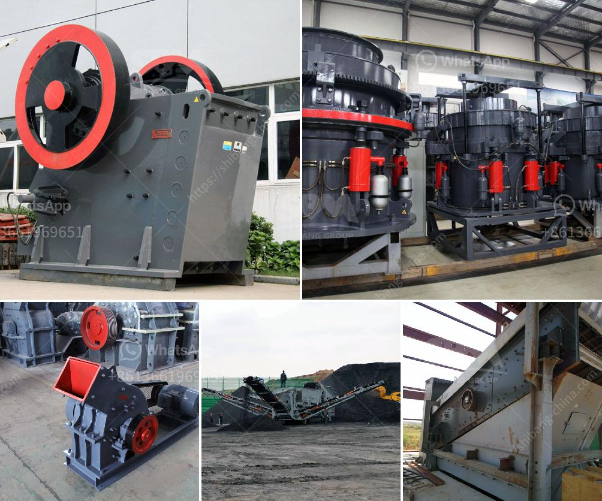

<h3>mini cement plant for sale in south africa</h3>
The construction industry in South Africa is growing at a rapid pace, and with it comes the increasing demand for cement. To meet this demand, many entrepreneurs are now looking to invest in mini cement plants, which are smaller versions of full-scale cement production plants. These mini plants offer several advantages, including lower capital investment and maintenance costs, as well as the ability to produce cement locally. If you are considering setting up a mini cement plant in South Africa, this article will guide you through the process and highlight some key factors to consider.

One of the primary advantages of mini cement plants is their lower capital investment. Compared to full-scale plants, the initial cost of setting up a mini cement plant is significantly lower, making it an attractive option for investors with limited resources. Additionally, these plants have relatively low operating costs, allowing for higher profit margins. This makes them a viable business opportunity for entrepreneurs looking to enter the construction industry.

Another key advantage of mini cement plants is their capability to produce cement locally. By producing cement within the country, these plants eliminate the need for expensive imports, which can drive up costs and result in supply chain disruptions. Moreover, locally produced cement can benefit from reduced transportation costs, as it can be easily distributed to construction sites within the country. This ensures a steady supply of cement and helps meet the increasing demand.

When setting up a mini cement plant, there are several factors to consider. Firstly, it is important to conduct a thorough market analysis to determine the demand for cement in the area where you plan to set up the plant. Understanding the local market dynamics, such as the competition and the pricing structure, will enable you to make informed decisions.

Next, you will need to secure the necessary permits and licenses to operate a cement plant. Compliance with environmental regulations is crucial, as cement production can have a significant impact on air and water quality. Consulting with local authorities and experts in environmental management will help ensure that your plant operates in a sustainable and responsible manner.

Additionally, it is essential to carefully select the location for your mini cement plant. The availability of raw materials, such as limestone and gypsum, is a key consideration. Proximity to construction sites and transportation infrastructure is also important for efficient distribution. Conducting a feasibility study that considers these factors will help determine the optimal location for your plant.

Lastly, it is crucial to invest in reliable equipment and machinery for your mini cement plant. The quality and efficiency of the equipment will directly impact the productivity of your plant and the quality of the cement produced. Choosing reputable suppliers and conducting thorough inspections and maintenance will ensure smooth operations.

In conclusion, the demand for cement in South Africa is driving the growth of mini cement plants. These plants offer several advantages, including lower capital investment and the ability to produce cement locally. Setting up a mini cement plant involves careful planning, market analysis, obtaining permits, selecting the optimal location, and investing in reliable equipment. By following these steps, entrepreneurs can capitalize on the growing construction industry and contribute to the development of South Africa's infrastructure.
<h3>Contact us</h3><ul><li><strong>Whatsapp:&nbsp;<a href="https://wa.me/8613661969651">+8613661969651</a></strong></li><li><a href="https://swt.shibang-china.com/?git&amp;zhl&amp;mini cement plant for sale in south africa"><strong>Online Service(chat now)</strong></a></li></ul><h3>Related</h3><ul><li><a href='crushers of jaw china.md'>crushers of jaw china</a></li><li><a href='slag peralatan pabrik vertikal.md'>slag peralatan pabrik vertikal</a></li><li><a href='how to make silica rock pebles in ball mill.md'>how to make silica rock pebles in ball mill</a></li><li><a href='talcum powder suppliers factories.md'>talcum powder suppliers factories</a></li><li><a href='equipment use in the mining of laterite.md'>equipment use in the mining of laterite</a></li></ul>