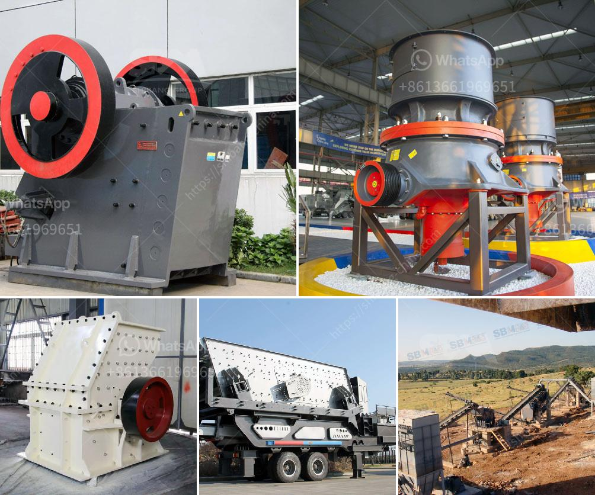

<h3>mini cone crusher price used</h3>
The demand for mini cone crushers has been growing rapidly in recent years, thanks to their compact size, portability, and high efficiency. These small crushing machines are ideal for a wide range of crushing applications, including construction waste recycling, sand and gravel production, quarrying, and mining. With their versatility, mini cone crushers have become an essential tool for many businesses. However, when it comes to choosing the right mini cone crusher, price plays a crucial role.

Price is one of the primary factors that potential buyers consider before investing in a mini cone crusher. It is essential to understand the various factors that affect the price of these machines to make an informed purchasing decision. In this article, we will explore the key aspects that influence mini cone crusher prices, along with some tips for finding the best deals.

The cost of a mini cone crusher primarily depends on its technical specifications, such as crushing capacity, motor power, and weight. These specifications determine the performance capabilities of the machine and its suitability for various applications. Generally, mini cone crushers with higher crushing capacities and motor powers tend to be pricier.

Another significant factor in mini cone crusher pricing is the brand. Well-known and reputable brands often come with a higher price tag due to their reliable performance, superior quality, and excellent after-sales service. While purchasing from a reputed brand may initially cost more, it often leads to long-term savings by minimizing the need for frequent repairs and replacements.

The condition of the used mini cone crusher also affects its price. A well-maintained crusher in excellent working condition will command a higher price compared to a machine that requires extensive repairs or replacement parts. It is crucial to thoroughly inspect the used mini cone crusher and request relevant maintenance records before finalizing a purchase.

Additionally, market demand and supply dynamics also impact mini cone crusher prices. Prices may vary depending on the location, seasonality, and economic conditions of the market. For instance, during peak construction seasons, when the demand for mini cone crushers is high, prices may increase due to limited supply. Conversely, prices may drop during the off-season when the market is less competitive.

To find the best deals on mini cone crushers, it is recommended to compare prices from multiple suppliers. Online marketplaces, equipment auctions, and direct inquiries to manufacturers or distributors can help find competitive offers. Additionally, considering refurbished or second-hand mini cone crushers can also offer cost advantages. Reputable sellers often refurbish used machines to ensure their reliable performance, making them a viable option for those on a tighter budget.

In conclusion, mini cone crushers offer excellent crushing capabilities in a compact and portable design. Price is a crucial consideration when purchasing these machines, and it is influenced by various factors such as technical specifications, brand reputation, machine condition, and market dynamics. By thoroughly understanding these aspects and comparing options from different suppliers, buyers can find the best mini cone crusher at a competitive price, ensuring value for their investment.
<h3>Contact us</h3><ul><li><strong>Whatsapp:&nbsp;<a href="https://wa.me/8613661969651">+8613661969651</a></strong></li><li><a href="https://swt.shibang-china.com/?git&amp;zhl&amp;mini cone crusher price used"><strong>Online Service(chat now)</strong></a></li></ul><h3>Related</h3><ul><li><a href='scale gold mining equipment in south africa.md'>scale gold mining equipment in south africa</a></li><li><a href='ball mill to buy in peru.md'>ball mill to buy in peru</a></li><li><a href='used sand dryer for sale australia.md'>used sand dryer for sale australia</a></li><li><a href='limestone field crushing plant.md'>limestone field crushing plant</a></li><li><a href='roll mill machine manufacturers.md'>roll mill machine manufacturers</a></li></ul>