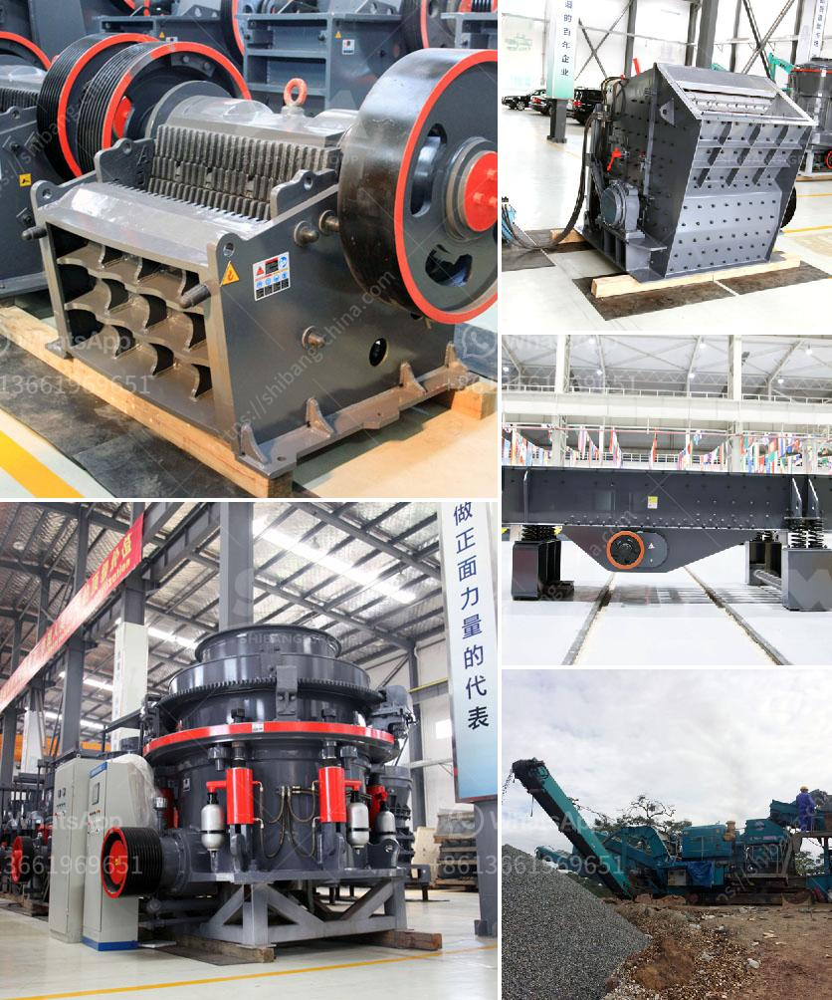

<h3>mini crusher for gravel</h3>
Gravel is an essential and versatile material in construction, used for various purposes such as driveways, pathways, and landscaping. In small-scale projects or areas with limited access, using large machinery to process and transport gravel can be impractical. This is where a mini crusher for gravel comes in handy. It offers a cost-effective and efficient solution for processing gravel on-site, allowing for immediate use and minimizing logistics and transportation costs. Let's delve into the benefits and applications of this compact equipment.

First and foremost, a mini crusher for gravel is small in size, making it highly portable and easy to maneuver. Its compact design allows it to fit through narrow access points, including doorways and narrow pathways, where larger machinery may struggle to reach. This makes it an ideal choice for indoor or urban areas, where space is limited or noise restrictions apply. Additionally, its lightweight construction enables it to be quickly transported on trailers or in the back of a pickup truck, facilitating easy relocation between different job sites.

Despite its small size, a mini crusher for gravel boasts powerful capabilities. These machines are equipped with robust and efficient jaws that can break down large pieces of gravel into smaller, more manageable sizes. By reducing the size of the gravel, it becomes easier to handle, transport, and spread across the desired area. Besides, a mini crusher can process various types of gravel, including hard and abrasive materials, ensuring versatility and adaptability for different project requirements.

Another significant advantage of using a mini crusher for gravel is cost-effectiveness. When compared to traditional methods of gravel processing, such as hiring labor or renting large machinery, a mini crusher eliminates the need for additional manpower or expensive equipment. It streamlines the work process by combining crushing and screening capabilities into one compact unit, reducing overall project costs. Moreover, by processing gravel directly on-site, transportation expenses are significantly reduced, both in terms of fuel consumption and logistics.

The applications of a mini crusher for gravel are vast and diverse. Aside from construction projects, it is widely used in gardening and landscaping endeavors. Whether it is creating a gravel pathway, leveling an uneven surface, or filling garden beds, a mini crusher can efficiently process gravel to meet specific requirements. Moreover, the crushed gravel can be recycled and repurposed as a base or sub-base layer for future construction projects, promoting sustainability and reducing waste accumulation.

To conclude, a mini crusher for gravel offers an efficient and cost-effective solution for small-scale projects. Its compact size and portable nature allow easy access to confined spaces, making it an excellent choice for indoor or urban areas. Despite its small stature, it boasts powerful crushing capabilities, ensuring the effective breakdown of gravel into manageable sizes. Furthermore, its cost-effectiveness, versatility, and portability make it an ideal choice for various applications, from construction projects to gardening and landscaping endeavors. Ultimately, a mini crusher for gravel provides convenience and efficiency, enabling immediate use of processed gravel while minimizing logistics and transportation costs.
<h3>Contact us</h3><ul><li><strong>Whatsapp:&nbsp;<a href="https://wa.me/8613661969651">+8613661969651</a></strong></li><li><a href="https://swt.shibang-china.com/?git&amp;zhl&amp;mini crusher for gravel"><strong>Online Service(chat now)</strong></a></li></ul><h3>Related</h3><ul><li><a href='setup for limestone crusher plant.md'>setup for limestone crusher plant</a></li><li><a href='stone crushing machines in uk.md'>stone crushing machines in uk</a></li><li><a href='cement manufacturing process pdf.md'>cement manufacturing process pdf</a></li><li><a href='consumption of ball mill with roller.md'>consumption of ball mill with roller</a></li><li><a href='crushers and grinders mill.md'>crushers and grinders mill</a></li></ul>