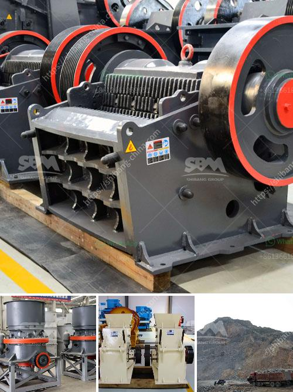

<h3>mini crusher mineral processing plants sweden</h3>
Mini crushers are gaining popularity in the mineral processing industry in Sweden due to their compact size and efficient operation. These smaller machines are designed to crush various types of minerals and rocks, making them ideal for construction projects and mining operations.

One of the advantages of mini crushers is their portability. They can easily be transported to different project sites, allowing for on-site crushing and processing of materials. This eliminates the need for costly transportation of larger crushers, saving time and money for businesses.

Mini crushers are also designed to be user-friendly, with simplified controls and easy maintenance. They are equipped with advanced technologies that ensure smooth operation and high productivity. Despite their smaller size, these crushers are powerful and able to handle a wide range of materials, including concrete, rock, and asphalt.

In addition to their compact size and efficiency, mini crushers play a crucial role in environmental sustainability. By processing materials on-site, there is reduced reliance on traditional quarrying and mining processes, which often have a bigger ecological footprint. This not only reduces greenhouse gas emissions but also minimizes the disturbance to the surrounding environment.

Sweden is known for its commitment to sustainability and environmental preservation. The adoption of mini crushers in the country's mineral processing industry aligns with these values, making it a preferred choice for many companies and contractors.

Overall, the use of mini crushers in mineral processing plants in Sweden offers numerous advantages. Their compact design, efficiency, and portability make them a valuable asset for various industries. Furthermore, their contribution to environmental sustainability further underscores their importance in modern-day operations.
<h3>Contact us</h3><ul><li><strong>Whatsapp:&nbsp;<a href="https://wa.me/8613661969651">+8613661969651</a></strong></li><li><a href="https://swt.shibang-china.com/?git&amp;zhl&amp;mini crusher mineral processing plants sweden"><strong>Online Service(chat now)</strong></a></li></ul><h3>Related</h3><ul><li><a href='manufacturers of 3 tph vertical roller mill in china.md'>manufacturers of 3 tph vertical roller mill in china</a></li><li><a href='3 roller raymond mill delhi.md'>3 roller raymond mill delhi</a></li><li><a href='vertical shaft impact crusher price.md'>vertical shaft impact crusher price</a></li><li><a href='brick making machine in zimbabwe.md'>brick making machine in zimbabwe</a></li><li><a href='brick stone crusher machine.md'>brick stone crusher machine</a></li></ul>