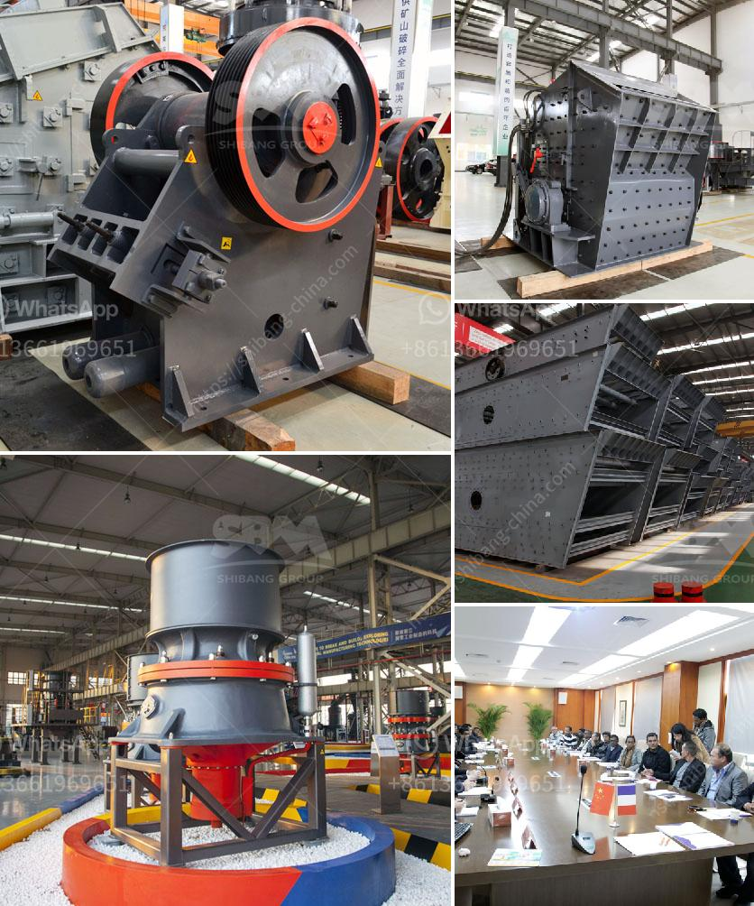

<h3>mini rock crushers</h3>
Rock crushers are machines used to break down large rocks into smaller pieces. These devices are often used in construction sites, mines, and other similar environments to crush rocks into gravel, sand, or other desired sizes. While there are various types of rock crushers available in the market, mini rock crushers offer several advantages that make them a popular choice among users.

Mini rock crushers are small machines that are designed to reduce rocks into smaller pieces. These crushers have two jaws, one fixed and one moving. The moving jaw moves back and forth against the fixed jaw, compressing rocks and breaking them into smaller chunks. Mini rock crushers are easy to transport and can be transported to different locations with ease, making them ideal for on-site crushing operations.

1. Portability: One of the key advantages of mini rock crushers is their portability. These crushers are small and lightweight, making it easy to transport them to different worksites. Whether you need to crush rocks at a construction site or in a mine, you can easily transport a mini rock crusher without any hassle.

2. Versatility: Mini rock crushers can handle various materials, including concrete, asphalt, and natural stones. This versatility makes these crushers suitable for a wide range of applications. Whether you need to crush rocks for road construction, create gravel for landscaping, or recycle construction waste, a mini rock crusher can do the job efficiently.

3. Cost-effectiveness: Compared to larger rock crushers, mini rock crushers are relatively affordable. They require less capital investment, and their maintenance and operational costs are also lower. This makes mini rock crushers a cost-effective solution, especially for small-scale operations or construction projects with tight budgets.

4. Easy to use: Mini rock crushers are designed to be user-friendly. These machines are simple to operate, with intuitive controls that allow even inexperienced operators to use them effectively. Additionally, they require minimal setup time, allowing you to start crushing rocks quickly and efficiently.

5. Environmental benefits: Mini rock crushers can assist in reducing the environmental impact of construction and mining activities. By crushing rocks on-site, you can minimize the need for transportation and reduce the amount of material transported to landfills. This not only saves transportation costs but also helps to conserve natural resources.

In conclusion, mini rock crushers are compact and versatile machines that offer numerous benefits for various crushing applications. Their portability, cost-effectiveness, ease of use, and environmental benefits make them an attractive choice for construction sites, mines, and other similar environments. Whether you need to crush rocks for construction purposes or recycling, a mini rock crusher can be an invaluable tool that simplifies your crushing operations.
<h3>Contact us</h3><ul><li><strong>Whatsapp:&nbsp;<a href="https://wa.me/8613661969651">+8613661969651</a></strong></li><li><a href="https://swt.shibang-china.com/?git&amp;zhl&amp;mini rock crushers"><strong>Online Service(chat now)</strong></a></li></ul><h3>Related</h3><ul><li><a href='dolomite crushing machine for sale dubai.md'>dolomite crushing machine for sale dubai</a></li><li><a href='basalt crusher machine.md'>basalt crusher machine</a></li><li><a href='coal crushing and washing plant sale south africa.md'>coal crushing and washing plant sale south africa</a></li><li><a href='sand and gravel dryer equipment qatar.md'>sand and gravel dryer equipment qatar</a></li><li><a href='grinding mill grinding machine grinders grinning mill.md'>grinding mill grinding machine grinders grinning mill</a></li></ul>