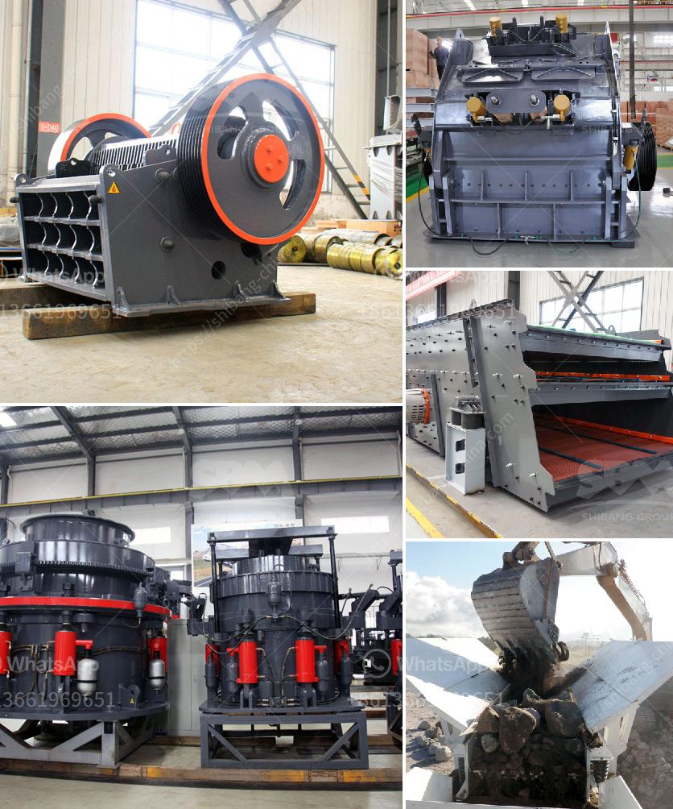

<h3>mini rock mobile jaw crusher west africa price in uk</h3>
The demand for mini rock mobile jaw crushers has been increasing over the years, and these machines are now considered common in many industries. This can be attributed to their versatility, efficiency, and ease of use. One of the leading manufacturers of mini rock mobile jaw crushers is based in West Africa, and they offer a wide variety of models to suit different application needs.

One of the main factors that make these machines popular is their compact size. Mini rock mobile jaw crushers are small enough to be transported easily, yet they have a high crushing capacity. This makes them ideal for construction sites where space is limited or for demolition projects where the debris needs to be crushed on-site. Additionally, their mobility allows operators to easily move them from one job site to another without the need for additional equipment.

Another advantage of mini rock mobile jaw crushers is their low operating costs. These machines are designed to be fuel-efficient and require minimal maintenance, resulting in reduced operational expenses. This is particularly beneficial for small and medium-sized businesses that are looking to maximize their profits.

The price of mini rock mobile jaw crushers in the UK varies depending on the model selected and the features included. However, customers can expect to invest between $10,000 and $30,000. While this may seem like a significant investment, the long-term benefits and cost savings justify the initial expense.

In conclusion, mini rock mobile jaw crushers offer a cost-effective solution for crushing needs in various industries. Their compact size, high crushing capacity, and low operating costs make them an attractive choice for businesses of all sizes. With a wide range of models available, customers in the UK can find the perfect mini rock mobile jaw crusher to suit their requirements.
<h3>Contact us</h3><ul><li><strong>Whatsapp:&nbsp;<a href="https://wa.me/8613661969651">+8613661969651</a></strong></li><li><a href="https://swt.shibang-china.com/?git&amp;zhl&amp;mini rock mobile jaw crusher west africa price in uk"><strong>Online Service(chat now)</strong></a></li></ul><h3>Related</h3><ul><li><a href='100tph stationery stone crushing plant.md'>100tph stationery stone crushing plant</a></li><li><a href='mobile stone crusher 120 tph price.md'>mobile stone crusher 120 tph price</a></li><li><a href='companies crushing plant.md'>companies crushing plant</a></li><li><a href='grinding machines for clay.md'>grinding machines for clay</a></li><li><a href='proposal usaha stone crusher.md'>proposal usaha stone crusher</a></li></ul>