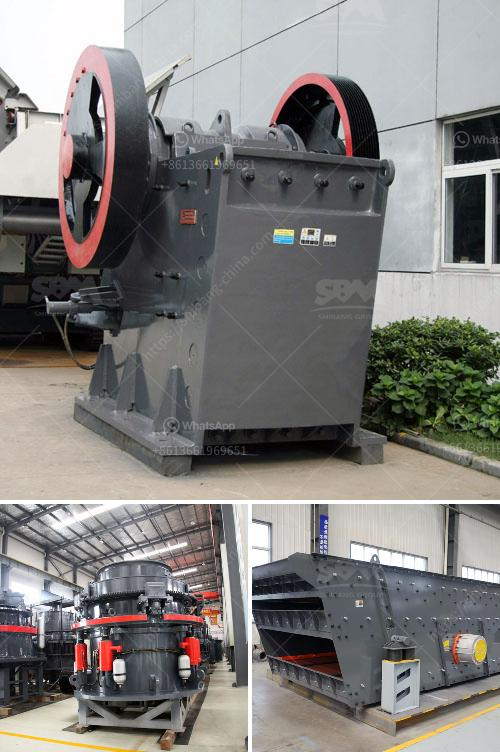

<h3>mini stone crusher machine</h3>
The development of a small stone crusher is the ultimate solution for efficiency and productivity. These machines are specifically designed to help reduce the size of large rocks, break them down into smaller pieces, and ultimately increase productivity. Here, we will discuss in detail the importance of mini stone crusher machines.

One of the key benefits of these machines is their ability to crush a wide range of materials. From soft rocks to hard rocks and everything in between, the mini stone crusher machines can handle it all. This versatility allows contractors and construction companies to use them in various projects, such as road construction, demolition, and landscaping.

Another advantage of mini stone crusher machines is their relatively small size and compact design. These machines are easier to transport and maneuver on construction sites, making them ideal for small-scale projects or locations with limited space. Their compact design also allows for easy storage and maintenance when not in use.

The mini stone crusher machines are also cost-effective. They consume less energy, require minimal maintenance, and have a lower operating cost compared to larger stone crushing machines. This makes them an economical choice for small or medium-sized businesses that want to optimize their operational expenses.

In addition to cost savings, mini stone crusher machines offer a wide range of benefits that improve productivity. These machines have powerful motors that enable them to crush and process rocks efficiently. This reduces the time required for crushing, resulting in increased productivity and faster project completion.

Furthermore, mini stone crusher machines are easy to operate. They are equipped with user-friendly controls, allowing operators of all skill levels to operate them effectively. This means that companies do not have to invest in specialized training for their employees, thus saving both time and money.

The durability of mini stone crusher machines is also worth mentioning. These machines are built to withstand tough conditions and heavy-duty use. They are made from high-quality materials that ensure long-lasting performance. With regular maintenance and proper care, these machines can serve companies for many years.

Last but not least, mini stone crusher machines provide a versatile solution for companies operating in different industries. Whether it is a construction company, a mining operation, or a landscaping business, these machines can meet their crushing needs. The ability to crush a wide range of materials allows businesses to diversify their operations and increase their revenue streams.

In conclusion, mini stone crusher machines offer numerous benefits that make them an excellent investment. Their versatility, cost-effectiveness, efficiency, and durability make them ideal for various industries. Whether it is reducing the size of rocks for construction projects or processing materials for landscaping purposes, these machines are a valuable asset.
<h3>Contact us</h3><ul><li><strong>Whatsapp:&nbsp;<a href="https://wa.me/8613661969651">+8613661969651</a></strong></li><li><a href="https://swt.shibang-china.com/?git&amp;zhl&amp;mini stone crusher machine"><strong>Online Service(chat now)</strong></a></li></ul><h3>Related</h3><ul><li><a href='crushing plant for sale philippines.md'>crushing plant for sale philippines</a></li><li><a href='8 kw hammer mill.md'>8 kw hammer mill</a></li><li><a href='stone crusher machine price in uganda.md'>stone crusher machine price in uganda</a></li><li><a href='white stone crusher plant in rajasthan.md'>white stone crusher plant in rajasthan</a></li><li><a href='cement manufacturing plant.md'>cement manufacturing plant</a></li></ul>