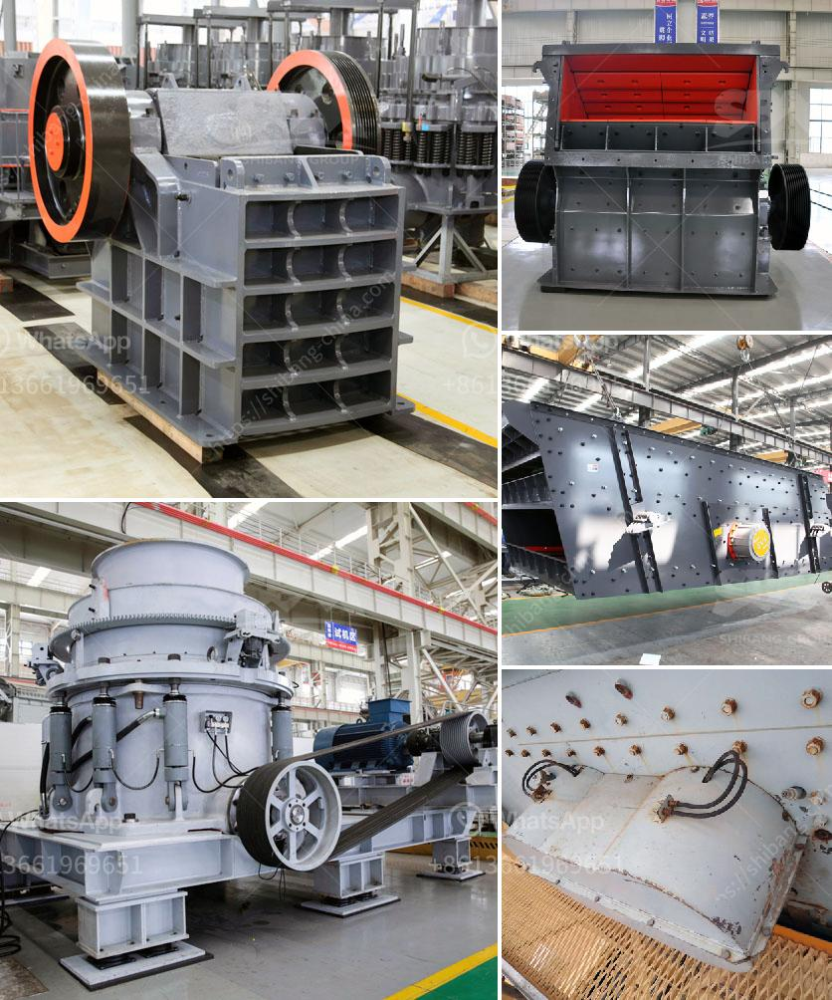

<h3>mining and machine in turkey</h3>
Turkey, with its rich natural resources and strategic geographic position, has been a major player in the mining industry for centuries. The country is considered to have significant potential in various mining sectors including coal, gold, copper, chrome, and boron. In recent years, the Turkish government has been working towards increasing the contribution of the mining sector to the country's GDP, aiming to attract both domestic and foreign investors.

One of the main factors contributing to the growth of mining in Turkey is the availability of advanced mining technology and machinery. Turkish mining companies have made significant investments in modernizing their operations, improving their efficiency, and adhering to international standards of environmental protection and safety. This has not only strengthened the competitiveness of the Turkish mining industry but also attracted foreign investors looking for reliable partners with cutting-edge technology.

Moreover, the government has implemented policies to support the expansion of the machine industry in Turkey, which has further boosted the mining sector. Local manufacturers have been encouraged to produce specialized machinery and equipment tailored to the needs of the mining industry, thereby reducing dependence on foreign imports. This has not only generated employment opportunities but has also enhanced the local expertise and capabilities in manufacturing mining machinery.

The mining and machine industry in Turkey has also positively impacted the overall economy. The sector has played a crucial role in job creation, particularly in rural areas where mining operations are typically located. Additionally, the revenues generated from mining activities have contributed to the country's export earnings and helped reduce the trade deficit.

However, like any other industry, the mining sector in Turkey faces challenges. There is a need for continuous investments in research and development to improve efficiency and reduce environmental impacts. Regulatory frameworks should also be constantly reviewed and updated to ensure the sustainability of mining operations, preserving the ecological balance and safeguarding the health and safety of the workers.

In conclusion, the mining and machine industry in Turkey have been key drivers of economic growth, attracting both domestic and foreign investments. With its rich natural resources, advanced technology, and supportive government policies, Turkey has successfully positioned itself as a competitive player in the global mining market. Continued investments in research, development, and sustainability will further strengthen the sector and contribute to the country's overall development.
<h3>Contact us</h3><ul><li><strong>Whatsapp:&nbsp;<a href="https://wa.me/8613661969651">+8613661969651</a></strong></li><li><a href="https://swt.shibang-china.com/?git&amp;zhl&amp;mining and machine in turkey"><strong>Online Service(chat now)</strong></a></li></ul><h3>Related</h3><ul><li><a href='spec vibrating screen.md'>spec vibrating screen</a></li><li><a href='hydrated lime production processing.md'>hydrated lime production processing</a></li><li><a href='slag crusher machine india.md'>slag crusher machine india</a></li><li><a href='project report of a tph stone crusher.md'>project report of a tph stone crusher</a></li><li><a href='calcite production plant.md'>calcite production plant</a></li></ul>