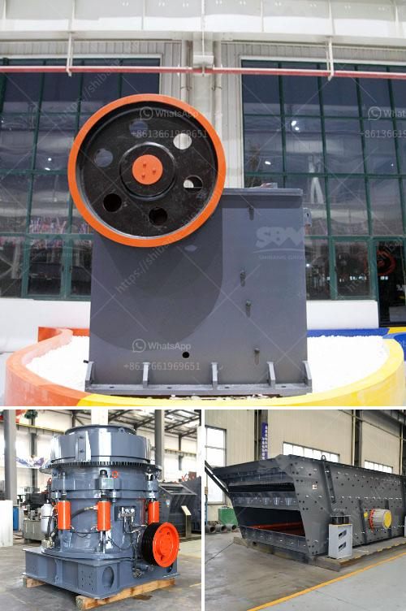

<h3>mining and quarrying crusher business in south africa</h3>
In South Africa, mining and quarrying crusher businesses play a significant role in the country’s economy as they provide essential raw materials needed for various industries such as construction, infrastructure, manufacturing, and agriculture. These businesses extract minerals and materials from the earth, which are then processed into valuable commodities that drive economic growth and development.

Mining and quarrying crusher businesses primarily operate by extracting and crushing large rocks and minerals from the earth's surface or underground. The extracted materials are then processed into smaller, more manageable sizes for use in various industries. The mining and quarrying crusher industry encompasses a wide array of activities, including exploration, site preparation, extraction, processing, and reclamation.

One of the key advantages of the mining and quarrying crusher business is its ability to generate substantial jobs and employment opportunities. With a strong demand for minerals and materials in South Africa, mining and quarrying crusher businesses create employment for thousands of individuals, including mine workers, truck drivers, machine operators, engineers, and support staff. These jobs not only provide income for individuals but also contribute to overall economic growth by increasing consumer spending and tax revenues.

Moreover, mining and quarrying crusher businesses contribute significantly to the country's export earnings. South Africa possesses abundant mineral resources, including gold, platinum, diamonds, coal, and iron ore. These resources are in high demand globally and attract foreign investment in the mining sector. By exporting these minerals and materials, the country earns valuable foreign exchange, which strengthens its balance of payments and boosts economic growth.

Another important aspect of the mining and quarrying crusher business is its contribution to the development of infrastructure. The materials extracted from mines and quarries, such as aggregates, sand, and stone, are vital for the construction of roads, bridges, buildings, and other infrastructure projects. Without a robust mining and quarrying crusher industry, the construction sector would face significant challenges in meeting the demand for these essential materials, hindering infrastructure development and economic progress.

However, it's important to acknowledge that the mining and quarrying crusher industry also poses environmental challenges. Extraction and processing activities can result in land degradation, deforestation, air and water pollution, and habitat destruction. To mitigate these adverse impacts, the South African government has implemented comprehensive regulations and environmental management practices for the mining sector. Businesses in this industry are required to adhere to strict environmental standards, including measures for waste management, land rehabilitation, and pollution control.

In conclusion, the mining and quarrying crusher business in South Africa is a profitable endeavor with significant contributions to the country's economy. It generates jobs, stimulates export earnings, and supports infrastructure development. Nonetheless, it is crucial for businesses in this industry to operate responsibly and sustainably, minimizing their environmental footprint and contributing to the overall well-being of local communities. By striking a balance between economic growth and environmental preservation, the mining and quarrying crusher business can continue to thrive and benefit South Africa in the long run.
<h3>Contact us</h3><ul><li><strong>Whatsapp:&nbsp;<a href="https://wa.me/8613661969651">+8613661969651</a></strong></li><li><a href="https://swt.shibang-china.com/?git&amp;zhl&amp;mining and quarrying crusher business in south africa"><strong>Online Service(chat now)</strong></a></li></ul><h3>Related</h3><ul><li><a href='coal crusher hammer.md'>coal crusher hammer</a></li><li><a href='300 tone per hour limestone crusher.md'>300 tone per hour limestone crusher</a></li><li><a href='crushers equipment dealer in saudi arabia.md'>crushers equipment dealer in saudi arabia</a></li><li><a href='rock crusher quarry.md'>rock crusher quarry</a></li><li><a href='crusher plant in malaysia.md'>crusher plant in malaysia</a></li></ul>