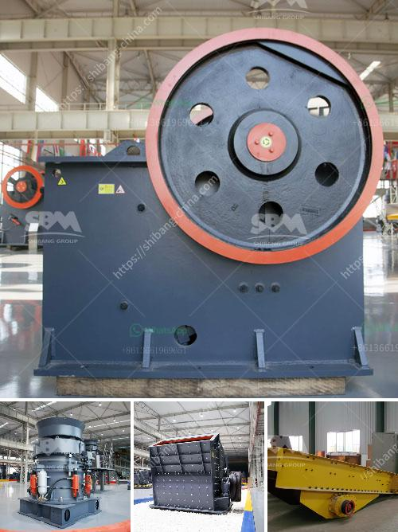

<h3>mining crusher machine</h3>
Mining industries are essential for the extraction of various raw materials, such as coal, minerals, metals, and others, which are crucial for the development of numerous products. In this process, crushers play a vital role as they help in reducing the size of large-sized rocks and ores into smaller, easily manageable particles. With advancements in technology, mining crusher machines have become more efficient, reliable, and versatile, ensuring higher productivity and profitability for mining operations.

One of the key components of any mining operation is the crusher machine. Crushers are used to break down the material into smaller, manageable sizes. Crushing is an energy-consuming process that involves a substantial investment in terms of time and machinery. The availability of high-quality and robust crushers is, therefore, critical to ensure efficient and productive mining processes.

Mining crusher machines come in different types and models, each designed for specific applications. Jaw crushers are commonly used in primary crushing stages, where they excel at processing hard rock, ore, and aggregate materials. Cone crushers, on the other hand, are more often used for secondary, tertiary, and quaternary crushing operations. They are known for their high capacity and excellent end-product quality. Impact crushers, which incorporate impact force to crush materials, are suitable for various applications, including but not limited to limestone, concrete, and asphalt recycling.

Various factors need to be considered when selecting the right crusher machine for a mining operation. The hardness of the material, its size, and the desired output size are crucial parameters that determine the type and capacity of the crusher. Additionally, factors such as operating costs, maintenance requirements, and environmental impact should also be taken into account. It is important to find a balance between efficiency, cost-effectiveness, and sustainability.

Advancements in technology have brought significant improvements to mining crusher machines. Modern crushers are equipped with advanced features, such as hydraulic systems, electronic control units, and intelligent operating systems. These enhancements facilitate easier operation, higher productivity, and increased safety. For example, hydraulic systems ensure efficient and smooth crusher operation, prevent damage due to tramp iron or excessive pressure, and enable quick and easy maintenance.

Furthermore, the integration of automation and remote monitoring capabilities allows for real-time monitoring and control of crusher performance. This enables proactive maintenance interventions, reducing downtime and maximizing machine availability. Some crushers are also equipped with smart sensors and predictive maintenance features, which help anticipate and prevent potential breakdowns, resulting in improved reliability and reduced operating costs.

In conclusion, mining crusher machines are essential for the success of any mining operation. They are responsible for reducing the size of rocks and ores into smaller, manageable particles, thereby enabling the extraction of valuable raw materials. Selecting the right crusher machine involves considering various factors, such as material hardness, size, desired output, operating costs, and environmental impact. Advancements in technology have improved the efficiency, productivity, and safety of crushers, making them an integral part of modern mining processes.
<h3>Contact us</h3><ul><li><strong>Whatsapp:&nbsp;<a href="https://wa.me/8613661969651">+8613661969651</a></strong></li><li><a href="https://swt.shibang-china.com/?git&amp;zhl&amp;mining crusher machine"><strong>Online Service(chat now)</strong></a></li></ul><h3>Related</h3><ul><li><a href='old used farm hammer mills.md'>old used farm hammer mills</a></li><li><a href='vsi stone crusher operation principle.md'>vsi stone crusher operation principle</a></li><li><a href='mobile screening plant south africa.md'>mobile screening plant south africa</a></li><li><a href='companies selling mining equipment.md'>companies selling mining equipment</a></li><li><a href='quartz rock processing equipment.md'>quartz rock processing equipment</a></li></ul>