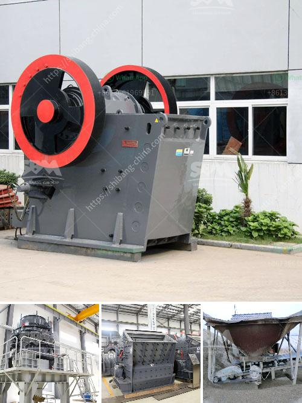

<h3>mining equipment in turkey</h3>
Turkey has a rich mining history and a robust mining industry that continues to thrive and grow. With its strategic location, abundant natural resources, and favorable investment climate, the country has become a significant player in the global mining sector.

Mining equipment plays a pivotal role in the mining industry, as it is responsible for excavating, drilling, and extracting valuable minerals and resources from the earth. The Turkish mining equipment market has seen substantial growth in recent years, driven by increased demand from both domestic and international markets.

One of the key factors contributing to the growth of the mining equipment industry in Turkey is the country's rich and diverse mineral reserves. Turkey is known for its vast deposits of gold, silver, copper, nickel, coal, and other minerals. These resources have attracted local and international mining companies, leading to increased investments in mining operations and thus a higher demand for mining equipment.

Furthermore, Turkey's strategic location between Europe, Asia, and the Middle East has made it a favorable investment destination for mining equipment manufacturers and suppliers. The country serves as a regional hub for mining activities, providing easy access to major markets and an extensive network of transportation and logistics facilities.

The Turkish government has also played a significant role in promoting the mining sector by implementing various incentives and reforms to attract more foreign direct investment. In recent years, the government has introduced legislation to streamline mining licensing procedures, reduce bureaucracy, and provide tax incentives for mining companies. These initiatives have created a favorable business environment that has further boosted the demand for mining equipment in the country.

The increasing scale and complexity of mining operations in Turkey have driven the need for advanced and efficient mining equipment. Mining companies are employing state-of-the-art technologies and equipment to optimize productivity, minimize environmental impact, and ensure worker safety. This demand for advanced equipment has led to an influx of foreign mining equipment manufacturers into the Turkish market, as well as the growth of local manufacturing capabilities.

Local companies in Turkey have also recognized the opportunities in the mining equipment sector and have started to manufacture and supply specialized machinery and equipment for the mining industry. These companies benefit from lower production costs and have a better understanding of local regulations and customer needs.

In conclusion, the mining equipment industry in Turkey is experiencing impressive growth, driven by the country's rich mineral resources, favorable investment climate, and government initiatives. The demand for mining equipment, both from domestic companies and foreign investors, continues to rise as the mining sector expands and modernizes. With its strategic location and commitment to advancing the mining industry, Turkey is well-positioned to become a major player in the global mining equipment market.
<h3>Contact us</h3><ul><li><strong>Whatsapp:&nbsp;<a href="https://wa.me/8613661969651">+8613661969651</a></strong></li><li><a href="https://swt.shibang-china.com/?git&amp;zhl&amp;mining equipment in turkey"><strong>Online Service(chat now)</strong></a></li></ul><h3>Related</h3><ul><li><a href='talcum powder suppliers factories.md'>talcum powder suppliers factories</a></li><li><a href='stone crasher busness plan pdf.md'>stone crasher busness plan pdf</a></li><li><a href='crusher machine for sale in nepal.md'>crusher machine for sale in nepal</a></li><li><a href='price of artificial sand mill.md'>price of artificial sand mill</a></li><li><a href='tracked jaw crusher for sale.md'>tracked jaw crusher for sale</a></li></ul>