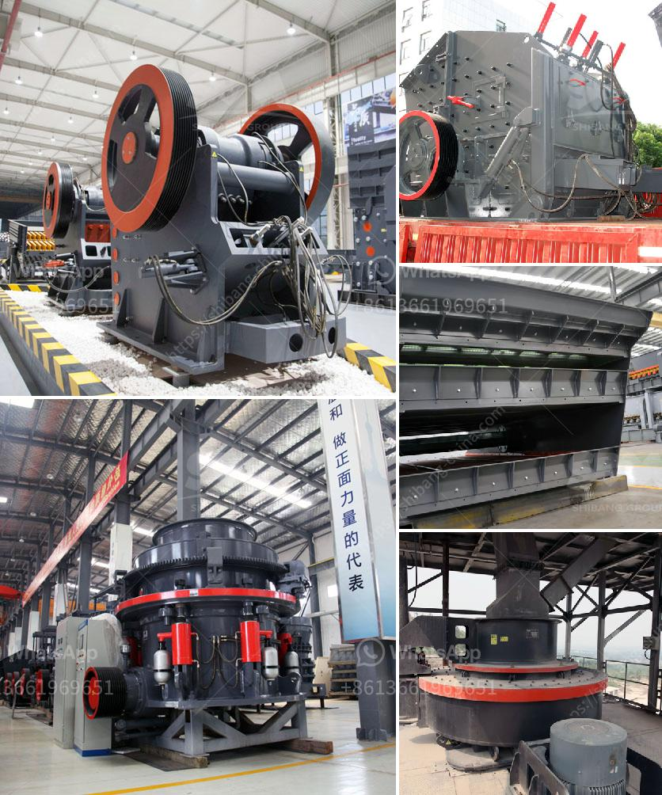

<h3>mining rental equipment south africa</h3>
South Africa is well known for its rich mineral resources, and mining plays a vital role in the country's economy. However, mining operations require expensive machinery and equipment to extract valuable resources from the ground. This is where mining rental equipment comes into play, providing companies with an affordable and flexible solution for their mining needs.

One of the main advantages of renting mining equipment is the cost savings it offers. Mining machinery can be incredibly expensive, with prices sometimes reaching into the millions. For smaller mining operations or companies with limited resources, purchasing such equipment might not be financially feasible. Renting eliminates the need for a substantial upfront investment, allowing companies to allocate their funds more efficiently.

In addition to saving costs, renting mining equipment also provides companies with flexibility. The mining industry is subject to market fluctuations, and demand for certain resources can change rapidly. Renting equipment allows companies to adapt quickly to these changes, without the burden of having to sell or replace expensive machinery. Whether it's a short-term project or a long-term operation, mining rental equipment can be tailored to suit the specific needs of a company, providing them with the necessary machinery for the duration required.

South Africa has a well-developed and competitive market for mining rental equipment, offering a wide range of options for companies to choose from. From earthmoving equipment to underground mining machinery, there is a rental solution available for every type of mining operation. Rental companies usually provide well-maintained equipment that meets industry safety standards, ensuring the efficient and safe operation of mining activities.

Another advantage of renting mining equipment in South Africa is the access to specialized machinery. Certain mining projects require specific equipment that might not be readily available or economically viable to purchase. Rental companies usually have a diverse fleet of machinery, including highly specialized equipment, catering to the unique requirements of different mining operations. This eliminates the need for companies to compromise on the quality or efficiency of their mining projects and ensures that they have the right tools for the job.

While the benefits of renting mining equipment in South Africa are evident, it is important for companies to carefully consider their rental agreements and contracts. Factors to consider include rental rates, maintenance and support services provided, as well as the rental terms and conditions. Companies should also assess the reputation and track record of the rental companies they engage with to ensure reliable and efficient service.

In conclusion, mining rental equipment provides South African companies with a cost-effective and flexible solution to their mining needs. From cost savings and flexibility to access specialized machinery, renting equipment allows companies to efficiently and safely carry out mining operations. With a competitive market offering a variety of rental options, South Africa's mining industry can continue to thrive with the support of rental equipment.
<h3>Contact us</h3><ul><li><strong>Whatsapp:&nbsp;<a href="https://wa.me/8613661969651">+8613661969651</a></strong></li><li><a href="https://swt.shibang-china.com/?git&amp;zhl&amp;mining rental equipment south africa"><strong>Online Service(chat now)</strong></a></li></ul><h3>Related</h3><ul><li><a href='bauxite processing plant.md'>bauxite processing plant</a></li><li><a href='stone crusher plant management software.md'>stone crusher plant management software</a></li><li><a href='crusher equipment oman in oman.md'>crusher equipment oman in oman</a></li><li><a href='crushers and grinders mill.md'>crushers and grinders mill</a></li><li><a href='ball mill south africa.md'>ball mill south africa</a></li></ul>