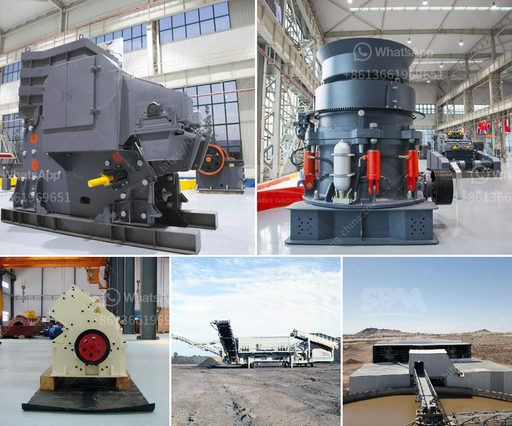

<h3>mobile crusher 100tph</h3>
The mobile crushing plant has a primary or secondary crusher that is designed to crush all kind of materials. Regardless of the capacity, the mobile crusher plant offers a cost-effective solution for recovering construction waste and making it accessible to the market. Mobile crushers have won this trust from their operators as their operational flexibility, ease of transportation, and maintenance require very little attention from users.

The 100tph capacity mobile crusher is available for crushing various materials like stone, granite, trap rock, coke, coal, manganese ore, iron ore, emery, fused aluminum, oxide, fused calcium carbide, lime stone, quartzite, alloys, etc. The crushing capacity of a mobile stone crusher can be up to 400 tph.

Depending on the model, crushing plants have the ability to accept up to 20% reject material before it is passed through the screening deck. If the reject material is not reclaimed, it is considered a waste product. Some plant configurations allow the reject material to be incorporated back into the system via a reject conveyor.

The primary mobile crusher of 100tph is heavily built and sturdy, which enables it to withstand the most challenging conditions. All components of the primary crusher are mounted to a frame, which provides easy access to the chamber and allows for high reduction ratios. This reduces the need for multiple crushers, which saves both space and investment.

The secondary mobile crusher of 100tph typically operates in conjunction with a primary crushing unit. This makes it possible to produce multiple products simultaneously. The secondary unit is equipped with optional multi-slope screens, which allow the material to be sorted into different sizes, ensuring the end product meets the desired specifications.

The 100tph mobile crusher not only has the ability to crush materials efficiently, but it also has a wide range of applications. The device is particularly suitable for construction waste disposal in urban demolition sites, roads, and bridges construction projects, as well as quarrying, mining, and recycling applications. It allows for on-site crushing, minimizing the need for transportation of materials, and ultimately reducing costs.

The mobile crusher 100tph can be transported easily and can be deployed into the field within a very short period of time. Compared to traditional crushers, it reduces the operational costs by up to 50%. The device directly serves the purpose of processing stones, eliminating the intermediate links of transporting, crushing, and reprocessing. This results in lower costs and improved efficiency.

In conclusion, the mobile crusher 100tph has become an essential machine in the modern construction industry. No matter the terrain, this equipment can reach any location, providing a cost-effective solution for crushing and screening operations. Its versatility, ease of maintenance, and low operational costs have made it the preferred choice for many contractors. With advances in technology, the mobile crushers of today offer even greater efficiency and productivity, contributing to a more sustainable and environmentally-friendly construction industry.
<h3>Contact us</h3><ul><li><strong>Whatsapp:&nbsp;<a href="https://wa.me/8613661969651">+8613661969651</a></strong></li><li><a href="https://swt.shibang-china.com/?git&amp;zhl&amp;mobile crusher 100tph"><strong>Online Service(chat now)</strong></a></li></ul><h3>Related</h3><ul><li><a href='rotary dryer machine photo.md'>rotary dryer machine photo</a></li><li><a href='crushers and grinders mill.md'>crushers and grinders mill</a></li><li><a href='10 inches marble grinding stone.md'>10 inches marble grinding stone</a></li><li><a href='new rubber belt conveyor for sale.md'>new rubber belt conveyor for sale</a></li><li><a href='concrete crusher price.md'>concrete crusher price</a></li></ul>