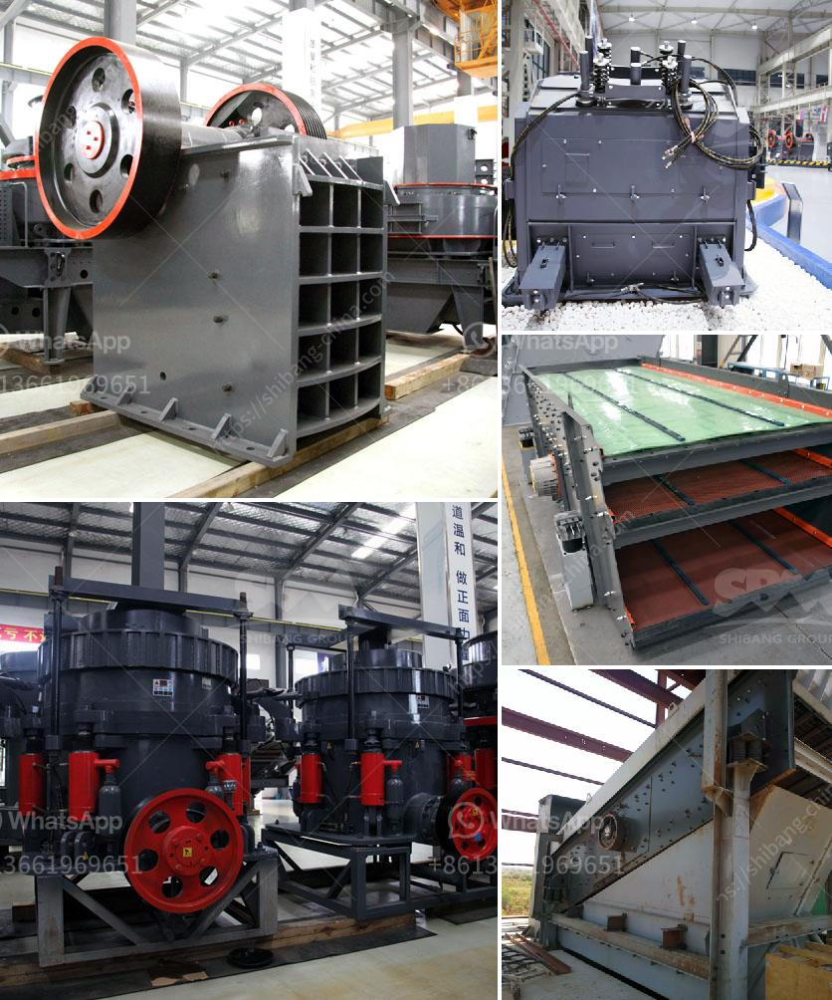

<h3>mobile crusher in saudi</h3>
Mobile crushers are precisely designed and built to serve the construction industry in Saudi Arabia. With the rapid growth in the construction industry, the demand for crushers has risen significantly. Mobile crushers enable operations to take place close to the extraction points in mines and quarries. How to choose the right mobile crusher for your operational needs?

Every construction project is different; adjusting the equipment according to the needs is crucial. Mobile crushers let operators increase productivity and efficiency in the workplace, reducing the cost of materials. Mobility, high productivity, easy maintenance, and low cost of operation are the main characteristics of mobile crushers. You can find many different types of mobile crushers for sale with different sizes and capabilities.

1. Local geography conditions: Climate, moisture, and topography play a vital role in the selection process. The level of accessibility to an area also determines the type of crusher you require.

2. Material characteristics: The type of rock and the output required should be taken into account. Jaw crushers are generally used for coarse crushing, cone crushers for intermediate crushing, and roll crushers for producing finer particles.

3. Maintenance costs: Regular maintenance is essential to keep equipment in good working condition. Make sure how easy it is to get spare parts and to maintain equipment before choosing a mobile crusher.

4. Crushers' specifications: Crushers are now available with a wide range of capabilities, making it capable of specifying the output size required. Jaw crushers, as primary crushers, efficiently reduce the size of materials and are capable of producing large quantities of uniformly fine crushed stone.

1. Ease of transportation: Mobile crushers offer the convenience of transporting the unit from one place to another, which is beneficial in terms of reducing costs on expensive transportation in the mining sector.

2. Versatility: Mobile crushers' ability to adapt to different environments and capacities makes them an ideal choice for contractors. Versatility in crushing and handling different types of materials, including concrete, asphalt, and demolition debris, is very important.

3. Efficiency: Mobile crushers can be connected to any heavy machinery that is a part of the crushing process. Depending on the type of crusher being used, the mobile machine can reduce the size of rocks or stone particles down to their equivalent gravel sizes.

4. Reduced manpower and time: Mobile crushers allow operators to move the crusher unit closer to the extraction point and reduce labor and transport costs.

In summary, mobile crushers are a heavy-duty and highly efficient solution for construction projects of all sizes. They provide several benefits to the construction industry, including better productivity, reduction in costs, and a safer working environment. It's critical to choose the right type of mobile crusher based on the specific requirements of the project, ensuring maximum efficiency and cost-effectiveness.
<h3>Contact us</h3><ul><li><strong>Whatsapp:&nbsp;<a href="https://wa.me/8613661969651">+8613661969651</a></strong></li><li><a href="https://swt.shibang-china.com/?git&amp;zhl&amp;mobile crusher in saudi"><strong>Online Service(chat now)</strong></a></li></ul><h3>Related</h3><ul><li><a href='crusher machine for sale philippines.md'>crusher machine for sale philippines</a></li><li><a href='stone crushers in veracruz.md'>stone crushers in veracruz</a></li><li><a href='crusher price for crushed stone.md'>crusher price for crushed stone</a></li><li><a href='talcum powder suppliers factories.md'>talcum powder suppliers factories</a></li><li><a href='all about ball mills.md'>all about ball mills</a></li></ul>