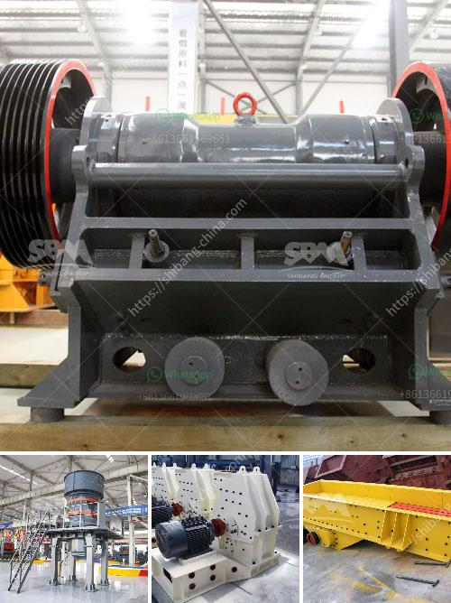

<h3>mobile crusher japan</h3>
Construction waste is a significant problem in many countries around the world. It not only takes up valuable space in landfills but also contributes to environmental pollution. As the population continues to grow and urban areas become more densely populated, the need for effective waste management solutions becomes increasingly important.

One such solution is the mobile crusher, a machine that is increasingly being deployed in construction sites in Japan. Developed by Komatsu, mobile crushers are also known as stone crushers or rock crushers. They are machines that reduce the size of rocks and stones in construction projects, such as roads, bridges, and buildings, by crushing them into smaller pieces.

Mobile crushers are designed to be compact and easily transported to and from the construction site. This makes them highly versatile and ideal for use in urban areas where space is limited. The compact design also allows for efficient maneuvering through narrow streets and congested areas, reducing the time and costs involved in transporting materials to and from the site.

One of the key advantages of mobile crushers is their ability to process various types of construction waste, including concrete, bricks, and asphalt. These materials can be crushed and reused in new construction projects, reducing the need for new raw materials and saving energy. By recycling construction waste, mobile crushers contribute to a circular economy and help reduce the environmental impact of construction activities.

In addition to their environmental benefits, mobile crushers are also cost-effective. Compared to traditional methods of waste disposal, such as landfilling or transporting waste to dedicated recycling facilities, mobile crushers offer significant cost savings. They eliminate the need for separate transportation and disposal of waste materials, reducing both time and labor costs.

Moreover, mobile crushers can operate in remote areas without access to electricity. They can be powered by a diesel engine or connected to an external power source, such as a generator or the electrical grid. This makes them a reliable option for construction projects in rural or off-grid locations.

Japan, with its high population density and limited land resources, has been at the forefront of developing innovative solutions for waste management. The use of mobile crushers in the country has been steadily increasing in recent years, as more construction companies recognize their benefits. The government has also been supportive, providing incentives and subsidies to encourage the adoption of environmentally friendly technologies.

In conclusion, mobile crushers have emerged as an environmentally friendly and cost-effective solution for construction waste management in Japan. With their compact design, versatility, and ability to process various types of waste materials, these machines have become an integral part of construction projects across the country. By recycling construction waste, mobile crushers contribute to a sustainable and circular economy, reducing the need for new raw materials and minimizing the environmental impact of construction activities.
<h3>Contact us</h3><ul><li><strong>Whatsapp:&nbsp;<a href="https://wa.me/8613661969651">+8613661969651</a></strong></li><li><a href="https://swt.shibang-china.com/?git&amp;zhl&amp;mobile crusher japan"><strong>Online Service(chat now)</strong></a></li></ul><h3>Related</h3><ul><li><a href='crushing plant price list.md'>crushing plant price list</a></li><li><a href='limestone field crushing plant.md'>limestone field crushing plant</a></li><li><a href='to do with the stone crusher.md'>to do with the stone crusher</a></li><li><a href='list of manufacturers vertical milling machines in europe.md'>list of manufacturers vertical milling machines in europe</a></li><li><a href='used gold washer machine plant.md'>used gold washer machine plant</a></li></ul>