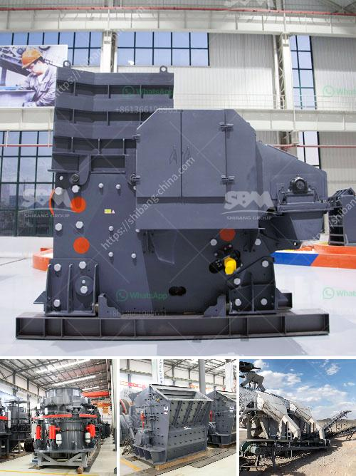

<h3>mobile crusher plant for hire in mpumalanga province</h3>
Mobile crushing plants are often used in demolition projects, construction sites, and mining operations to reduce the size of large rocks, concrete, and other materials for easier transportation and processing. These plants can be hired from specialty companies that rent out mobile crushers for various applications.

In Mpumalanga Province, South Africa, mobile crusher plant has been widely used for many years. With mobile crusher plant, people can process various kinds of stones, such as limestone, granite, basalt, marble, shale, sandstone, quartzite, slate, gneiss, and diabase, etc. If you are interested in mobile crusher plant for hire in Mpumalanga Province, you can consider our company.

1. Versatile Crushing Capabilities: Our mobile crusher plant is equipped with jaw crusher, impact crusher, and cone crusher for different crushing applications. With the flexibility of configuration, it can be operated independently or in conjunction with other equipment to meet different product requirements.

2. High Efficiency and Reliability: The mobile crusher plant is designed with advanced technology and high-quality materials, ensuring its reliable and efficient performance. The various crushing and screening processes can be completed at one time, reducing the overall processing time and improving productivity.

3. Easy Transportation and Installation: Our mobile crusher plant is equipped with a crawler chassis, which allows it to be transported easily between different sites. It can be quickly set up and dismantled, making it ideal for projects that require frequent relocation.

4. Cost-effective Solution: Hiring a mobile crusher plant is a cost-effective alternative to purchasing new equipment. It eliminates the need for capital investment and maintenance costs, allowing you to focus on your core business activities.

5. Environmental Friendliness: Our mobile crusher plant is designed to minimize dust and noise emissions, ensuring a clean and quiet working environment. It is equipped with dust suppression systems and noise reduction measures, making it suitable for urban areas.

1. Contact Us: You can get in touch with our company by phone, email, or through our website. Our experienced staff will provide you with detailed information on our mobile crusher plant and assist you in choosing the right model for your project.

2. Discuss Requirements: We will discuss your specific requirements, such as the type of material to be processed, desired output size, production capacity, and other relevant factors. This information will help us tailor the mobile crusher plant to meet your needs.

3. Site Visit and Quotation: Our team will visit your project site to assess the terrain, access, and other logistical considerations. Based on this evaluation, we will provide you with a detailed quotation that includes the hire rates, terms and conditions, and any additional services you may require.

4. Contract and Delivery: Once you have reviewed and accepted our quotation, we will prepare a contract for you to sign. Upon receipt of the signed contract, we will deliver the mobile crusher plant to your project site, ensuring it is set up and ready for operation.

In conclusion, hiring a mobile crusher plant in Mpumalanga Province can provide you with a flexible, cost-effective, and efficient solution for your crushing and screening needs. With our versatile equipment, high-quality materials, and professional service, we are confident that our mobile crusher plant will exceed your expectations. Contact us today to discuss your requirements and get a customized quotation.
<h3>Contact us</h3><ul><li><strong>Whatsapp:&nbsp;<a href="https://wa.me/8613661969651">+8613661969651</a></strong></li><li><a href="https://swt.shibang-china.com/?git&amp;zhl&amp;mobile crusher plant for hire in mpumalanga province"><strong>Online Service(chat now)</strong></a></li></ul><h3>Related</h3><ul><li><a href='price jaw crusher price stone crusher.md'>price jaw crusher price stone crusher</a></li><li><a href='objectives of ball mill.md'>objectives of ball mill</a></li><li><a href='used portable crusher for sale in germany.md'>used portable crusher for sale in germany</a></li><li><a href='sell artificial sand mill.md'>sell artificial sand mill</a></li><li><a href='rock crusher in europe.md'>rock crusher in europe</a></li></ul>