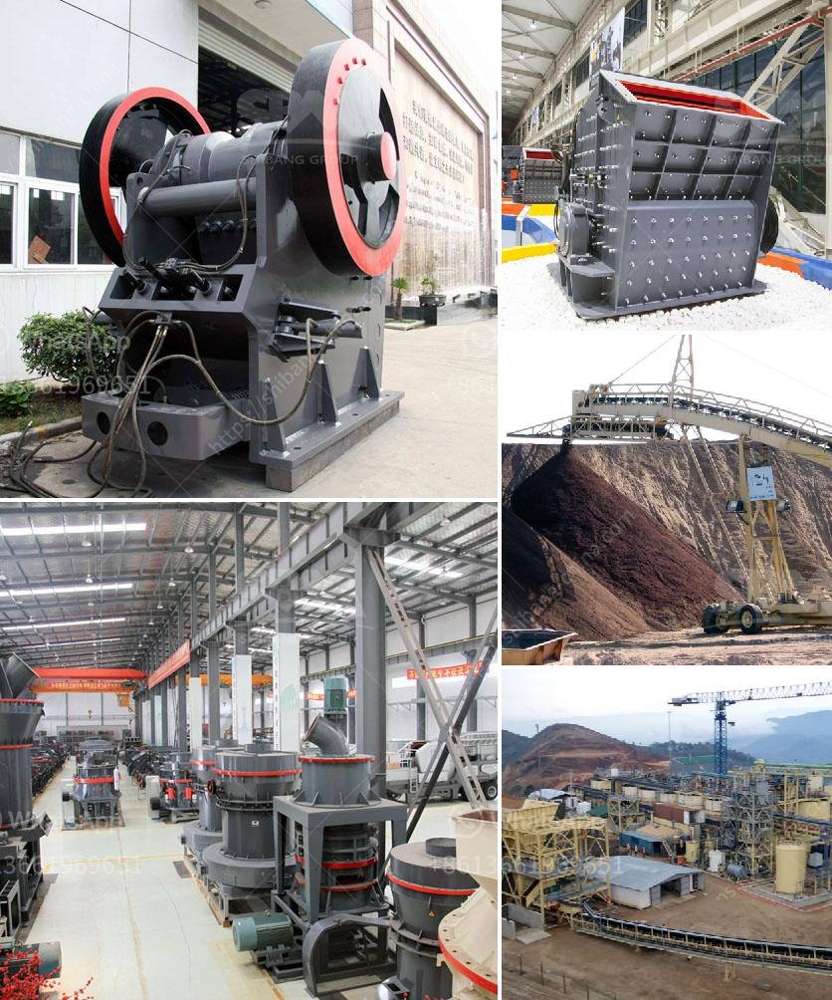

<h3>mobile crusher plant for hire in province</h3>
In recent years, a significant number of construction and mining companies in the province have been exploring the benefits of mobile crushing plant for hire. The reason behind this growing demand is the flexibility and efficiency that mobile crushers offer compared to stationary crushing plants. These portable crushing machines can be easily transported to different areas or job sites, allowing construction and mining companies to process materials on-site, saving time and money.

One of the key advantages of mobile crusher plants is their ability to crush materials directly at the construction or mining site, eliminating the need for transportation of materials. This not only reduces transportation costs but also reduces the environmental impact associated with transporting materials over long distances. Moreover, mobile crushers can crush a wide range of materials, including concrete, asphalt, gravel, and more, making them suitable for various construction and mining applications.

Another benefit of mobile crusher plants for hire is their versatility. These machines come with different configurations and can be equipped with various types of crushers, screens, and conveyors, depending on the specific needs of the project. This ensures that the crushing plant can efficiently handle different types of materials and produce different sizes of aggregates or crushed materials.

Additionally, mobile crusher plants for hire are equipped with advanced features and technologies that enhance productivity and safety. These include remote control operation, hydraulic adjustment systems, and intelligent control systems. The advanced technologies not only improve efficiency but also help in minimizing downtime and reducing maintenance costs.

When considering mobile crusher plant for hire, it is essential to choose a reputable and experienced provider. High-quality machines and reliable service are crucial for ensuring smooth operations and achieving desired results. Furthermore, it is important to assess the specific requirements of the project, including the volume of material to be processed and the desired sizes of the final products, to select the appropriate crushing plant configuration.

In conclusion, mobile crusher plant for hire in the province offers construction and mining companies a flexible and efficient solution for on-site material processing. By eliminating the need for transportation and providing versatility, mobile crushers significantly contribute to cost savings and increased productivity. With advanced features and technologies, these crushing plants enable safe and reliable operations. Therefore, for construction and mining projects, considering mobile crusher plant for hire is a logical choice that leads to improved efficiency and project success.
<h3>Contact us</h3><ul><li><strong>Whatsapp:&nbsp;<a href="https://wa.me/8613661969651">+8613661969651</a></strong></li><li><a href="https://swt.shibang-china.com/?git&amp;zhl&amp;mobile crusher plant for hire in province"><strong>Online Service(chat now)</strong></a></li></ul><h3>Related</h3><ul><li><a href='gypsum powder price in south africa.md'>gypsum powder price in south africa</a></li><li><a href='mining and machine in turkey.md'>mining and machine in turkey</a></li><li><a href='stone medina stone mobile crusher.md'>stone medina stone mobile crusher</a></li><li><a href='coal crusher and screening plants for sale.md'>coal crusher and screening plants for sale</a></li><li><a href='proposal usaha stone crusher.md'>proposal usaha stone crusher</a></li></ul>