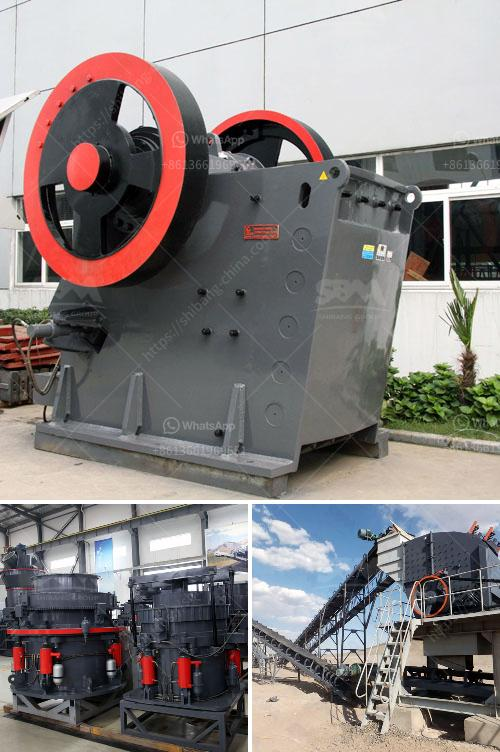

<h3>mobile crusher plant for sale</h3>
Mobile crusher plant, also called portable crushing plant, is a flexible and powerful crushing solution designed for small to medium projects. It provides on-sites crushing without material transporting from one place to another, thus reducing your material transportation costs. The output capacity ranges from 100t/h to 400t/h. We have models to meet various needs.

One important feature of our mobile crusher plant is its flexibility. This plant can work independently or together with other crushing machines. It is adaptable to various terrains and can be easily transported from one site to another. The mobile crushing plant can be used in mines, coal mines, garbage and construction waste recycling, earth and stone works, urban infrastructure, roads or construction sites. Flexible configuration makes it easy for customers to realize various kinds of material processing requirements according to operation mode and raw material type.

Another advantage of mobile crusher plant is its energy efficiency. The plant uses a diesel engine as the power source, which reduces fuel consumption. Not only does it make the operation more economical, but it also reduces the impact on the environment. In addition, the diesel engine has low noise, excellent performance, stable operation, and low failure rate, ensuring high-quality and efficient operation of the equipment.

The mobile crusher plant is equipped with vibrating feeder, jaw crusher, cone crusher, impact crusher, belt conveyor, VSI crusher, vibrating screen, etc. These equipment can meet different crushing requirements. The plant can be equipped with a hydraulic system to facilitate the replacement of parts, and timely repair in case of failure, reducing downtime and maintaining high production efficiency.

Moreover, our mobile crusher plant for sale is equipped with intelligent control system, which can accurately control the equipment operation. The plant is compact in structure, small in size, and fully automated, which can support local area network and computer centralized control. With the remote control system, the operation of the equipment is simpler, and the operator can directly monitor the working condition of the equipment through the display screen.

The mobile crusher plant for sale is designed for various crushing applications. The cone crushers should come with high crushing ratio and large processing capacity. In order to choose the suitable machine, you should keep these factors in mind. Apart from the crusher itself, you should also consider the feeding size and discharge size. The feeding size of different cone crushers is different, and the discharging size is also different. Choose the suitable one according to your actual needs.

In summary, mobile crusher plant is a highly efficient, reliable and flexible crushing solution that can be used for various industries. It is especially suitable for stone crushing, construction waste recycling and other projects. It provides customers with efficient and low-cost operation methods, excellent product quality and high customer satisfaction. If you are in need of a mobile crusher plant, please contact us for more detailed information and quotation.
<h3>Contact us</h3><ul><li><strong>Whatsapp:&nbsp;<a href="https://wa.me/8613661969651">+8613661969651</a></strong></li><li><a href="https://swt.shibang-china.com/?git&amp;zhl&amp;mobile crusher plant for sale"><strong>Online Service(chat now)</strong></a></li></ul><h3>Related</h3><ul><li><a href='sand and gravel dryer equipment qatar.md'>sand and gravel dryer equipment qatar</a></li><li><a href='sell plant of crushing mobile.md'>sell plant of crushing mobile</a></li><li><a href='stone crusher used equipment germany.md'>stone crusher used equipment germany</a></li><li><a href='how much is crusher for gypsum.md'>how much is crusher for gypsum</a></li><li><a href='mica pearl process flowchart.md'>mica pearl process flowchart</a></li></ul>