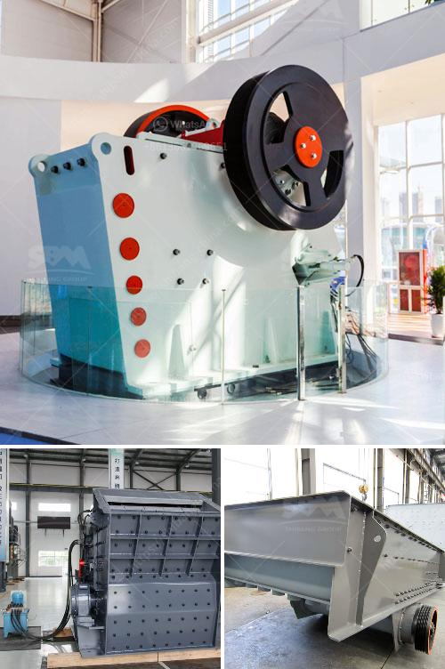

<h3>mobile crusher seller</h3>
Mobile crushers are gaining popularity due to their flexibility, mobility, and efficiency in crushing materials. These equipment are widely used in the construction, mining, and recycling industries, allowing operators to efficiently crush materials directly on-site, saving transportation costs and time.

When it comes to purchasing a mobile crusher, it is crucial to find a reliable seller that offers high-quality equipment and excellent customer service. With numerous sellers in the market, it can be challenging to choose the right one for your specific needs. This article will explore the qualities to look for in a mobile crusher seller.

First and foremost, a reputable mobile crusher seller should offer a wide range of products that cater to different needs. This means having a diverse selection of models and sizes to accommodate various job sites, material types, and production requirements. Whether you need a compact or heavy-duty crusher, the seller should have options to suit your specific project needs.

Additionally, a reliable seller should prioritize the quality and durability of their mobile crushers. Advanced engineering and manufacturing techniques, such as robust frames, powerful engines, and high-quality components, ensure the longevity and performance of the equipment. A reputable seller should be able to provide detailed specifications and technical information about their products, allowing customers to make an informed decision.

Apart from the quality of the mobile crusher, it is crucial to consider the after-sales support provided by the seller. A reputable seller will offer excellent customer service, including technical support, spare parts availability, and maintenance assistance. Mobile crushers require regular maintenance and occasional repairs, so it is vital to have a seller that can provide prompt and efficient service to minimize downtime and keep your operations running smoothly.

Furthermore, a reliable seller should have a strong reputation in the industry. Look for customer reviews, testimonials, and references to gauge the seller's track record. Positive feedback and satisfied customers are indicators of a trustworthy seller that delivers on its promises.

Lastly, price is an important consideration when choosing a mobile crusher seller. While it is essential to find a cost-effective option, it is equally important not to compromise on quality. A reputable seller will offer competitive pricing while ensuring the highest standards of equipment.

In conclusion, finding a reputable mobile crusher seller is crucial for those in the construction, mining, and recycling industries. Look for a seller with a diverse range of products, ensuring there is a suitable option for your specific needs. Prioritize quality, durability, and after-sales support, as these factors contribute to the overall performance and longevity of the equipment. Consider the seller's reputation in the industry and ensure competitive pricing without compromising on quality. By choosing the right seller, you can acquire a high-quality mobile crusher that meets your requirements and facilitates efficient crushing operations.
<h3>Contact us</h3><ul><li><strong>Whatsapp:&nbsp;<a href="https://wa.me/8613661969651">+8613661969651</a></strong></li><li><a href="https://swt.shibang-china.com/?git&amp;zhl&amp;mobile crusher seller"><strong>Online Service(chat now)</strong></a></li></ul><h3>Related</h3><ul><li><a href='graphite processing and beneficiation.md'>graphite processing and beneficiation</a></li><li><a href='rock crushing equipment for sale.md'>rock crushing equipment for sale</a></li><li><a href='rock crusher distributors in phillipinwes.md'>rock crusher distributors in phillipinwes</a></li><li><a href='stone crusher suppliers in indore.md'>stone crusher suppliers in indore</a></li><li><a href='horizontal impact crusher for sale.md'>horizontal impact crusher for sale</a></li></ul>