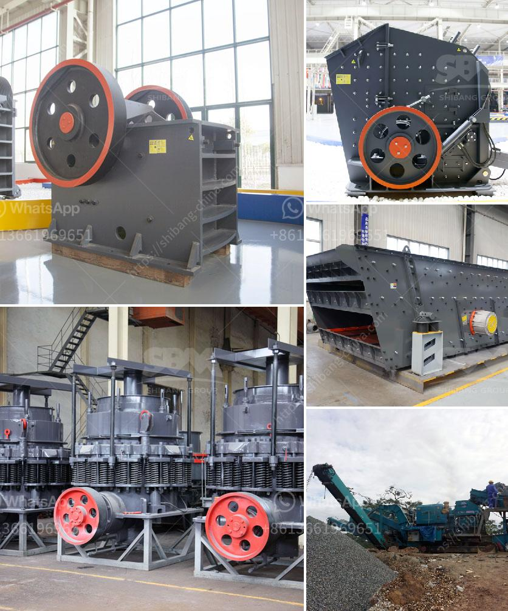

<h3>mobile crusher south africa</h3>
Mobile Crusher South Africa, along with other Asian markets, has become a hot commodity in recent years. Its versatility and convenience have propelled its popularity and made it a sought-after piece of equipment in a variety of industries.

A mobile crusher is a machine designed to reduce large rocks into smaller rocks, gravel, or rock dust. These machines utilize a heavy-duty jaw crusher to break down the material into usable sizes. The crushed material is then processed further to produce various types of construction materials such as concrete, asphalt, and aggregate.

One of the key advantages of a mobile crusher is its ability to move easily from one location to another. This makes it an ideal choice for construction companies and contractors who frequently need to transport their equipment to different sites. Instead of having to rely on expensive and time-consuming transportation methods, a mobile crusher can be easily transported to the desired location using a trailer or truck. This not only saves money but also reduces the overall downtime associated with moving heavy equipment.

Furthermore, a mobile crusher eliminates the need for costly infrastructure such as concrete foundations or building structures. Traditional crushers require a fixed installation, which can be both time-consuming and expensive. In contrast, a mobile crusher can be set up and operational within a matter of hours, significantly reducing both the upfront costs and the time required to start production.

The versatility of a mobile crusher is another key factor that has contributed to its popularity. These machines can handle a wide range of materials, including concrete, bricks, stones, and rubble. This makes them an ideal choice for recycling applications, where materials can be crushed and reused on-site, reducing the need for additional raw materials and minimizing waste.

Mobile crushers also offer enhanced safety features compared to traditional crushers. Many models are equipped with advanced systems such as remote control operation, hydraulic adjustment, and automatic monitoring of vital parameters. These features not only make operation more efficient but also reduce the risk of accidents and injuries.

In conclusion, mobile crushers have revolutionized the construction and mining industries in South Africa and other developing countries. Their portability, versatility, and cost-effectiveness make them an attractive choice for a wide range of applications. As technology continues to improve, we can expect to see even more advanced mobile crushers in the future, further enhancing their efficiency and performance.
<h3>Contact us</h3><ul><li><strong>Whatsapp:&nbsp;<a href="https://wa.me/8613661969651">+8613661969651</a></strong></li><li><a href="https://swt.shibang-china.com/?git&amp;zhl&amp;mobile crusher south africa"><strong>Online Service(chat now)</strong></a></li></ul><h3>Related</h3><ul><li><a href='sewa stone crusher di jakarta.md'>sewa stone crusher di jakarta</a></li><li><a href='stone crusher conveyor belts.md'>stone crusher conveyor belts</a></li><li><a href='feasibility study for stone crusher plants.md'>feasibility study for stone crusher plants</a></li><li><a href='process of kaolin mining crusher.md'>process of kaolin mining crusher</a></li><li><a href='mining and machine in turkey.md'>mining and machine in turkey</a></li></ul>