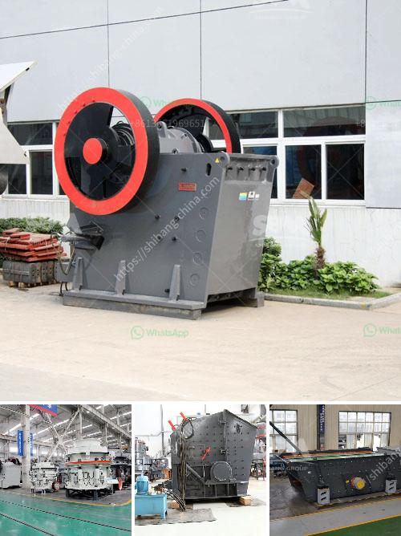

<h3>mobile crushers for hire in product</h3>
In today's fast-paced environment, the importance of mobilizing heavy machinery and equipment cannot be overstated. This is particularly true in the construction, mining, and quarrying industries, where the ability to move efficiently and quickly is key to staying competitive. One such innovation that has greatly enhanced productivity in these sectors is the availability of mobile crushers for hire.

Mobile crushers are versatile machines that pulverize a wide range of materials quickly and efficiently. Whether it is gravel, rock, limestone, or demolition waste, these machines can process it all. With the ability to crush and screen materials on-site, they eliminate the need for transporting material to a stationary crusher, saving time and cost.

The advantages of choosing mobile crushers for hire are numerous. First and foremost, these machines are highly portable. They can be easily transported from one site to another, ensuring that you have access to crushing and screening capabilities wherever your project takes you. This mobility also allows for on-site crushing, reducing the need for material to be transported to and from the site, further saving time and cost.

Secondly, mobile crushers are extremely efficient and productive. Equipped with powerful jaw crushers or impact crushers, these machines can process large volumes of material in a short amount of time. This means that projects can be completed faster, leading to increased output and revenue.

Another significant advantage of mobile crushers for hire is their flexibility. This is especially beneficial for projects with varying material requirements. The ability to adjust the crushing and screening settings allows for the production of a wide range of finished products. Whether you need coarse aggregates for road construction or fine sand for concrete production, mobile crushers can cater to your specific needs.

Furthermore, opting for mobile crushers for hire can greatly benefit small and medium-sized businesses. Purchasing and maintaining heavy machinery can be a considerable investment that may not be viable for companies with limited budgets. By opting for hire, businesses can access cutting-edge technology and equipment without the burden of ownership expenses.

In conclusion, mobile crushers for hire offer a flexible, efficient, and cost-effective solution for crushing and screening needs. They are highly portable, allow for on-site processing, and can produce a variety of finished products. Whether you are embarking on a construction project, mining venture, or quarrying operation, incorporating mobile crushers into your fleet is undoubtedly a wise decision.
<h3>Contact us</h3><ul><li><strong>Whatsapp:&nbsp;<a href="https://wa.me/8613661969651">+8613661969651</a></strong></li><li><a href="https://swt.shibang-china.com/?git&amp;zhl&amp;mobile crushers for hire in product"><strong>Online Service(chat now)</strong></a></li></ul><h3>Related</h3><ul><li><a href='copper slag recycling plants china.md'>copper slag recycling plants china</a></li><li><a href='second hand equipment for sale in south africa.md'>second hand equipment for sale in south africa</a></li><li><a href='crusher price for crushed stone.md'>crusher price for crushed stone</a></li><li><a href='precipitated calcium carbonate production plant design.md'>precipitated calcium carbonate production plant design</a></li><li><a href='gold milling machine for sale in south africa.md'>gold milling machine for sale in south africa</a></li></ul>