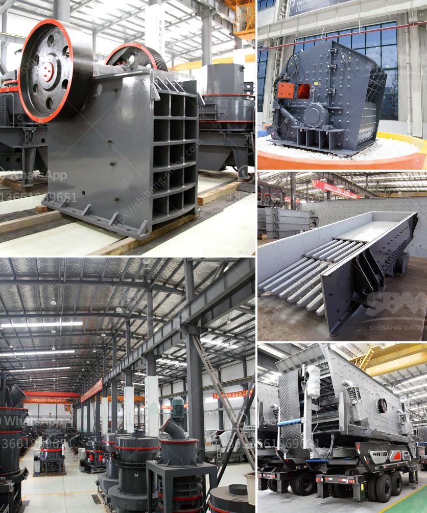

<h3>mobile crushers in abuja</h3>
Mobile crushers have revolutionized the way construction projects are carried out in Abuja and across Nigeria. These machines greatly simplify the process of crushing large materials into smaller pieces via their unique mechanism. They offer numerous advantages, such as increased efficiency, lower operating costs, and reduced environmental impact.

One of the key benefits of mobile crushers is their ability to move from one site to another. This mobility ensures that materials can be crushed on-site, eliminating the need for transportation to and from a centralized crushing site. In a city like Abuja, where vast construction sites are scattered across different locations, this mobility is crucial. It not only saves time but also reduces transportation costs and associated carbon emissions.

Furthermore, mobile crushers provide contractors with a more flexible and responsive approach to construction projects. They can be easily set up and dismantled, allowing for quick mobilization and demobilization. This flexibility enables contractors to respond promptly to changing project requirements, optimizing productivity and minimizing downtime. Whether it is crushing rocks, concrete, asphalt, or other materials, mobile crushers can rapidly adapt to different job sites and deliver superior results.

The use of mobile crushers in Abuja also has significant environmental implications. Traditional crushing methods involve the transportation of materials to and from centralized crushing sites, which requires heavy-duty vehicles and consumes a substantial amount of fuel. Mobile crushers, on the other hand, drastically reduce the need for transportation. By bringing the crushing process directly to the construction site, carbon emissions associated with transportation are greatly reduced. This contributes to a cleaner and more sustainable construction industry in Abuja, aligning with the country's environmental goals.

Another advantage of mobile crushers is their cost-effectiveness. Traditional crushing methods involve the use of large stationary crushers, which require significant capital investment and ongoing maintenance costs. In contrast, mobile crushers have a relatively lower initial investment cost, making them more accessible to smaller contractors and construction companies. Additionally, their portable nature eliminates the need for dedicated crushing equipment at multiple sites, further reducing capital expenses. Moreover, the efficient operation and reduced downtime of mobile crushers result in lower operating costs, making them an attractive investment for the construction industry.

In Abuja, where construction activities are intensifying and infrastructure projects are on the rise, mobile crushers have become essential equipment for contractors. They offer enhanced efficiency, cost-effectiveness, and environmental sustainability. With their ability to move effortlessly across different construction sites, these crushers are streamlining the crushing process and contributing to more efficient and streamlined construction projects. Furthermore, their lower environmental impact aligns with Abuja's commitment to sustainable development.

As the demand for construction materials continues to grow, mobile crushers will play an increasingly crucial role in Abuja's construction industry. With their ability to transform the crushing process, contractors can achieve faster completion times, cost savings, and a reduced environmental footprint. The integration of these innovative machines into Abuja's construction practices marks a significant milestone in the industry's evolution and paves the way for a more sustainable future.
<h3>Contact us</h3><ul><li><strong>Whatsapp:&nbsp;<a href="https://wa.me/8613661969651">+8613661969651</a></strong></li><li><a href="https://swt.shibang-china.com/?git&amp;zhl&amp;mobile crushers in abuja"><strong>Online Service(chat now)</strong></a></li></ul><h3>Related</h3><ul><li><a href='calcium carbonate manufacturing in egypt.md'>calcium carbonate manufacturing in egypt</a></li><li><a href='tph rock crusher.md'>tph rock crusher</a></li><li><a href='second hand jaw crusher philippines.md'>second hand jaw crusher philippines</a></li><li><a href='how to calculate cost per ton crusher aggregate.md'>how to calculate cost per ton crusher aggregate</a></li><li><a href='manufacturers of 3 tph vertical roller mill in china.md'>manufacturers of 3 tph vertical roller mill in china</a></li></ul>