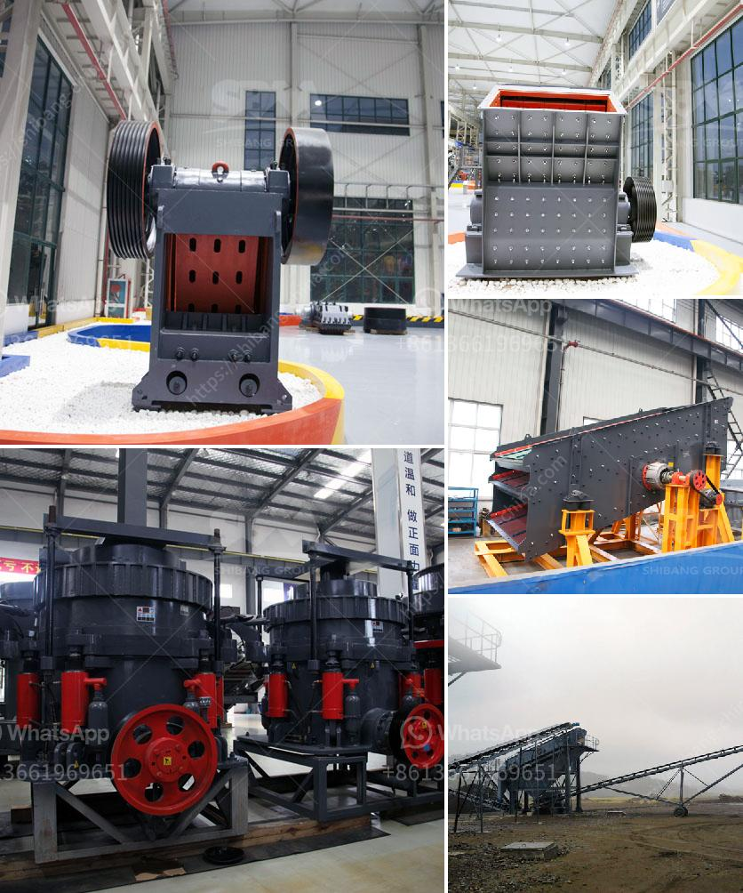

<h3>mobile crushing alocation</h3>
Construction and demolition waste (C&D waste) is a significant environmental concern worldwide. According to a report by the World Bank, the construction industry generates up to 40% of the total solid waste in the world. This waste is often disposed of in landfills, resulting in resource depletion and environmental pollution. However, with the introduction of mobile crushing technology, this landscape is changing for the better.

Mobile crushing entails the use of portable crushing machinery to process and recycle construction and demolition waste on-site. This technology offers numerous benefits that contribute to sustainable waste management and a greener construction industry.

First and foremost, mobile crushing allows for the immediate and on-site processing of waste materials. Traditional waste management methods often involve the transportation of C&D waste to off-site facilities, leading to additional fuel consumption, greenhouse gas emissions, and traffic congestion. With mobile crushing, construction sites can crush waste on the spot, reducing the need for transportation and minimizing the carbon footprint associated with waste disposal.

Another advantage of mobile crushing is the ability to separate and recycle various types of waste materials. Advanced mobile crushing machinery is equipped with screening and sorting capabilities, allowing for the separation of concrete, bricks, wood, metal, and other valuable materials. These separated materials can be recycled or reused in new construction projects, reducing the demand for virgin materials and conserving natural resources.

Furthermore, mobile crushing technology streamlines the waste management process by minimizing the need for manual labor. Traditionally, the sorting and disposal of C&D waste required significant manpower and time. However, with mobile crushers, the waste can be crushed, sorted, and loaded onto trucks or containers using simple on-site machinery. This automation not only saves time and resources but also reduces the potential for injuries and accidents associated with manual labor.

In addition to its environmental benefits, mobile crushing also offers economic advantages to construction companies. By recycling and reusing waste materials, companies can reduce their production costs and increase their profitability. Furthermore, mobile crushing eliminates the need for purchasing and transporting virgin materials, resulting in significant cost savings in the long run.

Mobile crushing technology has gained significant popularity in recent years, with its positive impact on waste management and sustainability. Governments and organizations worldwide are recognizing the potential of this technology, leading to its widespread adoption. For instance, the European Union has set a target to recycle 70% of C&D waste by the year 2020, encouraging the use of mobile crushing as a solution.

In conclusion, mobile crushing technology is revolutionizing waste management in the construction industry. With its ability to process waste on-site, separate valuable materials, and reduce the carbon footprint, mobile crushing is a game-changer in promoting sustainable construction practices. By adopting this technology, construction companies can contribute to a greener future while also benefiting economically. It is clear that mobile crushing is paving the way for a more sustainable and efficient construction and demolition waste management system.
<h3>Contact us</h3><ul><li><strong>Whatsapp:&nbsp;<a href="https://wa.me/8613661969651">+8613661969651</a></strong></li><li><a href="https://swt.shibang-china.com/?git&amp;zhl&amp;mobile crushing alocation"><strong>Online Service(chat now)</strong></a></li></ul><h3>Related</h3><ul><li><a href='crushed stone suppliers manufacture india.md'>crushed stone suppliers manufacture india</a></li><li><a href='how to calculate the powder conveying rate.md'>how to calculate the powder conveying rate</a></li><li><a href='vertical roller pre grinding mill.md'>vertical roller pre grinding mill</a></li><li><a href='stone crusher used equipment germany.md'>stone crusher used equipment germany</a></li><li><a href='lme copper ore price calculations.md'>lme copper ore price calculations</a></li></ul>