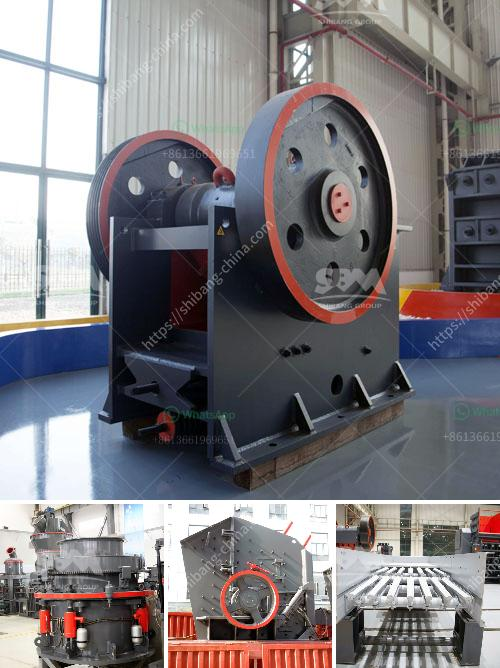

<h3>mobile crushing plant for limestone</h3>
Limestone is in great demand in the construction industry. It is not only an essential raw material for cement production but also a popular choice for the construction of buildings and roads due to its durability, versatility, and attractive appearance. With the increasing demand for limestone, the need for efficient crushing equipment is also growing.

Mobile crushing plant, as the name suggests, is a mobile crusher that can easily move from one location to another. This mobile crushing plant is mainly used in various crushing operations in the fields of metallurgy, chemistry, building materials, hydroelectric power, etc., to process materials that need to be moved, especially for stone crushing in highways, railways, hydropower projects, etc.

The mobile crushing plant is equipped with a complete set of crushing and screening equipment, including primary crushing station, secondary crushing and screening station, and belt conveyor. The crushing stations at all levels are independent working units, which can fulfill their respective responsibilities. The mobile crushing plant is flexible and convenient to move, which can save a large amount of infrastructure and relocation costs.

One of the advantages of the mobile crushing plant is that it can crush materials on site, eliminating the need to transport materials to the crushing site and then back to the construction site, which greatly reduces transportation costs. In addition, the mobile crushing plant can directly crush the materials on the site, bypassing the intermediate links of material transportation and reprocessing, thus saving a lot of time and reducing the loss caused by the middle process.

The mobile crushing plant for limestone can process various materials such as granite, basalt, iron ore, limestone, quartz stone, construction waste, coal, etc., which greatly expands the applications of limestone. The mobile crushing plant is widely used in mines, coal mines, garbage and construction waste recycling, earthwork, urban infrastructure, roads or construction sites, and site operations.

Using mobile crushing plant for limestone mining processing can greatly reduce the transportation cost and improve the production efficiency. It saves much time, which is beneficial for the utilization of limestone resources. The mobile crushing plant is easy to move and install on the working site, and flexible for severe and various applications. It is an economic and practical way in limestone ore processing industry.

With the increasing demand for limestone products, many manufacturers are eager to produce more limestone to meet the market demand. To produce limestone efficiently, reliable crushing equipment is needed, and the mobile crushing plant for limestone can be considered as a good choice. The mobile crushing plant is flexible and convenient to move, which provides a more convenient operation platform for the limestone processing. Therefore, it can save a large amount of infrastructure and relocation costs.

In conclusion, the mobile crushing plant is an ideal equipment for limestone processing. It is flexible, convenient, efficient, and reliable, making it a perfect choice for limestone crushing. So, if you are in need of a limestone crushing plant, do not hesitate to contact us. We will provide you with professional solutions and the best products.
<h3>Contact us</h3><ul><li><strong>Whatsapp:&nbsp;<a href="https://wa.me/8613661969651">+8613661969651</a></strong></li><li><a href="https://swt.shibang-china.com/?git&amp;zhl&amp;mobile crushing plant for limestone"><strong>Online Service(chat now)</strong></a></li></ul><h3>Related</h3><ul><li><a href='second hand equipment for sale in south africa.md'>second hand equipment for sale in south africa</a></li><li><a href='how much is a ball mill.md'>how much is a ball mill</a></li><li><a href='stone quarry process.md'>stone quarry process</a></li><li><a href='chrome sands washing plant with prices.md'>chrome sands washing plant with prices</a></li><li><a href='primary jaw crusher saudi.md'>primary jaw crusher saudi</a></li></ul>