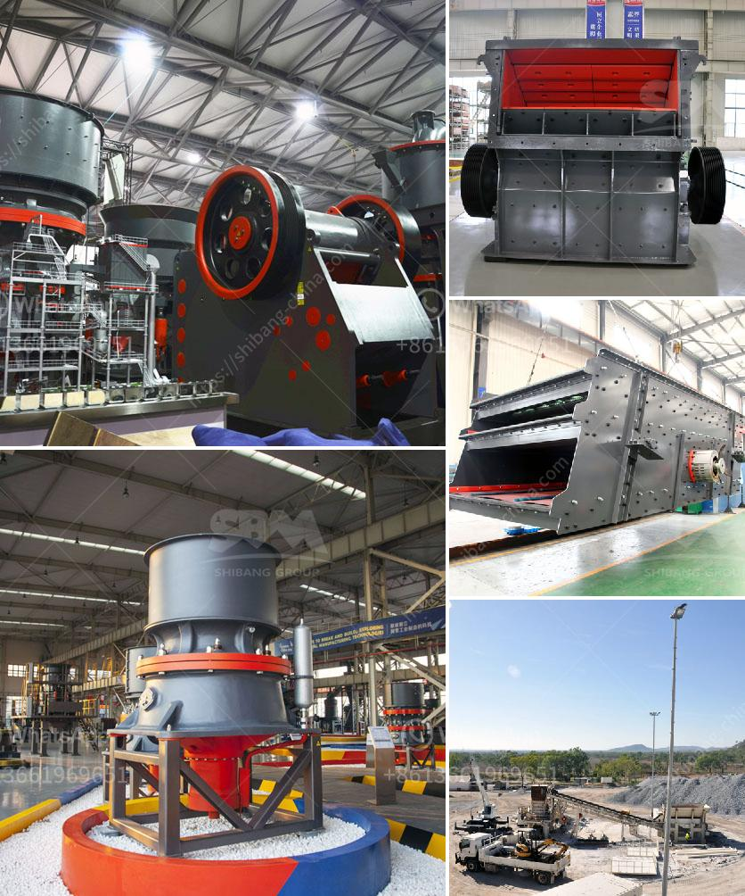

<h3>mobile iron ore jaw crusher for hire in india</h3>
India is one of the fastest growing economies in the world and it is endowed with a large and diverse mineral resource base. With mining operations dating back to 6,000 BCE, India has a rich history of mineral extraction and production. Today, it is one of the world's leading producers of coal, iron ore, bauxite, and various other minerals.

Iron ore is an essential raw material used for manufacturing steel. With abundant reserves of iron ore in India, it has become one of the biggest producers and exporters of iron ore in the world. However, mining of iron ore has its own set of challenges, especially in terms of transportation and processing.

To overcome these challenges, mobile iron ore jaw crushers have gained popularity among miners and quarry operators. These crushers are designed to handle large rocks and ores, making them suitable for both primary and secondary crushing. Mobile iron ore jaw crushers are compact in design and can crush a wide variety of iron ore into smaller sizes, which helps in the extraction process and makes it easier for further processing.

The availability of mobile iron ore jaw crushers in India has increased significantly over the years. The demand for these crushers is ever-growing due to their high efficiency and low operating costs. They can be easily transported from one location to another, making them ideal for on-site crushing operations.

Hiring a mobile iron ore jaw crusher in India has become a popular choice among miners and quarry operators. It enables them to increase their production and efficiency while reducing their transportation and operating costs. By using a mobile crusher, miners can save on fuel, maintenance, and manpower costs.

In conclusion, mobile iron ore jaw crushers are a great investment in India's mining industry. They offer a cost-effective solution for crushing large rocks and ores, making them a vital tool for Indian miners and quarry operators. With the increasing demand for iron ore, mobile crushers will continue to play a significant role in enhancing productivity and profitability in the mining sector.
<h3>Contact us</h3><ul><li><strong>Whatsapp:&nbsp;<a href="https://wa.me/8613661969651">+8613661969651</a></strong></li><li><a href="https://swt.shibang-china.com/?git&amp;zhl&amp;mobile iron ore jaw crusher for hire in india"><strong>Online Service(chat now)</strong></a></li></ul><h3>Related</h3><ul><li><a href='small scale mining partnership crusher.md'>small scale mining partnership crusher</a></li><li><a href='fuller traylor nt gyratory crusher manual.md'>fuller traylor nt gyratory crusher manual</a></li><li><a href='stone crasher busness plan pdf.md'>stone crasher busness plan pdf</a></li><li><a href='gold wash plant trummel revelstoke.md'>gold wash plant trummel revelstoke</a></li><li><a href='grinding mill machine in ethiopia.md'>grinding mill machine in ethiopia</a></li></ul>