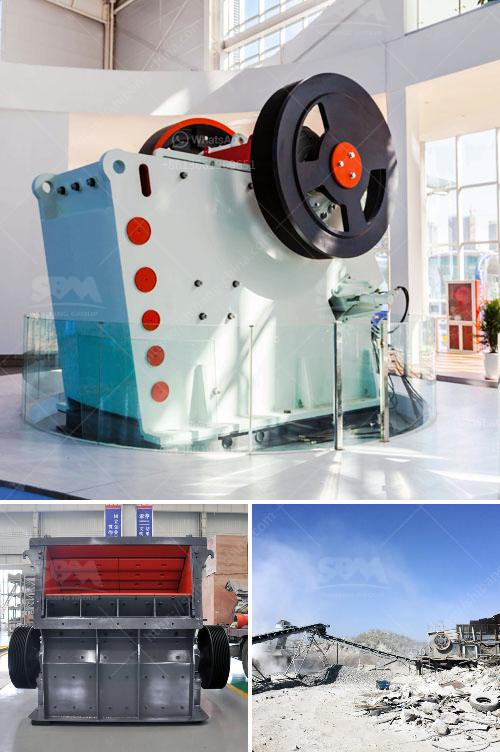

<h3>mobile jaw crusher nigeria</h3>
With the rapid development of technology, the demand for jaw crushers in the market is increasing gradually. Jaw crusher in Nigeria is widely used for medium crushing various ores and bulk materials in mining, smelting, building materials, highway, railway, water, chemical industry and other industries. The crushed materials are of a compressive strength less than 320MPa.

Jaw crusher has the characteristics of big crushing ratio, uniform product size, simple structure, reliable operation, easy maintenance, and economic operating cost. Jaw crusher is widely used in mining, smelting, building material, highway, railway, water conservancy and chemical industries and so on.

To crush granite, basalt, limestone, quartz, iron ore, gold ore, marble, aggregate, river stone, pebble and the like, jaw crusher has been the traditional equipment for coarse crushing, and mobile jaw crusher is also necessary in the construction waste processing line. Mobile jaw crusher actually is known as mobile jaw crushing plant, which is a kind of new mobile crushing plant.

The mobile jaw crusher can be divided into tracked mobile jaw crusher and wheeled mobile jaw crusher. The equipment set feeding, crushing, conveying as one of the equipment. During the operation, it can feed materials to the crusher continuously and uniformly, and also improve the crushing capacity and the output granularity. Compared with the ordinary jaw crusher, the mobile jaw crusher has the following advantages:

1. Flexibility: It can be moved to any location with the change of raw material places or the construction sites, and it can be applied in both stationary and mobile crushing plants.

3. High efficiency: It uses optimized structure to reach higher crushing efficiency and larger capacity.

4. Low cost: It is equipped with advanced hydraulic system and easy to operate and control with one button, making the maintenance and repair easier and more cost-effective.

In conclusion, the mobile jaw crusher in Nigeria is widely used in various materials processing and mining industries. Its versatile applications allow you to run the crusher individually or in a combination of units, depending on your needs and the requirements of your project.
<h3>Contact us</h3><ul><li><strong>Whatsapp:&nbsp;<a href="https://wa.me/8613661969651">+8613661969651</a></strong></li><li><a href="https://swt.shibang-china.com/?git&amp;zhl&amp;mobile jaw crusher nigeria"><strong>Online Service(chat now)</strong></a></li></ul><h3>Related</h3><ul><li><a href='raymond mill parts.md'>raymond mill parts</a></li><li><a href='stone crushing machine cost.md'>stone crushing machine cost</a></li><li><a href='manufacture of a conveyor belt.md'>manufacture of a conveyor belt</a></li><li><a href='portable crusher manufacturer.md'>portable crusher manufacturer</a></li><li><a href='scrap prices per ton in south africa.md'>scrap prices per ton in south africa</a></li></ul>