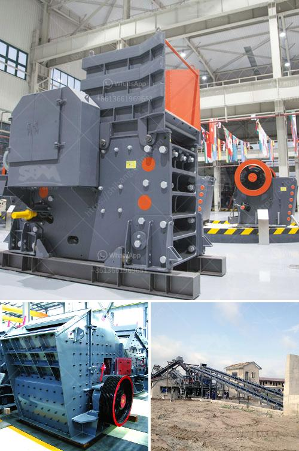

<h3>mobile jaw crusher with rotary screen</h3>
Mobile jaw crusher with rotary screen is a useful tool for infrastructure development projects. It allows the operator to crush and screen limestone, concrete, and brick materials without needing to transport them to a processing facility. This reduces material transportation costs and significantly cuts down on the amount of time required to process materials.

A mobile jaw crusher with rotary screen, commonly known as a wheel-mounted jaw crusher, is widely used for recycling construction waste and for processing various stones and minerals. It delivers a complete crushing operation in one single unit, making it a cost-effective option for diverse applications.

One of the main advantages of a mobile jaw crusher with rotary screen is its flexibility. It can be easily moved to different job sites, allowing the operator to bring the crushing process to the materials rather than having to transport the materials to a fixed processing facility. This improves efficiency and reduces the environmental impact associated with long-distance material transportation.

In addition to its mobility, a mobile jaw crusher with rotary screen offers a wide range of features and benefits. The rotary screen separates the crushed materials into different sizes, which can be used for various purposes such as road construction, landscaping, and building projects. The adjustable jaw ensures precise crushing and allows for easy control of the final product size.

Another advantage of a mobile jaw crusher with rotary screen is its versatility. It can be used for a variety of materials, including hard rocks, concrete, and asphalt. This makes it suitable for a wide range of applications, from construction and demolition waste recycling to quarrying and mining operations. The crusher can handle different types of materials with varying hardness levels, ensuring efficient crushing performance in various conditions.

The maintenance of a mobile jaw crusher with rotary screen is relatively easy. The machine is designed to be durable and reliable, requiring minimal maintenance. Regular inspections and lubrication of key components will keep the crusher running smoothly and reduce the risk of unexpected breakdowns.

In conclusion, a mobile jaw crusher with rotary screen is a versatile and cost-effective tool for infrastructure development projects. It offers flexibility, mobility, and a wide range of features that make it suitable for various applications. The ability to process materials on-site significantly reduces transportation costs and saves time. Whether it is for recycling construction waste or processing stones and minerals, a mobile jaw crusher with rotary screen is a valuable asset for any project.
<h3>Contact us</h3><ul><li><strong>Whatsapp:&nbsp;<a href="https://wa.me/8613661969651">+8613661969651</a></strong></li><li><a href="https://swt.shibang-china.com/?git&amp;zhl&amp;mobile jaw crusher with rotary screen"><strong>Online Service(chat now)</strong></a></li></ul><h3>Related</h3><ul><li><a href='rumus menghitung berat besi stanliss.md'>rumus menghitung berat besi stanliss</a></li><li><a href='iron mining machine manufacturer.md'>iron mining machine manufacturer</a></li><li><a href='small scale quarry mining equipment.md'>small scale quarry mining equipment</a></li><li><a href='clay grinding mill.md'>clay grinding mill</a></li><li><a href='copper making process.md'>copper making process</a></li></ul>