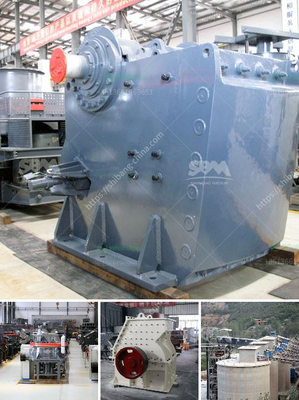

<h3>mobile rock crusher granulator jaw type ballitoville</h3>
The mobile rock crusher granulator is designed with the aim of reducing large rock objects into smaller pieces. This compact device is not only efficient but also versatile, as it can crush various types of materials, including granite, limestone, and concrete.

One of the standout features of this mobile rock crusher granulator is its jaw-type design. The jaw crusher is arguably the most popular crusher type worldwide, and for good reason. Its simple yet effective structure allows for easy operation and maintenance, making it a reliable option for crushing tasks.

The granulator's jaw-type configuration enables it to exert a powerful force on rocks, breaking them down into smaller, more manageable pieces. This makes it significantly easier to transport and use in different construction and mining sites.

With its compact design, the mobile rock crusher granulator can be easily transported and operated on-site. It can be towed by a truck or installed on a trailer, making it a convenient and mobile solution for crushing rocks in various locations.

Furthermore, the granulator's jaw-type design ensures efficient and consistent crushing performance. The rock crusher's jaws exert a strong force on the material, reducing it to the desired size for further processing or use. This uniformity of crushing ensures that the granulator produces consistent and high-quality output throughout its operation.

The mobile rock crusher granulator is also equipped with advanced safety features. These include a protective guard around the jaw to prevent accidental injury during operation. Additionally, the crusher is equipped with a safety switch that stops the machine in case of any malfunctions, ensuring both the operator's safety and the longevity of the equipment.

In conclusion, the mobile rock crusher granulator is a powerful and versatile machine that helps in reducing large rock objects into smaller, more manageable pieces. Its jaw-type design allows for efficient and reliable crushing performance while ensuring operator safety. With its compact and mobile nature, this rock crusher can be easily transported and operated on-site, making it an ideal choice for various construction and mining applications.
<h3>Contact us</h3><ul><li><strong>Whatsapp:&nbsp;<a href="https://wa.me/8613661969651">+8613661969651</a></strong></li><li><a href="https://swt.shibang-china.com/?git&amp;zhl&amp;mobile rock crusher granulator jaw type ballitoville"><strong>Online Service(chat now)</strong></a></li></ul><h3>Related</h3><ul><li><a href='crusher sand and stone in kenya.md'>crusher sand and stone in kenya</a></li><li><a href='bauxite crusher machine.md'>bauxite crusher machine</a></li><li><a href='small scale gold processing line.md'>small scale gold processing line</a></li><li><a href='how pyrite mined and processed.md'>how pyrite mined and processed</a></li><li><a href='coal powder making machine.md'>coal powder making machine</a></li></ul>