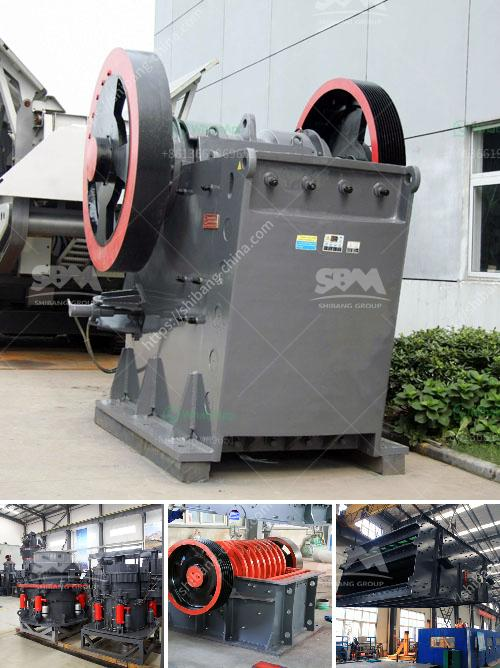

<h3>mobile screening plant south africa</h3>
Mobile screening plants in South Africa are an important resource for construction and mining companies. These plants can be used to remove unwanted material and enable the raw materials to be reused in different industries. Due to the rapid urbanization and industrialization in South Africa, the country's construction sector is growing at a significant rate, increasing the demand for mobile screening plants.

A mobile screening plant is a versatile piece of equipment that is used to screen rocks, gravel, sand, and other materials. It can be used in various applications such as mining, recycling, quarrying, and construction. The main advantage of a mobile screening plant is its mobility. It can be easily transported to different sites, allowing companies to quickly and efficiently screen materials wherever they are needed.

South Africa is one of the largest producers of minerals in the world, and its mining industry plays a vital role in the country's economy. The mobile screening plants in South Africa are primarily used by mining companies for the extraction of valuable minerals. These plants are equipped with vibrating screens and other sophisticated screening equipment that helps separate the minerals from the unwanted material.

Apart from the mining industry, mobile screening plants are also widely used in the construction sector. South Africa is experiencing a construction boom, with infrastructure projects such as roads, bridges, and buildings being built across the country. Mobile screening plants are used on construction sites to screen and separate materials such as concrete, sand, and gravel. This enables construction companies to recycle the materials and reduce waste, resulting in cost savings and environmental benefits.

Furthermore, mobile screening plants are also used in the recycling industry. South Africa has a growing focus on recycling to reduce waste and protect the environment. These plants can be used to screen and separate recyclable materials such as paper, plastic, and glass. By using mobile screening plants, recycling companies can sort and process recyclable materials efficiently, contributing to the country's sustainability goals.

In conclusion, mobile screening plants play a crucial role in South Africa's construction, mining, and recycling sectors. They provide a flexible and efficient solution for screening and separating various materials, allowing companies to reuse valuable resources and reduce waste. As the demand for construction and mining activities continues to grow in the country, the use of mobile screening plants is expected to increase. South Africa's mobile screening plant industry is well-positioned to meet this growing demand and contribute to the country's economic development and sustainability goals.
<h3>Contact us</h3><ul><li><strong>Whatsapp:&nbsp;<a href="https://wa.me/8613661969651">+8613661969651</a></strong></li><li><a href="https://swt.shibang-china.com/?git&amp;zhl&amp;mobile screening plant south africa"><strong>Online Service(chat now)</strong></a></li></ul><h3>Related</h3><ul><li><a href='jaw crusher in uae.md'>jaw crusher in uae</a></li><li><a href='best machine for marble processing.md'>best machine for marble processing</a></li><li><a href='ball mill suppliers in hyderabad.md'>ball mill suppliers in hyderabad</a></li><li><a href='raymond mill mumbai and africa.md'>raymond mill mumbai and africa</a></li><li><a href='quartz crusher machinery.md'>quartz crusher machinery</a></li></ul>