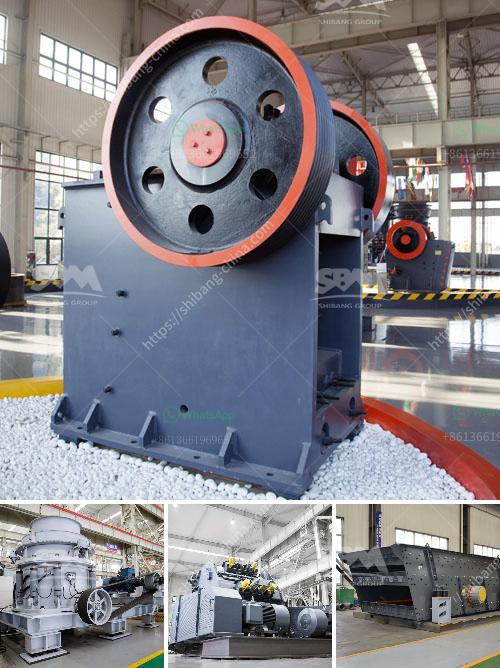

<h3>mobile stone crusher 120 tph price</h3>
Mobile stone crusher is a highly efficient and energy-saving crushing equipment, manufactured by our company based on years of research and development experience of mobile crushing plant equipment. With the advantages of various types and complete models, mobile stone crushers have yielded remarkable economic and social benefits.

The stone crusher mobile plant is a series machine to crush and screen various stone materials. It mainly consists of jaw crusher, impact crusher or cone crusher (crusher machine), and vibrating screen (screening equipment). The jaw crusher is the most common and reliable coarse crushing equipment, which is widely used in mining, metallurgy, building materials, highway, railway, water conservancy and chemical industries.

The impact crusher or cone crusher is usually used for secondary or tertiary crushing, while the vibrating screen can be a common screening machine for various specifications of finished products. The mobile stone crusher 120 tph price is about $18 million. It consists of feeding hopper, MTW215 European type trapezium mill, vibrating screen, belt conveyor, classifier, magnetic separator, stockpile, and auxiliary equipment.

The bulk materials are fed into the jaw crusher by the vibrating feeder for coarse crushing, and then the ore is transported to the cone crusher for medium and fine crushing. The crushed material is screened by the vibrating screen. The final product is conveyed to the storage yard through the belt conveyor, and the finished product is sent to the finished product stack through the finished product chute by the belt conveyor.

Compared with traditional crushing equipment, the high-frequency vibrating screen has excellent performance in various fields, such as ore, stone, coal, smelting, chemical industry, building materials, etc. In addition, the mobile stone crusher 120 tph price is reasonable and ensures long-term investment return.

Finally, the mobile stone crushing plant has a wide range of applications, especially for the treatment of construction wastes. The mobile stone crusher has reasonable matching and compact structure characteristics, which can effectively improve the operation efficiency of the equipment. In addition, the reasonable design of the crushing plant can effectively reduce the production cost, and make mobile stone crusher 120 tph price popular in the market.
<h3>Contact us</h3><ul><li><strong>Whatsapp:&nbsp;<a href="https://wa.me/8613661969651">+8613661969651</a></strong></li><li><a href="https://swt.shibang-china.com/?git&amp;zhl&amp;mobile stone crusher 120 tph price"><strong>Online Service(chat now)</strong></a></li></ul><h3>Related</h3><ul><li><a href='sandstone crusher quarry.md'>sandstone crusher quarry</a></li><li><a href='crusher plant for sale.md'>crusher plant for sale</a></li><li><a href='manufacturer of quartz powder mill.md'>manufacturer of quartz powder mill</a></li><li><a href='rotary kiln cement plant cost in india.md'>rotary kiln cement plant cost in india</a></li><li><a href='jaw crusher adalah.md'>jaw crusher adalah</a></li></ul>