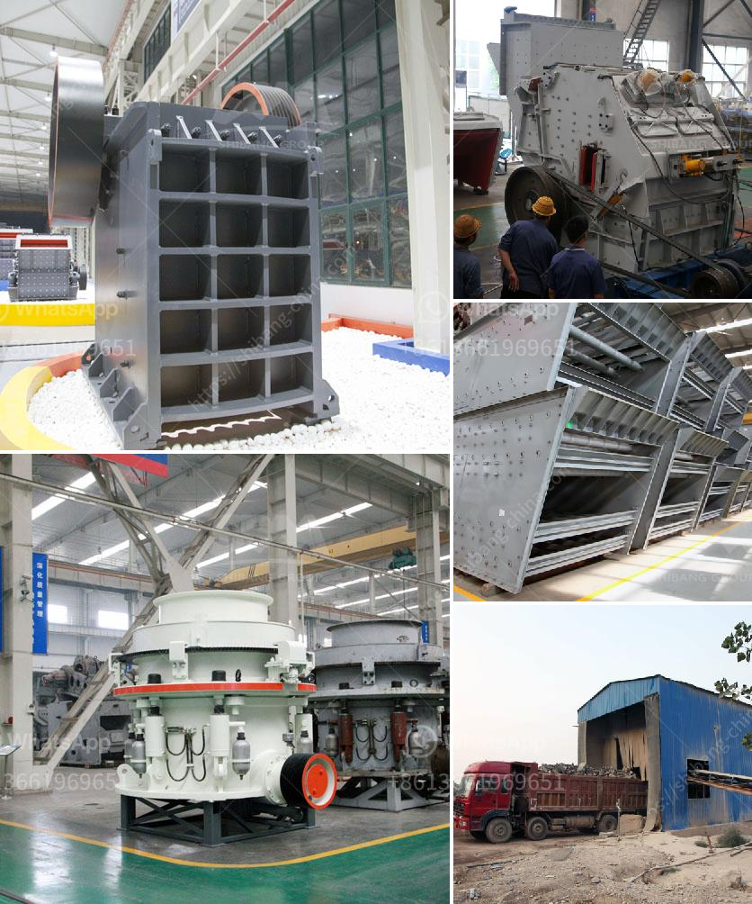

<h3>mobile stone crusher control systems</h3>
Mobile stone crusher control systems are designed to effectively manage and control all operations of a mobile stone crusher plant, ensuring optimum efficiency and reliable operation. These systems have a wide range of functionalities, enabling the crusher plant to be managed and monitored remotely from a control room, thus eliminating the need for onsite personnel.

One of the main advantages of mobile stone crusher control systems is their ability to maintain a constant feed rate even in challenging operating conditions. The system uses advanced algorithms to accurately regulate the flow of material into the crusher, preventing material congestion and ensuring a steady supply of crushed aggregate.

By managing the feed rate, these control systems also help optimize the crusher's performance and reduce the risk of overloading, which can cause excessive wear and damage to the machine. Additionally, the control systems are equipped with sensors that can detect and respond to any irregularities in the crusher's operation, such as the presence of foreign objects or abnormal operating temperatures. When an issue is detected, the system automatically adjusts the crusher's parameters or alerts the operator, preventing potential breakdowns and minimizing downtime.

Mobile stone crusher control systems also provide valuable data that can be used for analysis and optimization of the crushing process. The systems collect information on various parameters, such as feed rate, crusher power draw, and product size distribution, allowing operators to monitor and fine-tune the performance of the crusher in real-time. This data can then be used to identify potential areas for improvement, such as adjusting the crusher settings or optimizing the use of different crusher liners.

Furthermore, these control systems offer remote monitoring and diagnostics capabilities, allowing operators and maintenance personnel to access real-time information about the crusher's status and performance from any device with internet connectivity. This remote access feature enables proactive maintenance, as operators can identify potential issues and plan maintenance activities in advance, reducing the risk of unexpected breakdowns and maximizing the crusher's uptime.

Overall, mobile stone crusher control systems provide numerous benefits, both in terms of operational efficiency and maintenance. These systems ensure a steady and controlled feed rate, optimize crusher performance, prevent overload situations, and provide valuable data for process analysis and optimization. With their remote monitoring and diagnostic capabilities, they also enable proactive maintenance, reducing downtime and improving the overall reliability of the crusher plant.

In conclusion, mobile stone crusher control systems are essential tools for managing and optimizing the operation of a mobile stone crusher plant. These systems ensure a steady and controlled feed rate, optimize crusher performance, and provide valuable data for process analysis and optimization. By enabling remote monitoring and diagnostics, they also facilitate proactive maintenance, reducing downtime and enhancing the reliability of the crusher plant.
<h3>Contact us</h3><ul><li><strong>Whatsapp:&nbsp;<a href="https://wa.me/8613661969651">+8613661969651</a></strong></li><li><a href="https://swt.shibang-china.com/?git&amp;zhl&amp;mobile stone crusher control systems"><strong>Online Service(chat now)</strong></a></li></ul><h3>Related</h3><ul><li><a href='costo de la planta de procesamiento de coltan.md'>costo de la planta de procesamiento de coltan</a></li><li><a href='crusher plant for coal for sale in south africa.md'>crusher plant for coal for sale in south africa</a></li><li><a href='chilli powder making machine india price.md'>chilli powder making machine india price</a></li><li><a href='mining and quarrying crusher business in south africa.md'>mining and quarrying crusher business in south africa</a></li><li><a href='grinding mill sale.md'>grinding mill sale</a></li></ul>