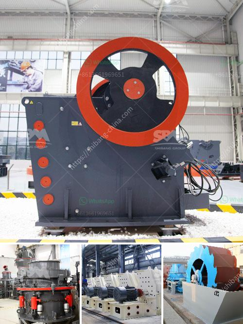

<h3>mobile stone crusher price india</h3>
In recent years, with the continuous development of the construction industry and the increasing demand for construction materials, the price of mobile stone crushers in India has also increased. And with the fierce competition among manufacturers, all kinds of mobile stone crushers are alluring customers with low prices. But, is the price of mobile stone crusher really cheap?

Mobile stone crusher price in India has a variety of configuration forms. The crusher can meet different material requirements by configuring different crushing chamber types. Some rock crushers are multi-functional while others are only suitable for specific crushing operations. For example, some crushers can crush iron ore, limestone, shale, river pebbles, and so on. But some crushers are only suitable for processing smaller materials.

The price of mobile stone crusher is different due to the difference in configuration. Generally speaking, price will be from tens of thousands to hundreds of thousands dollars. The quality of the crusher is determined by the quality of its parts. Many manufacturers will use inferior raw materials and cut corners to reduce costs. This will involve a series of problems such as low production efficiency, serious wear and tear, and short lifespan. Therefore, when choosing a mobile stone crusher, customers must also consider the reputation of the manufacturer and the quality of the crusher itself.

In addition to the quality of the crusher, customers can also consider the after-sales service and technical support provided by the manufacturer. With the continuous development of the Internet, more and more manufacturers are carrying out online sales. This can bring convenience to customers, but it also requires them to be more cautious. They should not only consider the price of the crusher but also judge the credibility and service capabilities of the manufacturer. A comprehensive comparison can help customers find the most suitable mobile stone crusher manufacturer.

In conclusion, the price of mobile stone crusher in India is affected by different factors, such as the configuration, technology, capacity, and material requirements of the crusher. The higher the configuration, the higher the production efficiency, the higher the output, and the higher the corresponding price. Customers can refer to the above analysis to evaluate the price of the equipment and choose the most cost-effective manufacturer to purchase. Moreover, it is important to remember that low price does not necessarily mean high quality, so it is crucial to consider the reputation and after-sales service of the manufacturer. With a careful comparison and selection process, customers can find a suitable mobile stone crusher in India at a reasonable price.
<h3>Contact us</h3><ul><li><strong>Whatsapp:&nbsp;<a href="https://wa.me/8613661969651">+8613661969651</a></strong></li><li><a href="https://swt.shibang-china.com/?git&amp;zhl&amp;mobile stone crusher price india"><strong>Online Service(chat now)</strong></a></li></ul><h3>Related</h3><ul><li><a href='copper processing plants in usa for sale.md'>copper processing plants in usa for sale</a></li><li><a href='conveyor belts for buckets.md'>conveyor belts for buckets</a></li><li><a href='marble quarry crusher equipments.md'>marble quarry crusher equipments</a></li><li><a href='crusher plant layout.md'>crusher plant layout</a></li><li><a href='crusher plant price komatsu.md'>crusher plant price komatsu</a></li></ul>