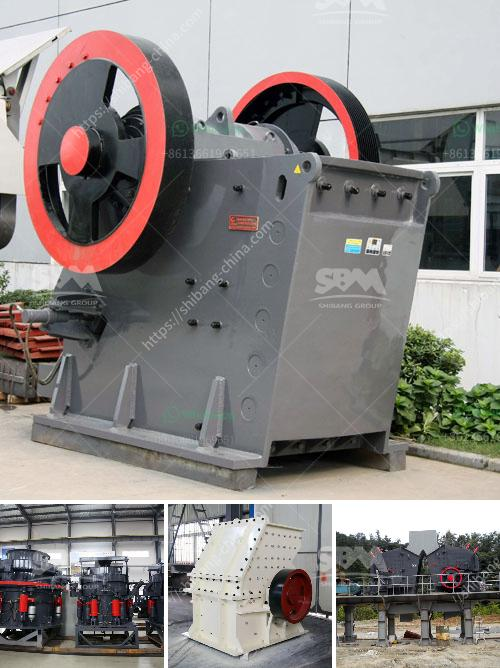

<h3>mobile vibrating screen for iron</h3>
Mobile vibrating screen is used to separate materials into various sizes for further processing or end use according to the customer's specific requirements. The device is commonly utilized in iron ore production to accelerate the screening process. It can be equally applicable to other materials, including gravel, sand, limestone, gypsum, coal, or any other mineral processing applications. 

The mobile vibrating screen consists of a vibrating deck with different sizes of screens, meshed together to form a separation grid. The mesh size determines the size of the particles that can pass through the screen. The vibrating deck is mounted on a chassis, and the whole unit is equipped with wheels, allowing it to move easily from one location to another.

One of the primary advantages of the mobile vibrating screen is its portability. Being mounted on a wheeled chassis, it can be transported to different locations within a mine site or to remote locations where mining operations are carried out. This makes it ideal for iron ore producers who need to move their screening operations around different mining sites.

The mobile vibrating screen simplifies the screening process, making it more efficient and cost-effective. Traditional screening methods, such as stationary screens or trommel screens, require extensive infrastructure and high operating costs. In contrast, the mobile vibrating screen eliminates the need for complex infrastructure, reducing setup and operational expenses.

Furthermore, the mobile vibrating screen offers flexibility in adjusting the screening parameters. The operator can easily change the vibrating screen's inclination, vibration amplitude, and mesh size to optimize the screening process for different types of iron ore. This flexibility allows iron ore producers to adapt the screening process to the specific properties of their ore, resulting in higher-quality products and increased efficiency.

Apart from its mobility and flexibility, the mobile vibrating screen offers several other benefits. For instance, it requires minimal maintenance compared to stationary or trommel screens. Its modular design also simplifies any necessary repairs or replacements of the vibrating deck or screens. Additionally, the vibrating deck is designed to minimize material clogging, ensuring continuous and smooth operation.

In conclusion, the mobile vibrating screen is a valuable tool in the iron ore production process. It simplifies the screening process, reduces setup and operational costs, and offers flexibility in adjusting the screening parameters. Its portability and minimal maintenance requirements make it an ideal choice for iron ore producers, allowing them to improve efficiency, productivity, and overall profitability.
<h3>Contact us</h3><ul><li><strong>Whatsapp:&nbsp;<a href="https://wa.me/8613661969651">+8613661969651</a></strong></li><li><a href="https://swt.shibang-china.com/?git&amp;zhl&amp;mobile vibrating screen for iron"><strong>Online Service(chat now)</strong></a></li></ul><h3>Related</h3><ul><li><a href='kenya regular impact crusher.md'>kenya regular impact crusher</a></li><li><a href='dolomite crusher turkey 200 ton price.md'>dolomite crusher turkey 200 ton price</a></li><li><a href='vertical cement grinding mill from 10 20 tph.md'>vertical cement grinding mill from 10 20 tph</a></li><li><a href='stone quarry process.md'>stone quarry process</a></li><li><a href='coconut shell crusher equipment.md'>coconut shell crusher equipment</a></li></ul>