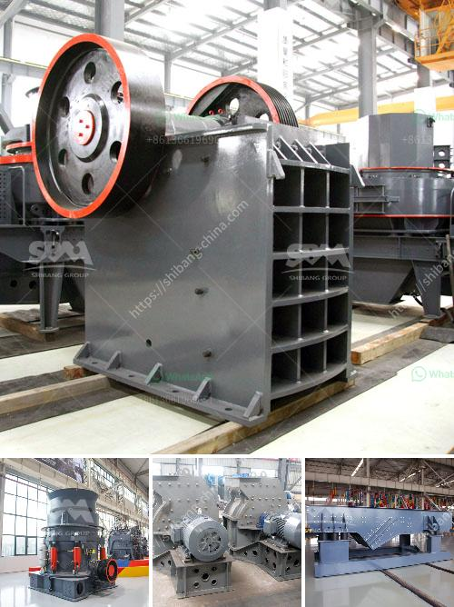

<h3>modular conveyor belt supplier china</h3>
Conveyor systems are essential for numerous industries, enabling a smooth and efficient flow of materials and products. Among the many types of conveyor belts available, modular conveyor belts have been gaining popularity due to their versatility, durability, and low maintenance requirements. China has emerged as a leading global supplier of modular conveyor belts, offering high-quality products that revolutionize industries worldwide.

Modular conveyor belts are constructed with interlocking plastic or metal modules that provide a flat, smooth, and reliable surface for transport. These belts are highly customizable, allowing for various belt widths, lengths, and designs to meet specific project requirements. With exceptional strength and flexibility, modular conveyor belts can handle heavy loads and withstand harsh environments, making them ideal for industries such as food processing, packaging, automotive, and logistics.

One of the primary advantages of modular conveyor belts is their ease of installation and maintenance. Traditional conveyor belts can be challenging to install or repair, requiring specialized tools and expertise. Modular conveyor belts, on the other hand, can be easily assembled, disassembled, and reconfigured using simple tools, saving time and resources. In addition, modular belts offer easy access to individual modules, enabling quick and cost-effective maintenance, as damaged parts can be replaced without replacing the entire belt.

As one of the world's manufacturing powerhouses, China has established itself as a leading supplier of modular conveyor belts. Chinese manufacturers have invested heavily in research and development, continuously innovating and improving the design, material, and performance of modular belts. This commitment to innovation has resulted in conveyor belts that exceed international quality standards, ensuring reliable operation and prolonged service life.

Chinese modular conveyor belt suppliers offer a wide range of belt options to meet various industrial requirements. From standard straight-line conveyors to complex curved and spiral designs, these suppliers can provide tailor-made solutions for any application. Whether it's a conveyor system for heavy-duty material handling or a hygienic solution for transporting food products, Chinese suppliers can offer modular belts with different materials, surface finishes, and accessories to suit specific needs.

Furthermore, Chinese modular belt suppliers prioritize customer satisfaction and after-sales service. With a strong emphasis on quality control, these suppliers implement strict manufacturing processes to ensure the highest product standards. They also provide comprehensive technical support and timely assistance, from design consultation to installation guidance, to help customers optimize their conveyor systems' performance.

In conclusion, the rise of modular conveyor belts has transformed material handling processes in various industries, with China at the forefront of this revolution. As a leading supplier, China combines innovation, quality, and cost-effectiveness, offering exceptionally engineered modular conveyor belts that meet the needs of customers worldwide. With their versatility, durability, and ease of maintenance, modular conveyor belts from Chinese suppliers are driving greater efficiency and reliability in industries around the globe.
<h3>Contact us</h3><ul><li><strong>Whatsapp:&nbsp;<a href="https://wa.me/8613661969651">+8613661969651</a></strong></li><li><a href="https://swt.shibang-china.com/?git&amp;zhl&amp;modular conveyor belt supplier china"><strong>Online Service(chat now)</strong></a></li></ul><h3>Related</h3><ul><li><a href='small ball mill prices in kenya.md'>small ball mill prices in kenya</a></li><li><a href='used sand dryer for sale australia.md'>used sand dryer for sale australia</a></li><li><a href='bentonite processing plant.md'>bentonite processing plant</a></li><li><a href='equipment needed for quarry crusher.md'>equipment needed for quarry crusher</a></li><li><a href='coal grinding plant.md'>coal grinding plant</a></li></ul>