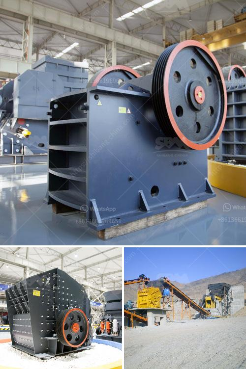

<h3>new rubber belt conveyor for sale</h3>
Are you in the market for a new rubber belt conveyor? Look no further! We are excited to introduce our state-of-the-art rubber belt conveyor, now available for sale. With its innovative features and superior quality, this conveyor is sure to exceed your expectations and improve the efficiency of your operations. Let's delve into the details and discover why this conveyor is worth every penny.

First and foremost, this rubber belt conveyor is built with durability in mind. Our engineers have carefully chosen the highest-quality materials to ensure that it can withstand the most demanding environments. The rubber belt is designed to endure heavy loads, resist extreme temperatures, and resist wear and tear, guaranteeing a long lifespan and minimizing maintenance needs. You can rest assured knowing that this conveyor will keep your production line running smoothly for years to come.

Our rubber belt conveyor is also highly versatile, making it suitable for a wide range of industries. Whether you need to transport bulk materials, finished products, or even delicate items, this conveyor can handle it all. The belt's surface is engineered to grip and move items efficiently, preventing slips and jams. Its adjustable speed control allows you to customize the conveyor's operation to meet your specific requirements, ensuring optimal performance and maximizing your productivity.

Furthermore, this rubber belt conveyor is designed with safety in mind. It is equipped with essential safety features, such as emergency stop buttons and protective guards, to minimize the risk of accidents and injuries. Additionally, the conveyor's design incorporates noise reduction technology, creating a quieter and more pleasant working environment. By investing in this conveyor, you are not only improving efficiency but also prioritizing the well-being of your workers.

In addition to its superior functionality, our rubber belt conveyor also boasts an intuitive control system. Its user-friendly interface allows for effortless operation, minimizing downtime and simplifying maintenance tasks. This conveyor is designed to be low-maintenance, with easy access to crucial components for inspections and repairs. This, combined with its straightforward controls, ensures that your operations can run smoothly without any complications.

Last but not least, our rubber belt conveyor is offered at a highly competitive price. We understand the importance of getting the most value for your investment, which is why we have priced this conveyor to be affordable without compromising on quality. You can take advantage of this opportunity to enhance your operations while staying within your budget.

To sum it up, our new rubber belt conveyor is the perfect solution for your material handling needs. With its durability, versatility, safety features, intuitive controls, and competitive pricing, it is undoubtedly an investment that will pay off in increased efficiency and improved productivity. Don't miss out on this opportunity – contact us today to learn more and place your order. Your operations will never be the same again!
<h3>Contact us</h3><ul><li><strong>Whatsapp:&nbsp;<a href="https://wa.me/8613661969651">+8613661969651</a></strong></li><li><a href="https://swt.shibang-china.com/?git&amp;zhl&amp;new rubber belt conveyor for sale"><strong>Online Service(chat now)</strong></a></li></ul><h3>Related</h3><ul><li><a href='small scale gold mining using stamp mill.md'>small scale gold mining using stamp mill</a></li><li><a href='crushing plant for sale in tanzania.md'>crushing plant for sale in tanzania</a></li><li><a href='stone crusher suppliers in indore.md'>stone crusher suppliers in indore</a></li><li><a href='impact crusher tanzania.md'>impact crusher tanzania</a></li><li><a href='quarry crushing line.md'>quarry crushing line</a></li></ul>