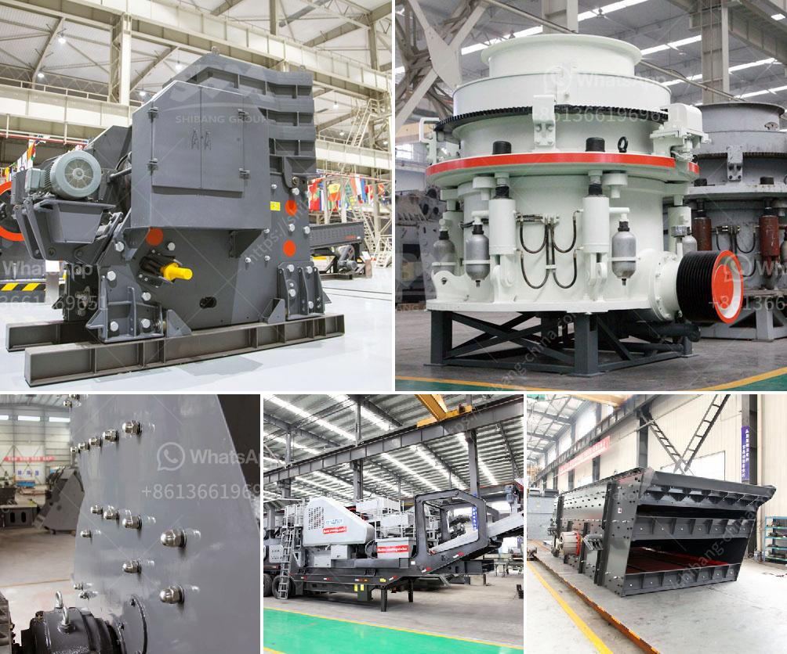

<h3>nigeria coal making process</h3>
Nigeria is rich in coal resources, with over 5 billion tons of deposit and ranked 6th highest in the world. Coal is a highly abundant energy source in the country, with over 4 billion tons mined annually. It is used for electricity generation, industrial processes, and the production of steel and cement, among other uses.

The process of coal making in Nigeria begins with coal exploration and surveying to locate coal deposits in the country. This involves the use of sophisticated techniques such as remote sensing, ground-truthing, and geological surveys to identify potential sites for mining.

Once the coal deposits are identified, the process of extracting coal from the earth begins. This is done through underground or surface mining, depending on the depth and location of the coal deposits. Underground mining involves the use of tunnels and shafts to access the coal seams, while surface mining involves the removal of overlying rocks and soil to expose the coal seams.

After extraction, the coal undergoes a series of processing steps to remove impurities and improve its quality. This includes crushing and screening to reduce the size of the coal and separate it into different grades based on its calorific value and sulfur content. The coal is then washed to remove ash and impurities, resulting in a cleaner and more efficient fuel.

In Nigeria, the processed coal is mainly used for electricity generation in thermal power plants. The coal is pulverized into a fine powder and burned in a boiler to produce steam, which drives a turbine connected to a generator. The generated electricity is then transmitted through the national grid to power businesses, industries, and households across the country.

Despite its significant coal reserves, Nigeria is gradually diversifying its energy mix to reduce its dependence on fossil fuels and promote renewable energy sources. However, coal will continue to play a crucial role in meeting the country's energy demands and supporting its economic development in the foreseeable future.
<h3>Contact us</h3><ul><li><strong>Whatsapp:&nbsp;<a href="https://wa.me/8613661969651">+8613661969651</a></strong></li><li><a href="https://swt.shibang-china.com/?git&amp;zhl&amp;nigeria coal making process"><strong>Online Service(chat now)</strong></a></li></ul><h3>Related</h3><ul><li><a href='companies companies in charge of vibrating screens.md'>companies companies in charge of vibrating screens</a></li><li><a href='crusher sale philippines.md'>crusher sale philippines</a></li><li><a href='cost of mobile crusher in india.md'>cost of mobile crusher in india</a></li><li><a href='manufacturers of coal mill in india.md'>manufacturers of coal mill in india</a></li><li><a href='used portable crusher for sale in germany.md'>used portable crusher for sale in germany</a></li></ul>