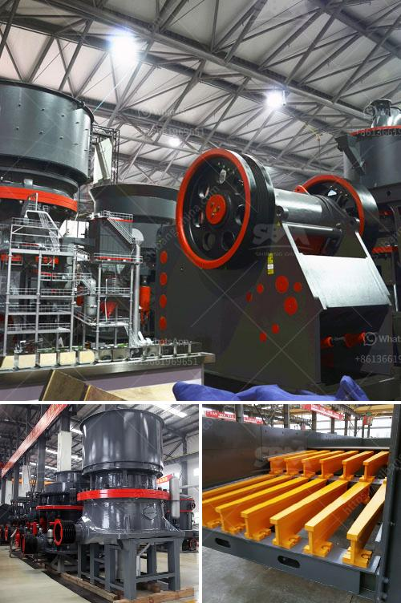

<h3>objectives of ball mill</h3>
The ball mill is an essential piece of equipment for grinding crushed materials, and it is widely used in production lines for powders such as cement, silicates, refractory material, fertilizer, glass ceramics, etc., as well as for ore dressing of ferrous and non-ferrous metals. The ball mill carries out dry or wet grinding of various ores and other grindable materials.

Nowadays, with the increasing raw material prices and energy costs, efficiency improvement has become an important factor in considerations for mill selection. In this article, we shall be looking at some of the objectives of a ball mill.

Grinding in a ball mill should be carried out by using steel balls with the largest diameter of the material to be ground (excluding steel balls). Such a homogeneous mixture of steel balls and ground ore particles provides maximum grinding efficiency. Accordingly, the balls should be of the correct diameter based on the size of the mill and the desired grinding result.

It is important to maintain the proper size distribution in the mill to ensure efficient grinding. The size distribution of the grinding media should be closely monitored to optimize the grinding process. Ideally, the particle size distribution should be as narrow as possible, which will result in a more efficient grinding operation.

The main objective of a ball mill is to provide reliable and consistent performance. By regularly monitoring the mill's performance, we can identify potential problems before they lead to a breakdown. This may involve checking the mill's motor and gearbox, as well as the lubrication system, to ensure that everything is operating within the recommended parameters.

The primary objective of a ball mill is to reduce the particle size of a material to a size necessary for a given process. The ball mill may perform both dry or wet grinding and achieve drying and grinding simultaneously. The process timing and grinding rates can be adjusted to obtain the desired particle size.

The use of stainless steel balls in a ball mill significantly increases the corrosion resistance and lifespan of the mill, making it ideal for long-term use in wet grinding processes. However, stainless steel balls may have a higher initial cost compared to other grinding media, but this is offset by lower wear rates and greater operational efficiency.

In conclusion, the primary objectives of a ball mill are to provide efficient grinding, maintain a consistent and reliable performance, reduce particle size, and utilize stainless steel balls for extended lifespan. By achieving these objectives, a ball mill can contribute to the overall success and profitability of a production line.
<h3>Contact us</h3><ul><li><strong>Whatsapp:&nbsp;<a href="https://wa.me/8613661969651">+8613661969651</a></strong></li><li><a href="https://swt.shibang-china.com/?git&amp;zhl&amp;objectives of ball mill"><strong>Online Service(chat now)</strong></a></li></ul><h3>Related</h3><ul><li><a href='cement clinker grinding manufacturer.md'>cement clinker grinding manufacturer</a></li><li><a href='pebble crushing production line.md'>pebble crushing production line</a></li><li><a href='silica sand price per tonne.md'>silica sand price per tonne</a></li><li><a href='super fine roller mill.md'>super fine roller mill</a></li><li><a href='dolomite process peritidal subtidal.md'>dolomite process peritidal subtidal</a></li></ul>