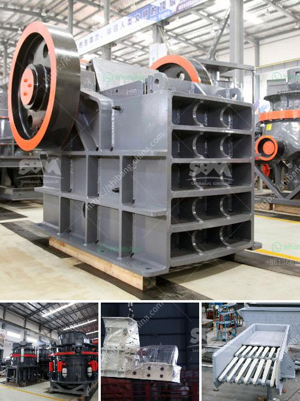

<h3>old stone crusher for sale</h3>
Since the earliest days of human civilization, stone has been used in construction industries for its beautiful and sturdy nature. Although stone is abundant in nature, extracting and transforming it into usable materials is an arduous and expensive task. With the development of machinery, the process of crushing and grinding stone has been made easier and more efficient.

One such machine that has made its mark in the mining industry is the old stone crusher. It is ideal for use in low-grade rock quarries and heavy-duty mining operations. Its main purpose is to reduce the size of the stone that is extracted from the quarry by breaking it down into manageable fragments that can then be transported and used for various purposes.

The old stone crusher consists of a hopper, a cone-shaped or rectangular-shaped cavity, and a crankshaft. The size of the final product is determined by the setting of the gap between the two surfaces at the bottom of the crusher. The size of the gap can be adjusted by tightening or loosening the crankshaft, allowing for different grades and sizes of crushed stone.

One of the biggest advantages of using an old stone crusher is its durability. These machines are designed to withstand harsh conditions and heavy use. Made from high-quality materials, they are built to last for decades with minimal maintenance. This is particularly beneficial in remote locations or areas where access to maintenance is limited.

Another advantage of using an old stone crusher is its cost-effectiveness. Compared to modern crushers, these machines are significantly cheaper, making them an attractive option for small-scale mining operations with limited capital. Additionally, their simple design and ease of operation make them user-friendly and accessible to operators with limited technical knowledge or experience.

In recent years, there has been a growing demand for old stone crushers among collectors and enthusiasts. Some view these machines as historical artifacts that tell the story of the mining industry and its evolution through time. Others are drawn to their unique design and machinery that harks back to a bygone era. As a result, the market for old stone crushers has seen a surge in interest, leading to a resurgence in their popularity.

If you are in the market for an old stone crusher, there are various options available to you. Online marketplaces, antique shops, and specialized dealers often have a selection of these machines for sale. It is important to thoroughly inspect and assess the condition of the stone crusher before making a purchase to ensure its functionality and longevity.

In conclusion, old stone crushers have played a significant role in the mining industry, contributing to the creation of usable materials from natural resources. They are durable, cost-effective, and hold historical and aesthetic value. For those interested in owning a piece of mining history, an old stone crusher could be a worthy addition to their collection.
<h3>Contact us</h3><ul><li><strong>Whatsapp:&nbsp;<a href="https://wa.me/8613661969651">+8613661969651</a></strong></li><li><a href="https://swt.shibang-china.com/?git&amp;zhl&amp;old stone crusher for sale"><strong>Online Service(chat now)</strong></a></li></ul><h3>Related</h3><ul><li><a href='rumus menghitung berat besi stanliss.md'>rumus menghitung berat besi stanliss</a></li><li><a href='stone crusher plant in westbengal.md'>stone crusher plant in westbengal</a></li><li><a href='hydraulic jaw crusher 30 x 40.md'>hydraulic jaw crusher 30 x 40</a></li><li><a href='raymond grinding mill manufacturers in udaipur.md'>raymond grinding mill manufacturers in udaipur</a></li><li><a href='overhaul jaw crusher.md'>overhaul jaw crusher</a></li></ul>