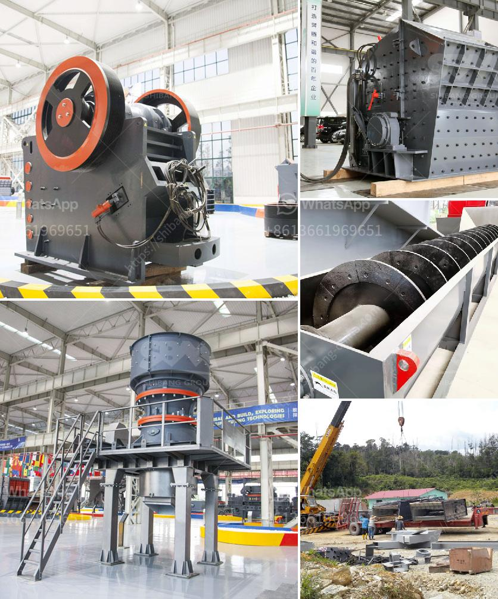

<h3>old used farm hammer mills</h3>
In the vast realm of agricultural machinery, few devices hold as much nostalgia and vintage charm as old farm hammer mills. These reliable workhorses of yesteryear continue to find a place in modern farming, thanks to their versatility and durability. Let's dive into the world of these age-old machines and explore their enduring value.

Dating back to the early 19th century, farm hammer mills revolutionized the agricultural industry. Initially powered by water or wind, these ingenious machines were designed to crush grain into small particles, making it easier for livestock to digest. As the industrial era unfolded, farmers began using steam engines and later tractors to power these versatile machines.

One of the primary reasons for the sustained popularity of old farm hammer mills is their multifunctionality. These mills not only pulverize grains but are also capable of crushing materials such as cornstalks, hay, straw, and even wood chips. This adaptability allows farmers to repurpose agricultural waste for various applications, often reducing expenses and environmental impact.

When it comes to reliability, old farm hammer mills outshine many contemporary alternatives. Vintage mills were primarily built with robust materials such as cast iron and steel, ensuring their longevity. This inherent durability makes them highly sought after by farmers today seeking equipment that can withstand rigorous demands over extended periods.

Another alluring aspect of acquiring an old farm hammer mill is their relatively affordable price compared to new machinery. With proper research and patience, farmers can find reasonably priced and well-maintained units that can provide dependable service without breaking the bank. Moreover, many collectors and enthusiasts specialize in restoring these mills, breathing new life into aged machinery and preserving historical value for generations to come.

Despite the advent of more sophisticated farming equipment, old farm hammer mills continue to have a place in the modern agricultural landscape. Farmers, particularly those who prioritize sustainable practices, recognize the ecological and economic benefits of utilizing these vintage machines. Aside from their ability to recycle agricultural waste, hammer mills can be used for grinding animal feed or producing homemade flour, further reducing dependence on external suppliers.

Collectors and enthusiasts play a crucial role in preserving the heritage of old farm hammer mills. Their passion and expertise ensure that these devices, often considered icons of bygone eras, are not forgotten. Restored mills can be displayed in museums or privately owned collections, providing a tangible link to the past for future generations.

Old farm hammer mills serve as a nostalgic reminder of simpler times in agriculture. Their versatility, dependability, and affordability make them relevant even in today's modern farming practices. The preservation efforts of collectors and enthusiasts ensure that their historical significance will endure. As more farmers appreciate the value of sustainability, these vintage machines may find renewed purpose on farms worldwide, cementing their reputation as timeless icons of agricultural ingenuity.
<h3>Contact us</h3><ul><li><strong>Whatsapp:&nbsp;<a href="https://wa.me/8613661969651">+8613661969651</a></strong></li><li><a href="https://swt.shibang-china.com/?git&amp;zhl&amp;old used farm hammer mills"><strong>Online Service(chat now)</strong></a></li></ul><h3>Related</h3><ul><li><a href='grinding and packing machines in pakistan.md'>grinding and packing machines in pakistan</a></li><li><a href='stones grinding plant thailand.md'>stones grinding plant thailand</a></li><li><a href='mobile vibrating screen for iron.md'>mobile vibrating screen for iron</a></li><li><a href='grinding plant in rajasthan.md'>grinding plant in rajasthan</a></li><li><a href='bentonite pulverizer ball mill in gujrat.md'>bentonite pulverizer ball mill in gujrat</a></li></ul>