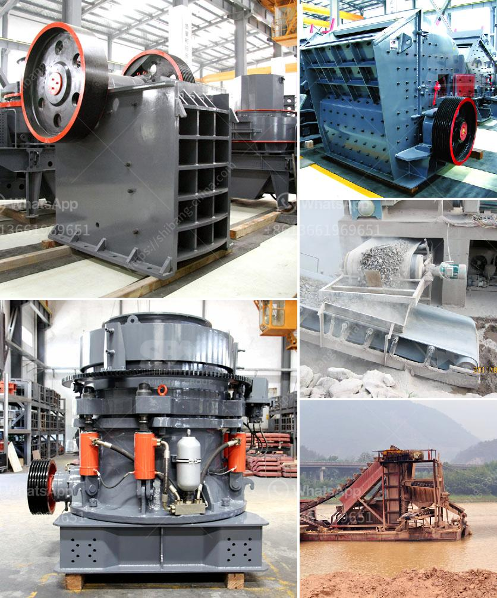

<h3>overhaul jaw crusher</h3>
Jaw crusher is a type of primary crushing equipment that can be used in the mining industry for a variety of purposes. It is essential to perform a thorough overhaul of jaw crushers as damage to the machine can have severe consequences, such as a shortened lifespan, reduced efficiency, and increased downtime.

The primary goal of overhauling a jaw crusher is to replace damaged or worn-out parts that affect its performance. This can include the jaw plates, toggle plates, toggle seats, tension rods, and springs. Over time, these components can become worn down due to the crushing of hard materials, which can lead to decreased productivity and potential breakdowns.

The first step in overhauling a jaw crusher is to carefully inspect it for any signs of damage or wear. This can be done by visually examining the machine and using various testing methods, such as measuring the clearance between the jaw plates and checking the condition of the toggle seats. Any worn-out or damaged parts should be identified and replaced as part of the overhaul process.

Replacing the jaw plates is one of the most crucial tasks during a jaw crusher overhaul. These plates are the primary crushing surfaces and directly come into contact with the material being crushed. Over time, they can wear down, becoming less efficient at crushing and potentially causing material to slip through without being properly crushed. Replacing the jaw plates can greatly improve the performance and efficiency of the machine.

In addition to the jaw plates, other components like the toggle plates, toggle seats, tension rods, and springs also require careful inspection and potential replacement. The toggle plates, located between the swing jaw and the pitman, help to transmit the crushing motion and ensure that the material is effectively crushed. If these plates become damaged or worn, they can cause the machine to function improperly.

Similarly, the toggle seats, tension rods, and springs all play a crucial role in maintaining the proper functioning of the jaw crusher. The toggle seats provide a resting place for the toggle plates, while the tension rods and springs help to maintain the proper tension and alignment of the machine. If any of these components are damaged or worn, they should be replaced during the overhaul to ensure optimal performance.

It is also essential to lubricate all moving parts during the overhaul process. This includes the bearings, which can become dry and worn over time, leading to increased friction and potential breakdowns. Proper lubrication can extend the lifespan of the machine and reduce the risk of costly repairs.

In conclusion, overhauling a jaw crusher is a vital task for the mining industry. It helps to identify and replace damaged or worn-out parts that can impact the performance and efficiency of the machine. By carefully inspecting the jaw crusher and replacing the necessary components, such as the jaw plates, toggle plates, toggle seats, tension rods, and springs, mining companies can ensure that their equipment operates at its best, minimizing downtime and maximizing productivity.
<h3>Contact us</h3><ul><li><strong>Whatsapp:&nbsp;<a href="https://wa.me/8613661969651">+8613661969651</a></strong></li><li><a href="https://swt.shibang-china.com/?git&amp;zhl&amp;overhaul jaw crusher"><strong>Online Service(chat now)</strong></a></li></ul><h3>Related</h3><ul><li><a href='cobalt concentrate processing equiopment manufacturers.md'>cobalt concentrate processing equiopment manufacturers</a></li><li><a href='coal crusher hammer.md'>coal crusher hammer</a></li><li><a href='application of hammer mill.md'>application of hammer mill</a></li><li><a href='different type of grinding mills.md'>different type of grinding mills</a></li><li><a href='zinc ore processing plant.md'>zinc ore processing plant</a></li></ul>