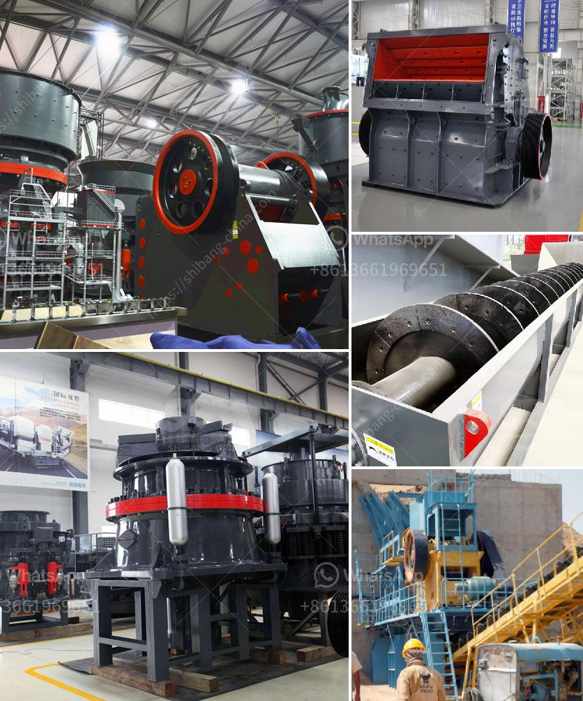

<h3>overland conveyor cost calculator</h3>
Title: Exploring the Overland Conveyor Cost Calculator: A Gamechanger for Efficient Mining Operations

In the mining industry, the transportation of ore and waste materials is crucial for achieving optimal operational efficiency. Overland conveyors have emerged as a popular solution due to their ability to transport large quantities of materials over long distances while minimizing the need for traditional trucks. However, the cost-effectiveness of implementing an overland conveyor system heavily relies on accurate cost estimation. This is where the Overland Conveyor Cost Calculator comes into play, revolutionizing the way mining companies plan and optimize their operations.

The Overland Conveyor Cost Calculator is a user-friendly software tool that helps mining companies accurately estimate the costs associated with constructing and operating an overland conveyor system. The calculator is web-based and provides transparent cost breakdowns, allowing engineers, managers, and decision-makers to make sound financial assessments and develop precise project budgets.

To generate accurate cost breakdowns, the Overland Conveyor Cost Calculator incorporates several essential factors. These include:

1. Conveyor Length: The total length of the conveyor plays a significant role in determining the overall cost. Longer conveyors generally require additional equipment, such as drive stations and transfer points, which impact installation costs.

2. Terrain and Topography: The calculator accounts for varying terrains, such as flat, hilly, or mountainous. Different terrains may require additional expenditures, such as earthwork, slope stabilization, and structural reinforcements.

3. Conveyor Design: The type of conveyor design chosen (straight, curved, or both) affects the overall project cost. Curved conveyors typically require specialized components, such as curve radii and idler sets, which contribute to increased expenses.

4. Material Capacity and Density: The amount of material to be transported per hour, as well as its density, influences the conveyor's sizing and associated costs. A higher capacity or denser material may necessitate larger, more robust components and increased power consumption.

1. Budget Accuracy: By accurately projecting costs, mining companies can develop realistic budgets and financial plans. This helps ensure efficient capital allocation and prevents cost overruns during the project implementation phase.

2. Decision-Making Support: The calculator allows decision-makers to evaluate the cost implications of different design options, route alternatives, and operational scenarios. Such insights empower informed decision-making, ensuring optimal outcomes for the operation's future.

3. Project Optimization: By assessing various cost components, the calculator can identify potential areas for optimization. Mining companies can fine-tune equipment specifications, consider alternative designs, or explore more cost-effective routing options to achieve substantial savings.

4. Stakeholder Communication: The transparent cost breakdowns generated by the calculator facilitate effective communication with stakeholders. Investors, executives, and regulatory authorities can better understand the project's value proposition, enhancing support and alignment.

The Overland Conveyor Cost Calculator is a revolutionary tool that enables mining companies to estimate the costs associated with designing, implementing, and operating an overland conveyor system. By considering critical cost components, the calculator helps create accurate budgets, support decision-making, optimize projects, and enhance stakeholder communication. Investing in this cutting-edge technology empowers mining operations to elevate their efficiency, reduce costs, and drive sustainable long-term growth. With the Overland Conveyor Cost Calculator, the mining industry welcomes a gamechanger for the transportation of materials, redefining operational standards.
<h3>Contact us</h3><ul><li><strong>Whatsapp:&nbsp;<a href="https://wa.me/8613661969651">+8613661969651</a></strong></li><li><a href="https://swt.shibang-china.com/?git&amp;zhl&amp;overland conveyor cost calculator"><strong>Online Service(chat now)</strong></a></li></ul><h3>Related</h3><ul><li><a href='price of grinder machine in malaysia.md'>price of grinder machine in malaysia</a></li><li><a href='crushing and screening contractors in south africa.md'>crushing and screening contractors in south africa</a></li><li><a href='different between the mill and hammer crusher.md'>different between the mill and hammer crusher</a></li><li><a href='white stone crusher plant in rajasthan.md'>white stone crusher plant in rajasthan</a></li><li><a href='gold wash plant trummel revelstoke.md'>gold wash plant trummel revelstoke</a></li></ul>