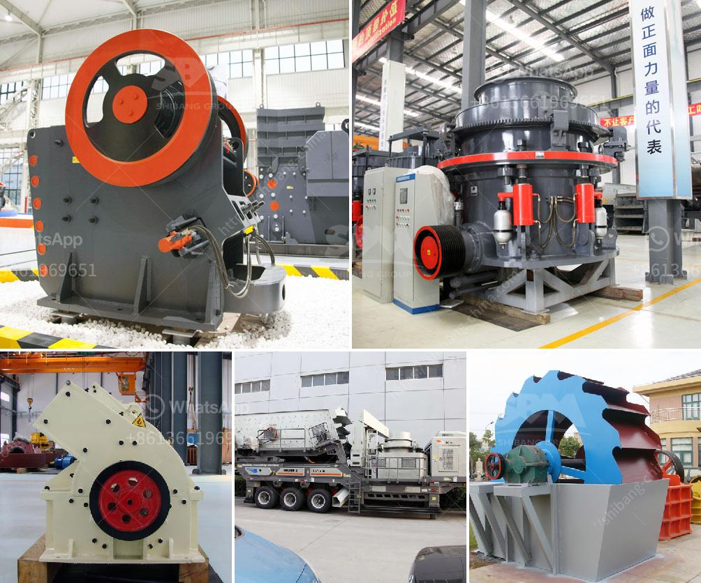

<h3>pakistan crusher machine</h3>
Pakistan is rich in mineral resources and mining industry is an important industry in the country. With the continuous development of the construction industry, the demand for crusher machines is increasing. Pakistan is a developing country and has a growing economy and infrastructure development. The construction and mining machinery industry is booming in Pakistan.

Crusher Machine is indispensable equipment in stone quarrying operation, gravel crushing, ore mining, and construction waste recycling. It plays pivotal roles in crushing various materials into pieces. The quality and working principles determine the price of these machines.

Pakistan is a great country to source crushers because of its abundance of mineral resources. The top countries of suppliers within the country are China, Pakistan, from which the percentage of crushers supply is 99%, 1% respectively. Numerous factors account for this burgeoning crusher market in Pakistan. One notable factor is the increased investment by the government in infrastructure development projects. The government’s focus on developing infrastructure has resulted in higher demand for construction materials such as gravel, sand, and stones.

Crushing and screening equipment plays a vital role in the construction industry because it provides the necessary aggregates for the development of roads, bridges, and buildings. These machines are also used in the mining industry to reduce the size of ore blocks and facilitate the extraction process. The rising demand for construction materials and the increasing investment in mining activities have led to a surge in the demand for crusher machines in Pakistan.

One popular type of crusher machine in Pakistan is the roller crusher. It is named as such because the crushing mechanism resembles human jaw and the material is crushed between two rollers. However, it has several drawbacks: it is bulky, difficult to maintain and expensive, which is why most construction and mining companies prefer jaw crushers. The jaw crusher is a more affordable alternative that offers the same crushing capabilities at a lower price point.

Crusher machines are widely used in the mining industry. Whether it is a copper mine, zinc mine, or gold mine, a crusher machine is necessary. Most of the ores must be crushed into smaller sizes for further processing in smelting facilities. The choice of crusher machine is important for these different ores. Jaw crushers and cone crushers are common types of crusher machines.

In Pakistan, where the mining industry is thriving, the crusher machine market is growing too. With the rapid development of the construction industry, the price of crusher machines is higher. The higher price is attributed to the quality and working principle of the crusher machines. Thus, making Pakistan an attractive market for potential buyers.

The crusher machine industry in Pakistan is expected to grow exponentially in the coming years. With the increasing demand for construction materials and the booming construction industry, investors in Pakistan are focusing on the development of crusher machines. In addition, many countries focus on the mining industry, which also promotes the expansion of this machine industry.

In conclusion, it is safe to say that the crusher machine industry in Pakistan is thriving due to the increasing demand for construction materials and the development of infrastructure projects. As the mining industry continues to grow and the government invests in infrastructure development, the demand for crusher machines is expected to rise significantly. Buyers and investors can find a variety of crusher machines in Pakistan to meet their specific needs and budget requirements.
<h3>Contact us</h3><ul><li><strong>Whatsapp:&nbsp;<a href="https://wa.me/8613661969651">+8613661969651</a></strong></li><li><a href="https://swt.shibang-china.com/?git&amp;zhl&amp;pakistan crusher machine"><strong>Online Service(chat now)</strong></a></li></ul><h3>Related</h3><ul><li><a href='chinese stone crusher machine.md'>chinese stone crusher machine</a></li><li><a href='gypsum calcining equipment price.md'>gypsum calcining equipment price</a></li><li><a href='sandstone crusher quarry.md'>sandstone crusher quarry</a></li><li><a href='impact crusher 70 130tph.md'>impact crusher 70 130tph</a></li><li><a href='milling equipment for talcum powder.md'>milling equipment for talcum powder</a></li></ul>