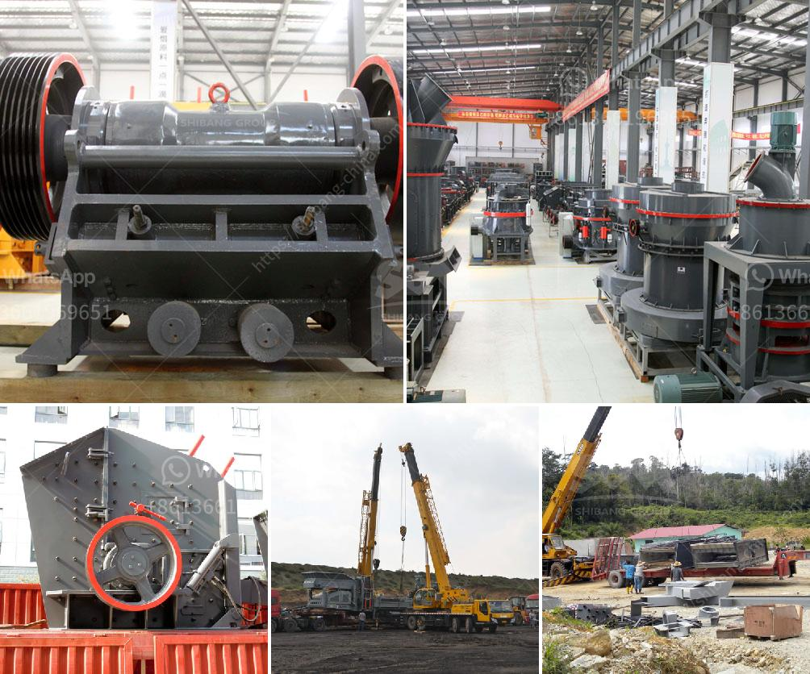

<h3>pakistan fabricated silica sand washing plant</h3>
Pakistan is a country blessed with an abundance of natural resources, including silica sand. Silica sand is widely used for various purposes such as glass making, water filtration, industrial casting, and sandblasting. To cater to the growing demand for this valuable resource, Pakistan has set up a fabricated silica sand washing plant.

The fabricated silica sand washing plant is designed to process high-quality silica sand, which is extensively used in construction industries. With the increasing demand for silica sand, the plant is producing fine-grade sand, which can be used in various applications, including water filtration systems and concrete production.

One of the major benefits of this plant is that it removes impurities from the silica sand, ensuring a high-quality end product. The process involves cleaning the sand to remove unwanted elements such as clay, silt, and organic matter, which can affect the performance of the final product. By removing these impurities, the fabricated silica sand washing plant ensures that the resulting sand is of the highest quality and meets industry standards.

Another advantage of this washing plant is its efficiency. With advanced technology and equipment, the plant is equipped to handle a large volume of silica sand and process it in a time-efficient manner. This allows for increased production and faster turnaround times, meeting the growing demands of the market.

Furthermore, the fabricated silica sand washing plant is also environmentally friendly. The water used in the washing process is recycled and treated, reducing water consumption and minimizing environmental impact. This sustainable approach makes the plant a responsible choice for silica sand production.

Overall, the fabricated silica sand washing plant in Pakistan is a valuable addition to the country's mining industry. It not only meets the growing demand for silica sand but also ensures high-quality, eco-friendly production. With its advanced technology and efficient processes, this plant is a testament to Pakistan's commitment to sustainable development and resource utilization.
<h3>Contact us</h3><ul><li><strong>Whatsapp:&nbsp;<a href="https://wa.me/8613661969651">+8613661969651</a></strong></li><li><a href="https://swt.shibang-china.com/?git&amp;zhl&amp;pakistan fabricated silica sand washing plant"><strong>Online Service(chat now)</strong></a></li></ul><h3>Related</h3><ul><li><a href='vibrating screen designs.md'>vibrating screen designs</a></li><li><a href='impact crusher tanzania.md'>impact crusher tanzania</a></li><li><a href='granite crusher cost.md'>granite crusher cost</a></li><li><a href='how to buy brick crushing machine from bangladesh.md'>how to buy brick crushing machine from bangladesh</a></li><li><a href='stone crusher used equipment germany.md'>stone crusher used equipment germany</a></li></ul>