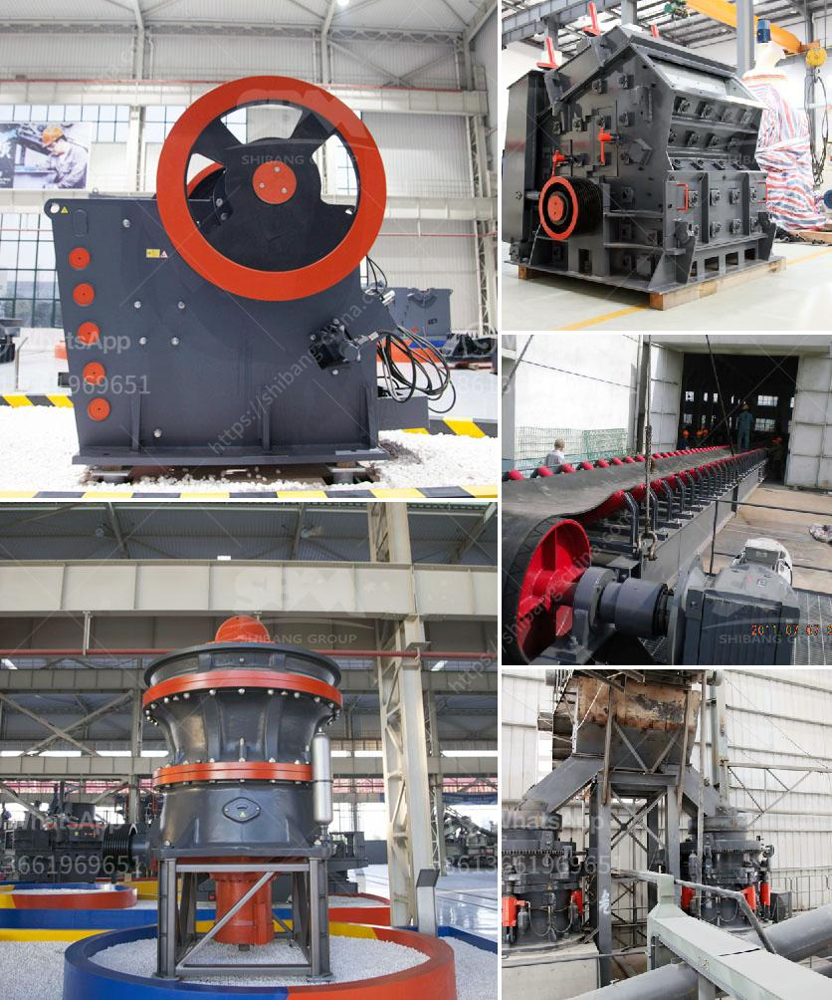

<h3>part of roller mill</h3>
Roller mills are commonly used in the agricultural and industrial sectors to process grains, herbs, and other materials into a fine powder or flour. They are a vital piece of equipment in various industries, allowing for efficient and consistent processing of raw materials. One crucial part of a roller mill is the roller assembly, which plays a significant role in the overall functionality and performance of the machine.

The roller assembly in a roller mill consists of several components, including the roller shaft, roller shell, bearings, and seals. These parts work together to ensure smooth operation and optimum grinding efficiency. The roller shaft is the backbone of the assembly, as it provides support and stability to the rollers during operation. Typically made of high-grade alloy steel, the roller shaft is machined to precise specifications to ensure proper alignment and balance.

Attached to the roller shaft are the roller shells, which are cylindrical components designed to grind the material being processed. Roller shells come in various shapes and sizes, depending on the specific application and desired particle size. They are usually made from hardened steel or cast iron to withstand the abrasion and impact forces that occur during grinding.

A critical aspect of the roller assembly is its bearings. Roller mill bearings are specialized, high-load bearings that allow for smooth rotation of the roller assembly even under heavy operational loads. These bearings are typically designed with multiple rows of rolling elements, such as tapered rollers or cylindrical rollers, to distribute the load evenly and minimize friction. The use of high-quality bearings is essential to prevent premature wear and ensure long service life of the roller assembly.

To protect the bearings and maintain their performance, roller mills also incorporate seals. Seals prevent the entry of dust, moisture, and other contaminants into the bearing area, which can cause premature failure. Common types of seals used in roller mill applications include lip seals, labyrinth seals, and mechanical seals. These seals are designed to withstand high temperatures, resist abrasion, and create an effective barrier against contaminants.

Proper maintenance and regular inspection of the roller assembly are crucial to ensure its optimal performance. Operators must check for signs of wear on the roller shells, bearings, and seals, and replace them as necessary to avoid costly downtime and reduce the risk of machinery failure. Lubrication of the roller assembly is also crucial to minimize friction and prevent overheating. Grease or oil is typically applied to the bearings and seals to promote smooth operation and prolong their lifespan.

In conclusion, the roller assembly is a vital component of a roller mill, playing a significant role in the industry's efficient and reliable operation. Its various parts, including the roller shaft, roller shells, bearings, and seals, work together to ensure smooth grinding and optimum performance. Regular maintenance, inspection, and lubrication are essential to prolong the lifespan of the roller assembly and avoid costly downtime. By understanding the importance of this part, operators can maximize the productivity and profitability of their roller mill operations.
<h3>Contact us</h3><ul><li><strong>Whatsapp:&nbsp;<a href="https://wa.me/8613661969651">+8613661969651</a></strong></li><li><a href="https://swt.shibang-china.com/?git&amp;zhl&amp;part of roller mill"><strong>Online Service(chat now)</strong></a></li></ul><h3>Related</h3><ul><li><a href='small jaw crusher for sale.md'>small jaw crusher for sale</a></li><li><a href='objectives of ball mill.md'>objectives of ball mill</a></li><li><a href='vertical grinder for spindle.md'>vertical grinder for spindle</a></li><li><a href='black stone crushing nigeria.md'>black stone crushing nigeria</a></li><li><a href='silica sand crusher machine manufacturin.md'>silica sand crusher machine manufacturin</a></li></ul>