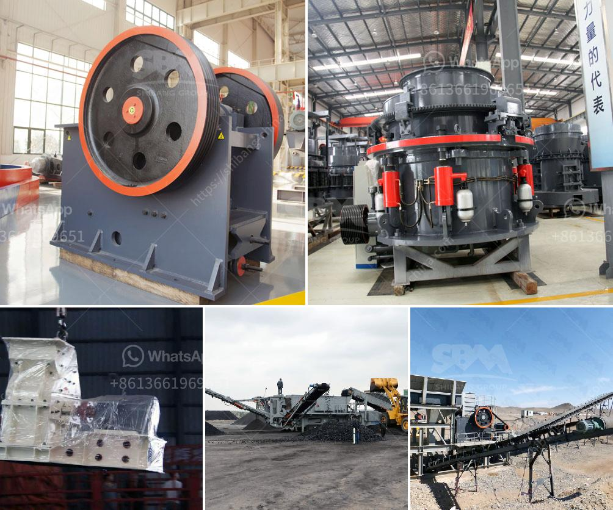

<h3>parts for stone crushers</h3>
Stone crushers are used in a wide range of industries such as mining, quarrying, and construction. There are different types of crushers based on their working principles and the materials they crush. However, the basic structure of these machines is the same, consisting of a rotor that rotates at high speed and feeds the material into a chamber where it is crushed into smaller pieces. 

One important aspect of stone crushers is the parts that are used in the machinery. Each part plays a crucial role in the operation of the machine. Some of the key parts commonly used in stone crushers include blow bars, impact plates, aprons, rotor assemblies, and more.

Blow bars are made from a variety of materials, namely iron, chrome, ceramic, or manganese steel. They are responsible for the crushing process by delivering a high impact force to the material being crushed. The choice of blow bars depends on the hardness of the material and the desired final product size.

Impact plates, also known as breaker plates, are another important part of stone crushers. These plates act as a barrier between the rotor and the chamber where the material is crushed. Impact plates absorb the impact forces generated by the blow bars and protect the crusher from damage.

Aprons are commonly used in stone crushers to regulate the material flow from the feed hopper to the impact crusher chambers. They have a series of adjustable plates that help control the feed rate of the material and ensure that it is evenly distributed across the crushing chamber.

Rotor assemblies are the heart of the stone crushers. They consist of a central shaft with multiple rotor discs attached to it. The material is fed into the center of the rotor, and the high-speed rotation of the rotor throws the material against the blow bars, causing it to break and be crushed into smaller sizes.

Other important parts in stone crushers include side plates, toggle plates, bearings, and transmission systems. Side plates are located on both sides of the machine and hold the crusher's main framework in place. Toggle plates act as a safety mechanism for the crusher by preventing it from accidental overloads. Bearings provide smooth operation and reduce friction, while transmission systems transfer power from the engine to the crusher.

Regular maintenance and replacement of these parts are crucial to ensure the efficient operation of stone crushers. Proper maintenance can extend the lifespan of the parts, improve the overall performance of the machine, and minimize downtime. Manufacturers and suppliers of stone crusher parts offer a wide variety of options to choose from, ensuring that the parts are tailored to meet the specific requirements of each crusher.

In conclusion, stone crushers play a vital role in the mining and construction industry. Their efficient operation depends on the proper functioning of various parts, including blow bars, impact plates, aprons, rotor assemblies, and more. Each of these parts is critical to the overall functionality of the machine and requires regular maintenance and replacement. By choosing high-quality stone crusher parts and conducting regular maintenance, operators can ensure that their crushers operate at peak efficiency and productivity.
<h3>Contact us</h3><ul><li><strong>Whatsapp:&nbsp;<a href="https://wa.me/8613661969651">+8613661969651</a></strong></li><li><a href="https://swt.shibang-china.com/?git&amp;zhl&amp;parts for stone crushers"><strong>Online Service(chat now)</strong></a></li></ul><h3>Related</h3><ul><li><a href='ball mill steel balls suppliers in nigeria.md'>ball mill steel balls suppliers in nigeria</a></li><li><a href='18tph roll mill process.md'>18tph roll mill process</a></li><li><a href='cocount crushing manchine.md'>cocount crushing manchine</a></li><li><a href='crushing plant working.md'>crushing plant working</a></li><li><a href='pebble crushing equipment.md'>pebble crushing equipment</a></li></ul>