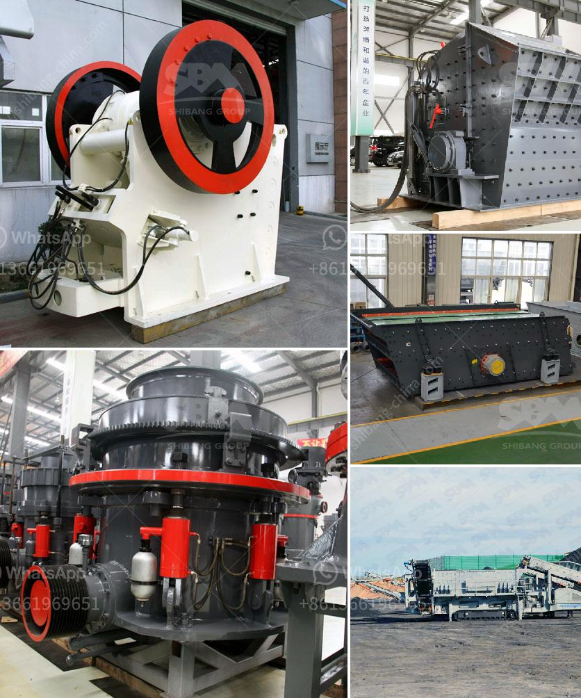

<h3>pebble crusher manufacturer</h3>
Throughout the years, thousands of customers have trusted us with their quarrying and aggregate needs. Given the diverse geological and geographical conditions across the globe, pebble crusher manufacturers need to develop different technologies and adapt to local requirements to stay on top of the game.

One notable company that has stood the test of time and emerged victorious is our very own Pebble Crusher Inc. Over the past three decades, we have solidified our reputation as a leading manufacturer and supplier of high-quality pebble crushing equipment. Our commitment to innovation, sustainability, and customer satisfaction has made us a sought-after choice for businesses in the mining and construction industry.

One of the primary reasons behind our success is our unwavering focus on research and development. We invest heavily in cutting-edge technology to ensure that our crushers are efficient, durable, and environmentally friendly. Our team of engineers and technicians works tirelessly to improve our machines, resulting in optimized performance and enhanced productivity for our clients.

Moreover, our commitment to sustainability is evident in every aspect of our manufacturing process. From utilizing renewable energy sources to minimizing waste and emissions, we are dedicated to reducing our environmental footprint. We ensure that our crushers adhere to the strictest global standards for energy efficiency and emissions control, making them a responsible choice for environmentally conscious businesses.

As a testament to our success and commitment to quality, we have expanded our operations beyond the United States. Today, we are proud to serve customers worldwide, catering to the unique needs and specifications of different regions. Our extensive network of dealers and distributors ensures that businesses can easily access our products and benefit from our exceptional customer service.

Understanding the diverse requirements of our global clientele, we have developed a range of pebble crushers suitable for various applications. Whether it is primary, secondary, or tertiary crushing, we have the perfect solution to meet specific project demands. Our crushers are designed to handle a wide range of materials, from hard rocks to soft pebbles, enabling businesses to extract the desired products efficiently.

Furthermore, our crushers come with a range of features and options that can be customized according to individual preferences. From adjustable settings to ensure precise product sizing to automated control systems for ease of operation, we offer flexibility to suit different operational requirements. Our aftersales support and robust warranty program also provide peace of mind, assuring customers that they can rely on our products in the long run.

In conclusion, Pebble Crusher Inc. has established itself as a leading manufacturer and supplier of pebble crushing equipment worldwide. Our commitment to innovation, sustainability, and customer satisfaction has allowed us to remain at the forefront of the industry. With our dedicated team of engineers, state-of-the-art technology, and global distribution network, we continue to provide efficient and reliable solutions that exceed customer expectations. Whether it be in the United States or anywhere else around the world, businesses can trust Pebble Crusher Inc. to deliver high-quality crushers and outstanding service.
<h3>Contact us</h3><ul><li><strong>Whatsapp:&nbsp;<a href="https://wa.me/8613661969651">+8613661969651</a></strong></li><li><a href="https://swt.shibang-china.com/?git&amp;zhl&amp;pebble crusher manufacturer"><strong>Online Service(chat now)</strong></a></li></ul><h3>Related</h3><ul><li><a href='ball mill equipment 150 tons hr.md'>ball mill equipment 150 tons hr</a></li><li><a href='cocount crushing manchine.md'>cocount crushing manchine</a></li><li><a href='crushers equipment dealer in saudi arabia.md'>crushers equipment dealer in saudi arabia</a></li><li><a href='crusher machine company in spain.md'>crusher machine company in spain</a></li><li><a href='sewa stone crusher di jakarta.md'>sewa stone crusher di jakarta</a></li></ul>